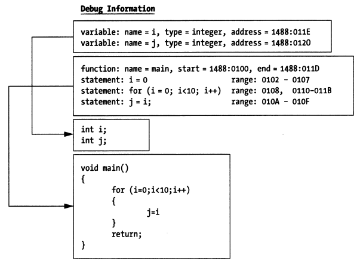
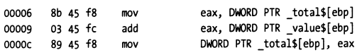
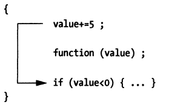

## 4.2 Dependencies (Support)

### 4.2.1 Debug Symbol Information

Compilers and linkers build executable programs from source code, and the data in executable programs is machine-oriented rather than human-oriented. How does a debugger understand the data in executable programs and convert between machine representation and human-readable form? This requires the support of debug information.

When a compiler converts source code into object files, it generates debug information and stores it in special sections of the executable program. When the linker combines multiple object files into a complete executable program, it merges the debug information scattered across different object files and stores it.


The generation, encoding/decoding, and storage of debug information are guided by corresponding debug information standards (such as DWARF), which guide how compilers, linkers, and debuggers collaborate. Compilers and linkers generate this debug information and store it in sections of the executable program, and debuggers extract and parse debug-related information from it to build a source-level view. Thus, debuggers can map between memory addresses, instruction addresses, and source code.

Different object file formats may store debug symbol information in different places, generally in two ways:

##### Stored in the Object File Itself

For example, the [ELF](https://en.wikipedia.org/wiki/Executable_and_Linkable_Format) file format contains sections corresponding to DWARF debug information, generally starting with ".debug" or ".zdebug". Sections starting with .debug indicate uncompressed data, while those starting with .zdebug indicate compressed data.

> Here's an example: __debug_bin is an executable program generated by `dlv debug` that contains debug symbol information. `readelf` can be used to read section headers from ELF files. Let's look at the debug information-related sections in the ELF file.
>
> go build can disable compression by specifying the linker option "**-ldflags=-compressdwarf=false**". Understanding this in advance is very useful for analyzing and understanding how DWARF debug information is organized using tools like dwarfdump.
>
> ```bash
> [root@centos ~]# readelf -a __debug_bin | grep debug
> [12] .zdebug_abbrev    PROGBITS         0000000000599000  0017b000
> [13] .zdebug_line      PROGBITS         0000000000599114  0017b114
> [14] .zdebug_frame     PROGBITS         00000000005a9f37  0018bf37
> [15] .zdebug_pubnames  PROGBITS         00000000005b11a8  001931a8
> [16] .zdebug_pubtypes  PROGBITS         00000000005b2fa0  00194fa0
> [17] .debug_gdb_script PROGBITS         00000000005b624b  0019824b
> [18] .zdebug_info      PROGBITS         00000000005b6273  00198273
> [19] .zdebug_loc       PROGBITS         00000000005dcfe2  001befe2
> [20] .zdebug_ranges    PROGBITS         00000000005e982d  001cb82d
> ```

> ps: The author started writing this e-book very early, back in 2018 when Go 1.13 was still in use. Many changes have occurred over these years.
>
> - First, in Go 1.13, it was indeed like this, with zlib compression writing to .zdebug_ sections (see: https://github.com/golang/go/issues/11799#issuecomment-399564050);
> - Since the e-book wasn't completed in one go, when the author tried running the existing code and proofreading the content again in Go 1.19, it was found that it no longer wrote to .zdebug_ sections (the above linker flag became ineffective);
> - As of today, February 14, 2025, when continuing to write the book content, further verification revealed that Go 1.22 has explicitly deprecated `.zdebug_` sections, instead determining whether compression is enabled based on whether the content in `.debug_` sections has the SHM_COMPRESSED flag.
>   see: https://github.com/golang/go/issues/58254#issuecomment-1421624004
>   see: https://sourcegraph.com/github.com/golang/go/-/commit/75136fc14c0d3ec64a2f6728e96fc86066d853c9
>
> So, we need to complete it quickly, as Go might upgrade from DWARF v4 to v5 in the future, which would introduce more changes.

##### Stored in Separate Files

For example, debug information generated by Microsoft Visual C++ 2.0 is stored in separate **.PDB (Program Database)** files, and debug symbol information built on macOS platforms is generally stored in separate **.dSYM/Resources/DWARF/** directories.

> Here's an example: On macOS 10.15, we'll build an executable program containing debug symbols using "**gcc -g**" and see how its debug information is stored:
>
> **file: main.c**
>
> ```cpp
> #include <stdio.h>
> #include <stdlib.h>
>
> int main(int argc, char *argv[])
> {
>   return 0;
> }
>
> ```
>
> ```bash
> $ gcc -g -o main main.c
> $ ls
> main main.c main.dSYM/
> $ tree main.dSYM
> main.dSYM/
> └── Contents
> ├── Info.plist
> └── Resources
>      └── DWARF
>            └── main|
> ```

As we can see, on macOS 10.15, gcc also stores debug information in a separate main.dSYM/ directory. You can use tools like `dwarfdump or splitdwarf` for analysis, refer to this article: https://blog.golang.org/debug-opt.

##### What's the Use of Debug Information?

Debuggers use debug information to map functions and variables in source code to memory addresses, meaning developers can directly operate on functions and variables in source code without worrying about specific memory addresses. This is the advantage of symbolic debuggers over instruction-level debuggers.

With the mapping from source code to memory addresses, symbolic debuggers can directly display variable values. How is this done? Because variable identifiers can be mapped to program memory addresses, and the debug information also records the variable's data type information. This type information tells the debugger how many bytes the variable occupies, how many bits are actually used, and what data type it should be interpreted as. The debugger can then correctly parse the memory data and display the variable value.



This mapping relationship also includes the mapping between source code statements and instruction address ranges in the code segment of memory, which is another advantage of symbolic debuggers. When you want to single-step execute a statement, the debugger can determine how many instructions to execute before stopping based on the address range corresponding to that statement.

### 4.2.2 Debug Support

Besides debug symbol information, debuggers also need other support, namely debug infrastructure, including: debug interrupts, system calls, interpreters, and debug user interfaces (GUI or command line).

#### 4.2.2.1 Debug Interrupts

All commercial operating systems provide debug-related hook mechanisms, typically implemented through kernel system calls. Why implement through system calls? When a debugger debugs an application, it needs to read and write program data and instructions, which involves accessing special protected data structures in system memory. Ordinary user processes don't have permission to access these, so they can only operate on behalf of user processes through system calls provided by the kernel.

There is one exception: the DOS operating system is a real-mode operating system. Since it doesn't protect memory, you can do anything directly.

#### 4.2.2.2 System Calls

Now, most operating systems implement memory protection mode, which is the foundation of multi-user, multi-tasking operating systems. Without protection mode, there would be no security. For how memory protection mode is implemented, you can refer to the development history of the X86 series of processors.

Unlike DOS, Windows, Linux, and BSD all implement memory protection mode, which means if you want to develop a debugger on these platforms, you need to implement it through system calls provided by the platform.

Taking Linux system calls as an example, the debugger process (tracer) can attach to a debugged process (tracee) through `ptrace(PTRACE_ATTACH…)`, and then the operating system kernel will send a SIGSTOP signal to the tracee process, causing it to stop. The tracer process can then wait for the tracee stop event through `waitpid(pid)`. After the tracer process detects that the tracee process has stopped executing, it can further read and write registers, memory data, and control code execution paths through the `ptrace` system call, combined with other ptrace parameters like `PTRACE_GETREGS, PTRACE_SETREGS, PTRACE_PEEKDATA, PTRACE_POKEDATA`, etc.

ps: For the representation of processes and threads, it's recommended to understand the concept of the operating system's Process Control Block (PCB) and related knowledge about task_struct, GDT, and LDT in Linux.

> For how Linux handles SIGSTOP signals, refer to: [How does SIGSTOP work in Linux kernel?](https://stackoverflow.com/questions/31946854/how-does-sigstop-work-in-linux-kernel)

> **ps: Let me briefly mention the implementation of memory protection mode, which helps understand why debuggers are generally implemented through operating system system calls, like Linux ptrace.**
>
> **Real Mode Basic Principle:**
>
> Let's use the development history of x86 processors to briefly explain. The 8086 processor used real-mode addressing, meaning you could write a program to jump to any instruction address for execution through CS:IP, or read/write data at any memory address through DS:Offset, which was very unsafe.
>
> In subsequent Intel processors, to establish memory protection mode, the concept of privilege levels was first introduced, ring0~ring3 (ring0 has the highest privilege). Linux only uses ring0 and ring3 (distinguishing between kernel mode and user mode is sufficient). Then the concept of GDT and LDT was introduced. What's their use? They are table structures that record a series of memory regions and the privilege levels required to access these memory locations. Before accessing actual memory regions, you need to check the table to verify if the privilege level is sufficient.
>
> **Preventing Execution of Instructions at Arbitrary Locations:**
>
> In real mode, CS:IP could be directly calculated for addressing, but this isn't possible in protected mode. The meaning of CS has changed - it's no longer the code segment starting address, but (part of the CS bit field) has become an index pointing to GDT and LDT. Looking up GDT and LDT can tell you the privilege level information required to access the corresponding memory region. If the current privilege level (CS bit field) is lower than the privilege level in the GDT descriptor entry corresponding to CS, then you cannot access the corresponding memory region. This way, when executing instructions, you can't arbitrarily specify an address to execute the instruction at that location.
>
> **Preventing Reading/Writing Data at Arbitrary Locations:**
>
> For how to prevent reading/writing data at arbitrary locations, this problem can be solved in a similar way, so I won't elaborate further. Interested readers can look up information themselves.
>
> For more information about how 80286 implemented memory protection mode, refer to [protected mode basics by Robert Collins](http://www.rcollins.org/articles/pmbasics/tspec_a1_doc.html). I'm supplementing this information based on my recollection of the content about protection mode in "Linux Source Code Scenario Analysis". Robert Collins also describes how protection mode is guaranteed in interrupt situations.
>
> So in protected mode, when we want to execute tracee's instructions or read/write tracee's data, we can just use system calls to handle these, right? Yes, that's the only way.

#### 4.2.2.3 Interpreters

If debugging an interpreted language, it's much more straightforward than through system calls, because all debug infrastructure can be directly built into the interpreter. Through an interpreter, you can have unlimited access to the execution engine. All debugging operations and their dependent capabilities run in user space rather than kernel space, so there's no need to use system calls. Nothing is hidden. All you need to do is add extensions to handle operations like breakpoints and single-step execution.

#### 4.2.2.4 Kernel Debuggers

After operating systems establish strict memory protection mode, to debug the kernel itself, you need a special type of debugger. Traditional user-mode debuggers won't work because memory protection mode (like segment and page management logic) prevents user-mode programs from operating on kernel images.

You need a kernel debugger!

A kernel debugger can command and control the Central Processing Unit (CPU), allowing you to debug and inspect kernel code through operations like single-step execution and breakpoints. This means the kernel debugger must be able to bypass memory protection mode mechanisms. Usually, kernel-level debuggers are packaged together with the operating kernel image. Some vendors, when implementing their own kernel-level debuggers, also consider designing and developing the debugger as a device driver or loadable kernel module.

> **ps: Kernel debugging and user program debugging are significantly different.**
>
> For example, if we print a memory variable, and unfortunately this memory page has been swapped out to the swap area by the operating system, if we use a user-level debugger through system calls like ptrace(PTRACE_PEEKDATA...), the operating system will automatically bring back the swapped-out page and help read the data back. It's very simple, and we don't even feel that a series of page fault handling has occurred behind the scenes.
>
> But if it's kernel-level debugging, the kernel-level debugger needs to debug kernel code, step by step, so page fault handling and other issues also need to be stepped through. If we directly print the variable address, we might not be able to see the value, as this might only trigger a page fault.
>
> These two types of debuggers are suitable for different problem scenarios and require different levels of understanding of underlying technical details from developers.
>
> To implement kernel-level debugging, the kernel must provide necessary debugging capability support. As for whether to use built-in debugging tools or external debugging tools, that choice is simple.
>
> For more information about kernel-level debuggers, interested readers can refer to:
>
> - [kernel space debuggers in Linux](https://sysplay.github.io/books/LinuxDrivers/book/Content/Part10.html)
> - [user mode debugging vs kernel mode debugging](https://stackoverflow.com/questions/32998218/is-there-ever-an-advantage-to-user-mode-debug-over-kernel-mode-debug#:~:text=in%20kernel%20mode.-,User%20mode%20debugging,you%20need%20to%20have%20really%20professional%20comprehension%20of%20all%20those%20topics.,-Conclusion)
> - [kernel debugger internals](https://www.kernel.org/doc/html/v4.18/dev-tools/kgdb.html#kernel-debugger-internals)

#### 4.2.2.5 Debugger Interface

Debugging is concerned with program state, and different debuggers provide users with different ways to view program runtime state. Some debuggers (like gdb) provide a simple but consistent command-line interface, while others may integrate with GUI environments.

GUI debuggers can simultaneously present and access more machine state information. Using a GUI debugger, you can easily monitor dozens of program elements at the same time.

On the other hand, if you're developing cross-platform applications, it may be difficult to find a GUI IDE that works on all platforms. In this case, cross-platform command-line debuggers have an advantage over GUI debuggers. Command-line debuggers may not have beautiful GUI interfaces, but their command-line operations and behavior are the same on any platform. Command-line debuggers have a steeper learning curve compared to GUI debuggers, but once mastered, you can debug your applications in a consistent way across different platforms.

### 4.2.3 Symbolic Debugger Extensions

#### 4.2.3.1 Program Breakpoints

A program breakpoint (breakpoint) refers to a location in a program where execution can be stopped to allow debuggers to observe program state. Program breakpoints can be divided into static breakpoints and dynamic breakpoints based on their generation/destruction methods and lifecycle.

> ps: From an implementation perspective, debug breakpoints can be divided into "software breakpoints" and "hardware breakpoints". The former is implemented through machine instructions, while the latter uses debug registers provided by the processor. This book will first discuss software breakpoints, and hardware breakpoints will be introduced if needed.

On the X86 platform, software breakpoints can be created by generating the **0xCC** one-byte machine instruction through the `int 3` instruction. The processor will pause the currently executing process after executing 0xCC.

How is this executed? int 3 indicates that it will trigger interrupt 3, corresponding to the machine instruction 0xCC. After the processor executes this instruction, it will trigger interrupt 3, and the corresponding interrupt service routine is in IDT[3] (IDT, Interrupt Descriptor Table or Interrupt Vector Table). The interrupt service routine provided by BIOS is 16-bit. If you understand how Linux builds 32-bit and 64-bit memory protection mode, you'll know that after Linux starts, IDT[3] actually points to the interrupt handler provided by the Linux kernel (Linux initialization will overwrite the interrupt vector table provided by the 16-bit BIOS interrupt service routine). Here, it will pause the execution of the current tracee process and notify the tracer process that the tracee has paused execution.

> ps: Strictly speaking, interrupts tend to represent events generated by peripherals, while exceptions refer to some events generated when the processor executes instructions, such as divide-by-zero exception, page fault, trap, etc. See: https://linux-kernel-labs.github.io/refs/heads/master/lectures/interrupts.html. In our text, we use interrupt as a broader term, and we hope readers understand this point.

Now that we understand the purpose of the 0xCC machine instruction, let's continue discussing the difference between static breakpoints and dynamic breakpoints:

##### Static Breakpoints

Static breakpoints refer to breakpoints created through hardcoding at certain locations in the program, such as creating breakpoints through the `int 0x3` assembly instruction in the program. The lifecycle of static breakpoints is the same as the process lifecycle. We can insert some branch judgment logic in the program to decide whether to create specific static breakpoints.

Some assembly instructions for getting and setting memory and registers can also be hardcoded in the code as needed.

A better solution is to encapsulate operations like creating static breakpoints, reading/writing memory, and reading/writing registers into library form, making it convenient for other programs to access through shared libraries or static libraries.

Static breakpoints are not flexible enough. To locate a problem, you may need to repeatedly modify source code and debug. Dynamic breakpoints have obvious advantages in comparison.

##### Dynamic Breakpoints

Dynamic breakpoints refer to breakpoints that debuggers dynamically create on demand while the program is running. Later you'll see that dynamic breakpoints enable symbolic debuggers to single-step execute in source code. You can think of gdb operations like next, step, finish, continue, etc.

Unlike static breakpoints, whose lifecycle is the process lifecycle, symbolic debuggers typically control debugging through dynamic breakpoints. The insertion and removal of dynamic breakpoints are generally implemented through the following process:

- The debugger identifies the opcode of the first instruction of the statement;
- The debugger saves the first byte of the above opcode and replaces the first byte of the opcode with 0xCC;
- The debugged process (tracee) executes to the above instruction location, and after executing 0xCC, it will trigger the breakpoint and pause execution (at this time, you can perform operations like checking registers and variables);
- The debugger process (tracer) replaces the 1-byte data at PC-1 position in tracee with 0xCC with the original opcode data, and decrements the PC value by 1;
- The debugger notifies the kernel to resume tracee execution, and continues execution to the next breakpoint location;

Let's illustrate this with a simple C language statement:

> ```c
> total = total + value;
> ```

Assume the assembly instruction corresponding to the above statement is:



To set a dynamic breakpoint for the above statement, the debugger first gets the first byte 0x8B of the opcode corresponding to the first instruction of the statement and replaces it with 0xCC. When the debugger encounters this breakpoint, it will stop after executing 0xCC. When clearing this breakpoint, it will replace the 0xCC here with the original opcode data 0x8b, and adjust the PC value from 00007 to 00006, then notify tracee to resume execution. Tracee can then execute the complete 3 instructions corresponding to the statement `total = total + value`.

Once the instructions corresponding to the above statement have been executed, the debugger can consider whether to set a dynamic breakpoint for this statement again. If it's impossible to execute to the above statement, it doesn't need to be set, but if it will still execute to it, it should set the dynamic breakpoint. For example, if you set a breakpoint in a for loop body statement, after you finish debugging one round, if you still want the breakpoint to take effect when entering the next loop, the debugger should insert the breakpoint again in this case.

#### 4.2.3.2 Single-Step Execution

For instruction-level debuggers (also called machine-level debuggers), single-step execution is simple: the processor just needs to execute the next machine instruction, then return program control to the debugger. For symbolic debuggers, this process is not so simple, because a single statement in a high-level programming language usually translates to multiple machine-level instructions. You can't simply let the debugger execute a fixed number of machine instructions, because the number of machine instructions corresponding to source code statements will vary.

How does a symbolic debugger insert dynamic breakpoints? This will depend on the type of single-step execution action, which can be divided into three types.

##### Step Into (Next Statement)

When a symbolic debugger single-steps a source code statement `function(value)`, it will scan the first few machine instructions to see if the statement is a function call. If the first opcode of the next instruction is not part of a function call, the debugger only needs to save that opcode and replace it with a breakpoint. Otherwise, the debugger will determine where the function call jumps to in memory and replace the first opcode of the function body instruction with a breakpoint, so that execution pauses after calling the function.


##### Step Out (of a Function)

When a symbolic debugger exits a function (or routine), it will look up the return address in the function's activation record (call stack information). Then, it will save the opcode of the machine instruction at the return address and replace it with a breakpoint. When the program resumes execution, the routine will execute the remaining statements and jump to its return address. Then, after returning to the next instruction at the return address, it will hit the breakpoint, and program control will be returned to the debugger. The result of this is that you can make the debugger return from the called function to the code that called the function.

##### Step Over (Next Statement)

When a symbolic debugger single-steps a statement, it will query the program's debug information to determine the address range of the statement in memory. Once the debugger determines the end position of the statement, it will save the opcode of the first machine instruction after the statement and replace it with a breakpoint. For the statement with the breakpoint, the debugger can only regain program control after the tracee has executed all machine instructions corresponding to the statement.



### 4.2.4 Section Summary

This section briefly introduced the generation, storage, and parsing operations of debug information, introduced the characteristics of various types of debuggers, explained the working principle of breakpoints, and used single-stepping a statement as an example to introduce some breakpoint setting processes during step into, step out, and step over operations.
