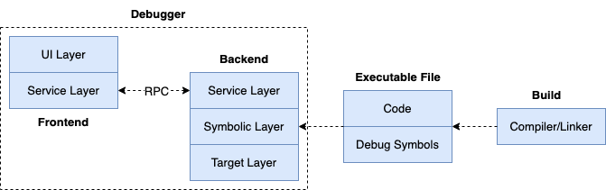

## Debugger Overview

Before implementing specific debugging actions, it's necessary to establish an implementation framework. For subsequent debugging action implementations, we only need to add debugging commands and their corresponding processing logic.

After understanding this framework, when reading the specific implementation chapters of related debugging actions, readers will naturally know how to locate the corresponding code in the project. This is important for organizing content in subsequent chapters and helping readers understand.

### Functional Requirements

The functional requirements of a debugger are quite intuitive when you think about common debugger usage experiences:

- Allow debugging executable programs, running processes, and coredump files;
- Allow automatic compilation and building of Go code, and cleanup of temporary build artifacts after debugging;
- Allow viewing source code information **list**;
- Allow disassembling binary files **disass**;
- Allow adding breakpoints in source code **breakpoint `file:lineno`**;
- Allow adding conditional breakpoints in source code **breakpoint `file:lineno` if `expr`**;
- Allow step-by-step statement execution **next**;
- Allow step-by-step instruction execution (and function entry) **step**;
- Allow exiting from functions **finish**;
- Allow displaying variable and register information **print, display**;
- Allow updating variable and register information **set**;
- Allow printing variable types **ptype**;
- Allow temporary function calls **call**;
- Allow viewing call stack information **bt**;
- Allow selecting specific stack frames **frame**;
- Allow viewing goroutines list and switching goroutine execution;
- Allow viewing threads list and switching thread execution;
- Others;

The functional requirements of a debugger are relatively intuitive, and requirements may change, with functions being adjusted accordingly.

For example, during debugging, we often accidentally miss a crucial event and want to go back a few statements to continue debugging. Usually, we can only **restart** the debugging session, add a breakpoint at the event location, then **continue**. When the codebase is large or the event is not easily reproducible, this approach may not be sufficient.

To further improve debugging convenience, we can add **record and replay** functionality to the debugger. This feature can track and record the debugging process and replay it when needed, making it much more convenient.

> Note: After implementing the main content of instruction-level and symbol-level debugging, we will introduce specific implementation projects for record and replay in the debugging field, such as [mozilla/rr](https://github.com/rr-debugger/rr): You record a failure once, then debug the recording, deterministically, as many times as you want ...

### Non-functional Requirements

Just as product development needs to focus on user experience, so does debugger development. We need to consider how to make it convenient and smooth for developers from their perspective.

For a debugger, because we switch between various tasks, it's necessary to flexibly run debugging commands. However, implementing command input for a command-line-based debugger is not an easy task.

- First, debuggers have many debugging commands, and memorizing these commands has a certain learning curve. Command-line-based debuggers have a steeper learning curve than GUI-based debuggers;
- Command-line-based debuggers display their UI in terminal text mode rather than graphical mode, meaning they can't flexibly display multiple pieces of information like GUI interfaces, such as simultaneously showing source code, breakpoints, variables, registers, and call stack information;
- Command-line-based debuggers need to consider the efficiency of debugging command input, such as entering commands and their parameters. Adding a breakpoint in a GUI debugger is usually simple - just a mouse click - but command-line debuggers require users to explicitly provide a source location, like "break main.go:15" or "break main.main";
- For the many debugging commands, we need to consider command auto-completion, parameter auto-completion, and if supported, aliases would be a good option. Debuggers also need to remember the last used debugging command for easy reuse, such as frequently executing the command sequence <next, next, next>, which can be replaced by <next, enter, enter>, where the enter key defaults to using the last command, making it more convenient for users;
- Debuggers have multiple startup methods, corresponding to multiple startup commands, such as `godbg exec <prog>`, `godbg debug <module>`, `godbg attach <pid>`, `godbg core <coredump>`, each with different parameters. Additionally, debuggers have various interactive debugging commands, such as `break <locspec>`, `break <locspec> cond <expression>`, etc., each with different parameters. How to efficiently and reasonably manage these commands is something to consider;
- Good products shape user habits, but better habits should only be known by users themselves. A configurable debugger is more appropriate, such as allowing users to customize command aliases, etc.;
- The debugger itself may need to consider future applications, whether it has sufficient adaptability for use in various application scenarios, such as whether it can be used in IDEs like GoLand, VSCode, or possible remote debugging scenarios. These also place requirements on the software architecture design of the debugger itself;
- Extensibility: Besides ease of use, we also need to consider its future extensibility, how to support a new programming language, how to support program debugging with different debugging information standards, how to easily integrate with other development tools;
- Robustness and correctness: How to ensure the robustness and correctness of the debugger itself can be improved through test coverage;
- Other non-functional requirements.

### Technical Solution

The technical solution here will initially focus on the following points.

#### Extensibility Design

The debugger should have good extensibility design to support interactions in different application scenarios, such as debugging in the command line, debugging in IDEs, and remote debugging.

This also requires the debugger's "**frontend**" and "**backend**" to implement a separated architecture, because we might debug a process running on a Linux machine from a macOS machine, where the frontend and backend operating environments might be completely different in terms of operating system and hardware platform.

Here's a brief mention of the general architecture of a well-designed symbol-level debugger:


The debugger needs to include UI Layer, Symbolic Layer, and Target Layer:

- UI Layer: Mainly responsible for user interaction, receiving user input and displaying debugging information, such as showing variable values and stack information. Separating the UI layer makes it easier to separate user interaction logic from core debugging logic, facilitating changes or support for different user interfaces.
- Symbolic Layer: Mainly responsible for parsing and managing symbol information, such as variable names, function names, conversion between source code locations and memory addresses, data, etc. It's the core part of the debugger, connecting user operations with the debugging logic of the target program. Separating the symbolic layer makes it easier to support different programming languages and debugging information formats.
- Target Layer: The target layer directly interacts with the debugged program, responsible for executing debugging commands to control the process and read/write data, such as setting breakpoints, single-step execution, reading memory and register data, etc. Separating the target layer makes it more convenient to support different target platforms, such as different operating systems and hardware architectures.

Considering the future application scenarios of the debugger, the design might be further adjusted, such as introducing a Service Layer:



We further divide the debugger architecture into frontend and backend:

- Frontend focuses on user interaction logic, completing the triggering of debugging actions and display of results;
- Backend focuses on the underlying implementation related to target processes and platform characteristics, receiving debugging commands from the frontend and returning corresponding results for display in the frontend;
- The bridge between frontend and backend is the newly introduced service layer, where frontend and backend can communicate through RPC.

#### Debug Command Management

[spf13/cobra](https://github.com/spf13/cobra) is an open-source command-line program development framework based on Go, with the following features:

- Supports quick addition of commands;
- Supports adding subcommands to specified commands;
- Supports comprehensive display of help information;
- Supports POSIX-style parameter parsing;
- Supports parameter parsing for common data types;
- Supports specifying required parameters for commands;
- Supports generating shell auto-completion scripts;
- And more;

It can be said that cobra is an excellent command-line program development framework, used in many large open-source projects such as kubernetes, hugo, github-cli gh, etc. In my personal projects, many also use cobra for command and subcommand management.

Using cobra to manage debugging commands will bring us great convenience. For commands and options management like `godbg exec <proc>`, `godbg attach <pid>`, cobra is more than sufficient, providing good support with default settings.

However, there are exceptions. Besides the "start debugging" related commands mentioned above, debuggers also have many debugging commands used in debugging sessions, such as breakpoint-related, call stack-related, viewing source code, variables, registers, etc. To help developers easily view debugging commands they're interested in and their help information, we can't simply sort and display all debugging commands - necessary grouping is very helpful.

For example, we can categorize break and clear operations related to adding/removing breakpoints into the "**[breakpoint]**" group, categorize print, display, list and other viewing-related operations into the "**[show]**" group, categorize backtrace, frame and other stack frame-related operations into the "**[frames]**" group, etc.

cobra provides a property cobra.Command.Annotations for each command, which is a map type that can add some key-value attribute information to each command, and then perform some custom operations like grouping based on this:

```go
breakCmd.Annotation["group"] = "breakpoint"
clearCmd.Annotation["group"] = "breakpoint"
printCmd.Annotation["group"] = "show"
frameCmd.Annotation["group"] = "frames"
```

Above, we grouped several commands according to their functions. If we use debugRootCmd to represent the top-level command, we can customize the Use method of debugRootCmd. Inside the method, we traverse all subcommands, group them according to their Annotation["group"] attribute, and then display the help information.

When viewing help information, you'll get the following grouped display style (instead of the default list style), which is more convenient and organized:

```bash
[breakpoint]
break : break <locspec>, add breakpoint
clear : clear <n>, clear breakpoint

[show]
print : print <variable>, display variable information

[frames]
frame : frame <n>, select corresponding stack frame
```

In summary, whether it's the commands when starting the debugger or the debugging commands that need to be interactively typed in the debugging session, we can safely use cobra to complete them. cobra can well meet our development needs.

#### Input Auto-completion

We listed many functional requirements above, each basically corresponding to one or several debugging commands, each command having different options. During debugging, we might forget how to use commands.

When we forget, we have to interrupt the debugging session, which is an inefficient process. Imagine having to execute the help command to view help information, which will pollute our debugging session and distract our attention. So as a debugger product designer and developer, we should further explore the need to "view help" information.

Users do need to view help information, but not necessarily through the help form. We can provide auxiliary input prompt information while they're entering commands. Auto-completion is a good method.

Auto-completion is not unfamiliar to us. Many commands we use in the shell have auto-completion functionality, including command-line applications developed with cobra itself, which also support generating shell auto-completion scripts (importing them can implement auto-completion functionality).

[go-prompt](https://github.com/c-bata/go-prompt) is a good auto-completion library. It can automatically provide auto-completion candidate lists based on user input during program execution, and supports multiple option settings, such as candidate list color, selected list item color, etc. It can be said that go-prompt is a very good choice, but we want more.

As mentioned earlier, if we want to manage debugging commands in the debugging session, we prefer to manage them through cobra, and after some thought, we found it's feasible. If we directly use go-prompt for auto-completion, we might have to manage these commands ourselves.

Alternatively, we can combine the advantages of both. [cobra-prompt](https://github.com/stromland/cobra-prompt) is here to solve this problem. It integrates go-prompt and cobra well, both utilizing cobra's command management and leveraging go-prompt's auto-completion advantages. The implementation principle of cobra-prompt is simple - it just needs to appropriately process the user input obtained by go-prompt and pass it to cobra debugRootCmd for processing.

> The debugger implementation provided in this book initially used cobra-prompt for development, but for some reasons, it was eventually replaced with liner, because cobra-prompt's auto-completion functionality sometimes also interferes with the debugging session and may not really provide substantial help.
>
> Finally, we use liner to read user-typed debugging commands and execute debugging actions through cobra's command management. In short, we still have auto-completion capability, just giving up the go-prompt-like auto-completion method.

### Code Implementation

For mainstream debugger implementations in the industry, they generally divide them into frontend and backend, communicating through a service layer. GDB, Delve, etc., are no exception.

The debugger implementation provided in this book starts from the perspective of popularizing debugger knowledge, so we focus more on the design and implementation of the debugger's underlying logic. We actually provide two versions of debugger implementation.

- Instruction-level debugger implementation: It's a simple debugger implementation based on a 3-layer architecture of UI layer, symbolic layer, and target layer. The implementation approach is reflected in the descriptions of each part of this section. The complete version of the instruction-level debugger implementation provided in this book is available at [hitzhangjie/godbg](https://github.com/hitzhangjie/godbg). To help everyone learn step by step according to the chapters, this book also provides code examples organized by chapters for developing the debugger progressively, available at [hitzhangjie/golang-debugger-lessons](https://github.com/debugger101/golang-debugger-lessons).
- Symbol-level debugger implementation: Initially, we hoped to write a symbol-level debugger from scratch, but the development workload was a bit large, so we finally tended to trim go-delve/delve to complete the symbol-level debugging part with less code and time, presenting the most core design and implementation points to everyone. The corresponding source code is available at [hitzhangjie/tinydbg](https://github.com/hitzhangjie/tinydbg).

Readers are welcome to download and experience it. If you find any issues or have better suggestions, please leave a message in the issues of this book's project :)

> Note: The updates of this e-book have been intermittent, and many things have happened in these years. Updates resumed on 2023.8.6. Must complete this year, :muscle:
> Note: Shit! I don't know how many times I've set this flag. Today is 2025.2.18, and in the past year, "Delta Force" was launched for a tough battle, really had no time to continue updates. Maybe can complete it in the first half of this year!
>      I'm planning to use AI to help translate it into English, maybe can attract some contributors who are also interested.
