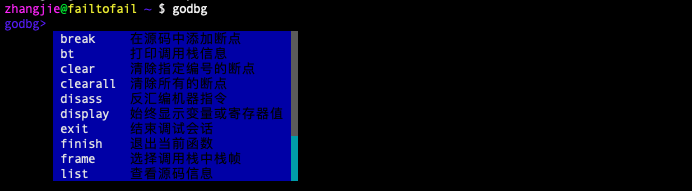

## Debugger Skeleton

Based on our previous considerations, we have initially implemented a debugger skeleton called `godbg`, which roughly includes the interactive capabilities we need. Later, we will implement instruction-level debugging and symbol-level debugging step by step on this foundation.

Let's first look at the execution effect of godbg, then briefly introduce the source code organization to help readers understand which part of the code corresponds to the explained functionality points. This will make it easier to match subsequent new chapter content and source code.

### Running Effect

#### Debugger Help Information

`godbg help` is used to display help information when starting the debugger. We can see it has several subcommands: attach, core, and exec, which correspond to different ways of starting the debugger, and help is used to view the help information for godbg and the above debugging commands.

```bash
$ godbg help

godbg is a symbol-level debugger for Go programs, developed with learning as the driving purpose.
We hope our work can open a door to understanding the computer world for more people. You're welcome!

Usage:
  godbg [flags]
  godbg [command]

Available Commands:
  attach      Debug running process
  core        Debug core dump
  exec        Debug executable program
  help        Help about any command

Flags:
      --config string   config file (default is $HOME/.godbg.yaml)
  -h, --help            help for godbg

Use "godbg [command] --help" for more information about a command.
```

#### Debugger Debugging Session Interface

When godbg starts, it will list the debugger's supported command information by popping up a prompt list. This is only shown once when godbg starts. To ensure the debugging session is not polluted, no prompt information is displayed when there is no user input.

After the debugger starts successfully, it will use "**godbg>**" to indicate the current debugging session. We enter debugging commands in this session to complete corresponding debugging actions.



Taking the clear breakpoint operation as an example, clear is for clearing a single breakpoint, and clearall is for clearing all breakpoints. When we type `cl`, it can match both `clear` and `clearall` commands. Developers can move through the candidate list using the `tab` key or `arrow-down`, and select a list item with `enter`.


Let's look at another example of command parameter auto-completion. Taking the list command for viewing source code as an example, it will return source code information involved in the process, such as main.go and helloworld.go here, making it easier for users to choose and debug.


This is the running effect display of the debugging session interface.

> NOTE: It's necessary to mention that this section was written based on the debugger version implemented with cobra-prompt. In subsequent development, we removed the cobra-prompt auto-completion method and switched to an auto-completion method that causes less interference to users. The documentation hasn't been updated yet.
>
> Readers don't need to worry too much, as this inconsistency won't bring much burden to learning. Later, we will update the interaction interface based on the latest implementation.

#### Displaying Help Information in Session

The debugger supports multiple debugging commands in the debugging session. What are the functions of these debugging commands, and how are they used?

Running the help command "**godbg> help**" inside the debugger will list all commands supported by the debugger and their function descriptions, and these commands are categorized by function. For example, breakpoint-related commands break, clear, and clearall are all placed under the "**[breakpoint]**" group, code-related commands like list and disass are all placed under the "**[code]**" group, control flow-related commands like next, step, and finish are all placed under "**[ctrlflow]**", and there are other debugging commands.

```bash
godbg> help
interactive debugging commands

[breakpoint]
break <locspec> :    Add breakpoint in source code
clear <n>       :    Clear breakpoint with specified number
clearall <n>    :    Clear all breakpoints

[code]
disass <locspec>:    Disassemble machine instructions
list <linespec> :    View source code information

[ctrlflow]
finish          :    Exit current function
next            :    Execute one statement
step            :    Execute one instruction

[information]
bt              :    Print call stack information
display <var|reg>:    Always display variable or register value
frame           :    Select stack frame in call stack
print <var|reg> :    Print variable or register value
ptypes <variable>:    Print variable type information
set <var|reg>=<value>:    Set variable or register value

[other]
exit            :    End debugging session
help [command]  :    Help about any command
```

If you want to know how to use a specific debugging command in detail, you can run "**godbg> help `cmd`**". For example, to view the usage of the break command, run "**godbg> help break**".

#### Executing Debugging Commands in Session

Here, let's demonstrate how to execute debugging actions in the debugging session using displaying source code information as an example. Execute the debugging command "**godbg> list main.go**" in the debugging session to display source code information in main.go.

```bash
godbg> list main.go
list codes in file
```

We tried running the command `list main.go` and found that it only output one line of statement without actually printing the source code.

Don't worry, this is what we mentioned earlier - this is just a debugger skeleton. We have indeed set up the framework, and in the following chapters, we will implement each command step by step, first implementing the instruction-level debugger, then the symbol-level debugger.

### Code Implementation

For the debugger code, see: [golang-debugger-lessons/0_godbg](https://github.com/debugger101/golang-debugger-lessons/tree/master/0_godbg). Let's take a brief look at the implementation.

#### Directory Structure

The source code directory structure of godbg is as follows (some file entries are omitted to save space):

```bash
tree godbg
godbg                         : Project root directory
├── LICENSE                   : Copyright information
├── cmd                       : Commands for starting debugging
│   ├── root.go               : rootCmd binds subcommands core, exec, attach
│   ├── attach.go
│   ├── core.go
│   ├── exec.go
│   ├── debug                 : Debugging commands available in debugging session
│   │   ├── root_debug.go     : debugRootCmd binds many debugging session commands
│   │   ├── backtrace.go
│   │   ├── break.go
│   │   ├── clear.go
│   │   ├── clearall.go
│   │   ├── disass.go
│   │   ├── display.go
│   │   ├── exit.go
....
├── go.mod
├── go.sum
├── main.go                  : Program entry point main.main
├── syms                     : Symbol layer, for implementing mapping between instruction addresses and source code, symbol lookup, etc.
└── target                   : Target layer, for implementing low-level operations, such as instruction patch for setting breakpoints, etc.
    ├── backtrace.go
    ├── breakpoint.go
    ├── call.go
    ├── continue.go
    ├── disassemble.go
    ....

```

We can see that we have already included most of the commands needed for debugging, but they haven't been implemented yet. We will implement each debugging command step by step later. The functional logic of command implementation may involve the corresponding `${command}.go` file, as well as related code in the symbol layer syms package and target layer target package.

After introducing the code organization, when explaining the implementation of a debugging command or functionality later, readers should be able to quickly find the corresponding implementation code.

#### Source Code Analysis: Command Management Logic

Those familiar with cobra programming will know that this debugger is based on cobra for command management after reading main.go.

```go
package main

import "godbg/cmd"

func main() {
	cmd.Execute()
}
```

The subcommands exec, debug, and core under godbg correspond to cmd/exec.go, cmd/debug.go, and cmd/core.go respectively. They are all subcommands of rootCmd defined in cmd/root.go.

```go
var rootCmd = &cobra.Command{
	Use:   "godbg",
	Short: "godbg is a symbol-level debugger for Go language",
	Long: `
godbg is a symbol-level debugger for Go programs, developed with learning as the driving purpose.
We hope our work can open a door to understanding the computer world for more people. You're welcome!`,
	// Uncomment the following line if your bare application
	// has an action associated with it:
	Run: func(cmd *cobra.Command, args []string) {
		// TODO comment out this, this should be enabled only in debugging phase
		debug.NewDebugShell().Run()
	},
}
```

When we execute godbg, it executes the `rootCmd.Run()` logic. When we execute `godbg exec`, it executes the `execCmd.Run()` logic. This is easy to understand and get started with.

```go
var execCmd = &cobra.Command{
	Use:   "exec <prog>",
	Short: "Debug executable program",
	Long:  `Debug executable program`,
	Run: func(cmd *cobra.Command, args []string) {
		// TODO start process and attach
		fmt.Printf("exec %s\n", strings.Join(args, ""))
	  
		debug.NewDebugShell().Run()
	},
}

func init() {
	rootCmd.AddCommand(execCmd)
}
```

The above is the exec command to be executed when `godbg exec <prog>`. It first starts the process and attaches to it. After preparation is complete, it starts a debugging session where we continue to input debugging commands for debugging.

#### Source Code Analysis: Debugging Session Command Management

godbg/cmd/debug/root_debug.go contains a command manager built using cobra-prompt, which combines cobra command management with go-prompt's auto-suggestion and completion capabilities. It's very suitable for managing scenarios with many commands, many command options, many command candidate parameters, and frequent command usage, such as in debugging sessions.

Just execute `debug.NewDebugShell().Run()` to quickly simulate the logic of user input, execution processing, and completion of debugging information display in a debugging session.

```go
// NewDebugShell creates an interaction manager specifically for debugging
func NewDebugShell() *cobraprompt.CobraPrompt {

	fn := func() func(cmd *cobra.Command) error {
		return func(cmd *cobra.Command) error {
			usage := groupDebugCommands(cmd)
			fmt.Println(usage)
			return nil
		}
	}
	debugRootCmd.SetUsageFunc(fn())

	return &cobraprompt.CobraPrompt{
		RootCmd:                debugRootCmd,
		DynamicSuggestionsFunc: dynamicSuggestions,
		ResetFlagsFlag:         true,
		GoPromptOptions: []prompt.Option{
			prompt.OptionTitle(description),
			prompt.OptionPrefix(prefix),
			prompt.OptionSuggestionBGColor(prompt.DarkBlue),
			prompt.OptionDescriptionBGColor(prompt.DarkBlue),
			prompt.OptionSelectedSuggestionBGColor(prompt.Red),
			prompt.OptionSelectedDescriptionBGColor(prompt.Red),
			// here, hide prompt dropdown list
			// TODO do we have a better way to show/hide the prompt dropdown list?
			prompt.OptionMaxSuggestion(10),
			prompt.OptionShowCompletionAtStart(),
		},
		EnableSilentPrompt: true,
		EnableShowAtStart:  true,
	}
}
```

For the implementation of custom auto-suggestion information, you can refer to the function implementation `dynamicSuggestions(string, prompt.Document)`.

```go
func dynamicSuggestions(annotation string, _ prompt.Document) []prompt.Suggest {
	switch annotation {
	case suggestionListSourceFiles:
		return GetSourceFiles()
	default:
		return []prompt.Suggest{}
	}
}

// list 输入list时返回候选源文件名作为提示补全信息
func GetSourceFiles() []prompt.Suggest {
	return []prompt.Suggest{
		{Text: "main.go", Description: "main.go"},
		{Text: "helloworld.go", Description: "helloworld.go"},
	}
}
```

需要注意的是cobra-prompt规定了cobra command只有添加了 `<cobraprompt.CALLBACK_ANNOTATION,"value">`的annotation项之后才会激发命令参数的自动补全逻辑。以list命令将源文件列表作为补全信息为例，list命令在Annotations这个map字段中添加了CALLBACK_ANNOTATION的kvpair.

```go
var listCmd = &cobra.Command{
	Use:     "list <linespec>",
	Short:   "查看源码信息",
	Aliases: []string{"l"},
	Annotations: map[string]string{
		cmdGroupKey:                     cmdGroupSource,
		cobraprompt.CALLBACK_ANNOTATION: suggestionListSourceFiles,
	},
	Run: func(cmd *cobra.Command, args []string) {
		fmt.Println("list codes in file")
	},
}
```

调试会话中运行 `list main.go`

```bash
godbg> list main.go
list codes in file
```

我们试运行命令 `list main.go`发现输出了一行语句，代表命令已经顺利执行了，我们后面会实现真实的展示源代码的功能。

Now, we've roughly introduced the skeleton of godbg, and I believe that readers are eager to enter the next step of development :) .

> Note：在该调试器demo的完整版实现中，详见 [hitzhangjie/godbg](https://github.com/hitzhangjie/godbg) 中，我们已经彻底移除了cobraprompt，动态提示对调试会话干扰性有点大，在其他的非高频输入的命令行程序中使用更合适。
