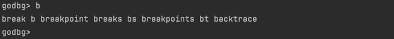

## Debug Session

### Implementation Goal: Establishing a Debug Session

To make the debugging process more convenient, we may have some functional and non-functional requirements:

- Remember the last executed debug command, allowing it to be repeated by pressing "Enter" to avoid re-typing;
- Remember the list of executed commands, making it easy to quickly find recently used commands using "up/down" keys;
- Remember the list of variable names to display, allowing tracking of multiple variable values simultaneously during debugging;
- Remember previously added breakpoints, enabling quick viewing of the breakpoint list or selective clearing of breakpoints;
- Maintain a list of debug-related commands and their help information for quick reference and command usage;
- After completing a debugging session, quickly initiate a new debugging session based on the current process;
- During a debugging session, be able to step back a few states to return to a previous state;
- Minimize the cost of typing debug commands and parameter information to reduce usage and memory burden;
- Others;

We can actually think of more ideas, and behind these ideas is the desire for the debugger to provide a flexible user interface that not only offers various debugging commands and usage help but also maintains the current debugging state to provide more rich capabilities.

This is essentially a debug session that records and tracks user debugging settings and states, making it more convenient to assist users in completing debugging tasks. We need to build a debug session for users.

### Code Implementation

When our debugger (tracer) successfully tracks the debugged process (tracee), we can create a debug session.

`godbg exec <prog>`, when a process is started and tracked this way, we can implement `debug.NewDebugShell().Run()` to create and start a debug session. In this section, we'll introduce the implementation details of the debug session. After reading this, you'll be familiar with using cobraprompt, or you can use liner as an alternative to implement different styles of debug sessions.

#### Command Management Based on Cobra

In the previous sections 1, 2, and 3, our example programs used `os.Args[1]` to determine godbg's subcommands and switch to corresponding processing logic. After implementing the debug session, we also need to frequently read other commands from user input, such as break, continue, next, etc. Each command corresponds to different processing logic. If we write everything like in the previous sections, our code will quickly become lengthy and unmanageable.

Earlier, we mentioned using the cobra command-line framework to manage debug commands like exec, attach, help, and various debugging commands in the debug session.

First, let's look at a simple example of building a command-line tool using cobra:

```go
package main

import (
  "fmt"

  "github.com/spf13/cobra"
)

func main() {

  // Create root command
  var rootCmd = &cobra.Command{
    Use:   "demo", 
    Short: "A command-line application based on cobra",
    Long: `spf13/cobra is a very easy-to-use Go command-line tool development framework. This is a demo program demonstrating the usage of spf13/cobra.`,  
  }

  // Create a version command
  var versionCmd = &cobra.Command{
    Use:   "version",
    Short: "Print version information",
    Long: `The version subcommand will print the application's version information`,
    Run: func(cmd *cobra.Command, args []string) {
      fmt.Println("Demo App v1.0")  
    },
  }

  // Add version command as a subcommand of root command
  rootCmd.AddCommand(versionCmd)

  // Execute root command
  rootCmd.Execute()
}
```

In the above example, we:

1. Create a root command "demo"
2. Create a "version" subcommand for printing version information
3. Add the "version" command as a subcommand of "demo"
4. Execute the root "demo" command

This builds a simple command-line tool with a "version" subcommand for printing the version string. Cobra makes building command-line interfaces simple. We can continue adding more subcommands to the root command to build functionality.

In actual development, to quickly add commands and subcommands, you can use [spf13/cobra-cli](https://github.com/spf13/cobra-cli), such as `cobra-cli add xxxCmd --parent rootCmd`, which will add a subcommand xxxCmd to rootCmd, and you can also add subcommands to xxxCmd.

Actually, by the time you read this, we have already refactored godbg based on the spf13/cobra command management framework to make it easier to manage commands and implement functionality. You'll see this in the subsequent debug session examples.

#### Implementation Based on Cobraprompt

The implementation based on cobraprompt focuses on its auto-completion convenience, and the implementation approach is relatively simple:

- Using cobra's command management capabilities, we create a debugRootCmd and register other debugging commands on it, such as breakpoint, list, step, continue, exit, etc. Each subcommand corresponds to a cobra.Command implementation;
- prompt has the ability to prompt user input, obtain and validate user input, and dynamically complete input. cobraprompt is a combination of cobra and prompt. Its role is to use prompt to get user input commands, support auto-completion during input, and when the user inputs the correct debugging command and parameters, pass the parameter information to the corresponding subcommand registered on debugRootCmd for execution, such as when the user types exit, execute the exitCmd logic;
- To help users quickly view help information for debugging commands, we need to group the numerous debugging commands. Therefore, we need to customize the help information for debugging commands. We use annotations of each subcommand to indicate its command group (such as breakpoint commands 1-breaks, source code commands 2-source), and then use a custom help function `helpMessageByGroups(rootCmd *cobra.Command)` to extract help information for all subcommands registered under rootCmd and summarize them by group;
- For detailed help information of a specific subcommand, it is still managed by cobra debugRootCmd itself;

```go
package debug

import (
	"bytes"
	"fmt"
	"sort"
	"strings"

	"github.com/c-bata/go-prompt"
	"github.com/hitzhangjie/godbg/target"
	cobraprompt "github.com/stromland/cobra-prompt"

	"github.com/spf13/cobra"
)

const (
	cmdGroupAnnotation = "cmd_group_annotation"

	cmdGroupBreakpoints = "1-breaks"
	cmdGroupSource      = "2-source"
	cmdGroupCtrlFlow    = "3-execute"
	cmdGroupInfo        = "4-info"
	cmdGroupOthers      = "5-other"
	cmdGroupCobra       = "other"

	cmdGroupDelimiter = "-"

	prefix    = "godbg> "
	descShort = "godbg interactive debugging commands"
)

const (
	suggestionListSourceFiles = "ListSourceFiles"
)

var (
	TraceePID   int
	breakpoints = map[uintptr]*target.Breakpoint{}
)

var debugRootCmd = &cobra.Command{
	Use:   "help [command]",
	Short: descShort,
}

// NewDebugShell creates an interactive manager specifically for debugging
func NewDebugShell() *cobraprompt.CobraPrompt {

	fn := func(cmd *cobra.Command, args []string) {
		// Description information
		fmt.Println(cmd.Short)
		fmt.Println()

		// Usage information
		fmt.Println(cmd.Use)
		fmt.Println(cmd.Flags().FlagUsages())

		// Command grouping
		usage := helpMessageByGroups(cmd)
		fmt.Println(usage)
	}
	debugRootCmd.SetHelpFunc(fn)

	return &cobraprompt.CobraPrompt{
		RootCmd:                debugRootCmd,
		DynamicSuggestionsFunc: dynamicSuggestions,
		ResetFlagsFlag:         false,
		GoPromptOptions: []prompt.Option{
			prompt.OptionTitle(descShort),
			prompt.OptionPrefix(prefix),
			prompt.OptionSuggestionBGColor(prompt.DarkBlue),
			prompt.OptionDescriptionBGColor(prompt.DarkBlue),
			prompt.OptionSelectedSuggestionBGColor(prompt.Red),
			prompt.OptionSelectedDescriptionBGColor(prompt.Red),
			// here, hide prompt dropdown list
			// TODO do we have a better way to show/hide the prompt dropdown list?
			prompt.OptionMaxSuggestion(10),
			prompt.OptionShowCompletionAtStart(),
			prompt.OptionCompletionOnDown(),
		},
		EnableSilentPrompt: true,
		EnableShowAtStart:  true,
	}
}

// helpMessageByGroups groups commands and displays help information
func helpMessageByGroups(cmd *cobra.Command) string {

	// key:group, val:sorted commands in same group
	groups := map[string][]string{}
	for _, c := range cmd.Commands() {
		// If no command group is specified, put it in the other group
		var groupName string
		v, ok := c.Annotations[cmdGroupAnnotation]
		if !ok {
			groupName = "other"
		} else {
			groupName = v
		}

		groupCmds, ok := groups[groupName]
		groupCmds = append(groupCmds, fmt.Sprintf("  %-16s:%s", c.Name(), c.Short))
		sort.Strings(groupCmds)

		groups[groupName] = groupCmds
	}

	if len(groups[cmdGroupCobra]) != 0 {
		groups[cmdGroupOthers] = append(groups[cmdGroupOthers], groups[cmdGroupCobra]...)
	}
	delete(groups, cmdGroupCobra)

	// Sort by group name
	groupNames := []string{}
	for k, _ := range groups {
		groupNames = append(groupNames, k)
	}
	sort.Strings(groupNames)

	// Group by group and sort commands within groups
	buf := bytes.Buffer{}
	for _, groupName := range groupNames {
		commands, _ := groups[groupName]

		group := strings.Split(groupName, cmdGroupDelimiter)[1]
		buf.WriteString(fmt.Sprintf("- [%s]\n", group))

		for _, cmd := range commands {
			buf.WriteString(fmt.Sprintf("%s\n", cmd))
		}
		buf.WriteString("\n")
	}
	return buf.String()
}

func dynamicSuggestions(annotation string, _ prompt.Document) []prompt.Suggest {
	switch annotation {
	case suggestionListSourceFiles:
		return GetSourceFiles()
	default:
		return []prompt.Suggest{}
	}
}

func GetSourceFiles() []prompt.Suggest {
	return []prompt.Suggest{
		{Text: "main.go", Description: "main.go"},
		{Text: "helloworld.go", Description: "helloworld.go"},
	}
}

```

#### Implementation Based on Liner

We already have an auto-completion implementation based on cobraprompt, so why do we also provide a version based on liner? When the author first attempted to implement the debug session, it was based on cobraprompt. At that time, the author thought cobraprompt's auto-completion capability was very convenient and cool, so it was highly praised. However, as debugging activities increased, the author gradually realized: **During debugging, maintaining user focus on problem exploration and reducing interference to users is more important than simply pursuing coolness and convenience itself**.

```go
package debug

import (
	"bytes"
	"fmt"
	"sort"
	"strings"

	"github.com/peterh/liner"
	"github.com/spf13/cobra"
)

const (
	cmdGroupAnnotation = "cmd_group_annotation"

	cmdGroupBreakpoints = "1-breaks"
	cmdGroupSource      = "2-source"
	cmdGroupCtrlFlow    = "3-execute"
	cmdGroupInfo        = "4-info"
	cmdGroupOthers      = "5-other"
	cmdGroupCobra       = "other"

	cmdGroupDelimiter = "-"

	prefix    = "godbg> "
	descShort = "godbg interactive debugging commands"
)

const (
	suggestionListSourceFiles = "ListSourceFiles"
)

var debugRootCmd = &cobra.Command{
	Use:   "help [command]",
	Short: descShort,
}

var (
	CurrentSession *DebugSession
)

// DebugSession 调试会话
type DebugSession struct {
	done   chan bool
	prefix string
	root   *cobra.Command
	liner  *liner.State
	last   string

	defers []func()
}

// NewDebugSession 创建一个debug专用的交互管理器
func NewDebugSession() *DebugSession {

	fn := func(cmd *cobra.Command, args []string) {
		// 描述信息
		fmt.Println(cmd.Short)
		fmt.Println()

		// 使用信息
		fmt.Println(cmd.Use)
		fmt.Println(cmd.Flags().FlagUsages())

		// 命令分组
		usage := helpMessageByGroups(cmd)
		fmt.Println(usage)
	}
	debugRootCmd.SetHelpFunc(fn)

	return &DebugSession{
		done:   make(chan bool),
		prefix: prefix,
		root:   debugRootCmd,
		liner:  liner.NewLiner(),
		last:   "",
	}
}

func (s *DebugSession) Start() {
	s.liner.SetCompleter(completer)
	s.liner.SetTabCompletionStyle(liner.TabPrints)

	defer func() {
		for idx := len(s.defers) - 1; idx >= 0; idx-- {
			s.defers[idx]()
		}
	}()

	for {
		select {
		case <-s.done:
			s.liner.Close()
			return
		default:
		}

		txt, err := s.liner.Prompt(s.prefix)
		if err != nil {
			panic(err)
		}

		txt = strings.TrimSpace(txt)
		if len(txt) != 0 {
			s.last = txt
			s.liner.AppendHistory(txt)
		} else {
			txt = s.last
		}

		s.root.SetArgs(strings.Split(txt, " "))
		s.root.Execute()
	}
}

func (s *DebugSession) AtExit(fn func()) *DebugSession {
	s.defers = append(s.defers, fn)
	return s
}

func (s *DebugSession) Stop() {
	close(s.done)
}

func completer(line string) []string {
	cmds := []string{}
	for _, c := range debugRootCmd.Commands() {
		// complete cmd
		if strings.HasPrefix(c.Use, line) {
			cmds = append(cmds, strings.Split(c.Use, " ")[0])
		}
		// complete cmd's aliases
		for _, alias := range c.Aliases {
			if strings.HasPrefix(alias, line) {
				cmds = append(cmds, alias)
			}
		}
	}
	return cmds
}

// helpMessageByGroups 将各个命令按照分组归类，再展示帮助信息
func helpMessageByGroups(cmd *cobra.Command) string {

	// key:group, val:sorted commands in same group
	groups := map[string][]string{}
	for _, c := range cmd.Commands() {
		// 如果没有指定命令分组，放入other组
		var groupName string
		v, ok := c.Annotations[cmdGroupAnnotation]
		if !ok {
			groupName = "other"
		} else {
			groupName = v
		}

		groupCmds, ok := groups[groupName]
		groupCmds = append(groupCmds, fmt.Sprintf("  %-16s:%s", c.Name(), c.Short))
		sort.Strings(groupCmds)

		groups[groupName] = groupCmds
	}

	if len(groups[cmdGroupCobra]) != 0 {
		groups[cmdGroupOthers] = append(groups[cmdGroupOthers], groups[cmdGroupCobra]...)
	}
	delete(groups, cmdGroupCobra)

	// 按照分组名进行排序
	groupNames := []string{}
	for k, _ := range groups {
		groupNames = append(groupNames, k)
	}
	sort.Strings(groupNames)

	// 按照group分组，并对组内命令进行排序
	buf := bytes.Buffer{}
	for _, groupName := range groupNames {
		commands, _ := groups[groupName]

		group := strings.Split(groupName, cmdGroupDelimiter)[1]
		buf.WriteString(fmt.Sprintf("- [%s]\n", group))

		for _, cmd := range commands {
			buf.WriteString(fmt.Sprintf("%s\n", cmd))
		}
		buf.WriteString("\n")
	}
	return buf.String()
}

```

### 代码测试

#### 基于cobraprompt实现

Although based on cobraprompt implementation has been abandoned by the author, for consistency with the previous content, since we discussed the implementation, we should also introduce its running effect. Moreover, readers might be interested in this style of auto-completion, so let's demonstrate the running effect.

After the debugger starts successfully, it will use "**godbg>**" to indicate the current debug session. We input debug commands in this debug session to perform corresponding debugging actions.

> If you want to test this code yourself, you need to check out version 8c07fbd of [hitzhangjie/godbg](https://github.com/hitzhangjie/godbg), then execute `go install -v` in the project directory to complete the installation, and then proceed with testing.

This code is located in the repo [hitzhangjie/godbg](https://github.com/hitzhangjie/godbg). Execute `go install -v` to try it out.

After the debugger starts, it creates a debug session. The debug session still uses "**godbg>**" as the input prompt. When we enter the help command, it displays the help information for various debug commands grouped together, which is very intuitive.


Let's look at the auto-completion prompts. The debugger assumes it already supports the breakpoint command (with aliases break or b), all breakpoints command (with alias bs), and call stack command backtrace (with alias bt).

When we enter the character "b" and press "TAB", we can see that all the breakpoint, call stack, and related commands and their alias forms are displayed. At this point, users can get hints on how to continue inputting. For example, if it's a breakpoint type, according to the prompt, they can input the letter "r". After we input "r", continue to input "TAB" and it will auto-complete to "break", with multiple options. At this point, we can continue typing the letter "p" to auto-complete to "breakpoint". If what we want to input is "breakpoint", we can just press Enter.



#### 基于liner实现

This code is located in the repo [hitzhangjie/godbg](https://github.com/hitzhangjie/godbg). Execute `go install -v` to try it out.

After the debugger starts, it creates a debug session. The debug session still uses "**godbg>**" as the input prompt. When we enter the help command, it displays the help information for various debug commands grouped together, which is very intuitive.


Let's look at the auto-completion prompts. The debugger assumes it already supports the breakpoint command (with aliases break or b), all breakpoints command (with alias bs), and call stack command backtrace (with alias bt).

When we enter the character "b" and press "TAB", we can see that all the breakpoint, call stack, and related commands and their alias forms are displayed. At this point, users can get hints on how to continue inputting. For example, if it's a breakpoint type, according to the prompt, they can input the letter "r". After we input "r", continue to input "TAB" and it will auto-complete to "break", with multiple options. At this point, we can continue typing the letter "p" to auto-complete to "breakpoint". If what we want to input is "breakpoint", we can just press Enter.


#### 简单对比

Through the code test section, we have made a simple comparison between the debug session implemented based on cobraprompt and liner:

- The implementation based on cobraprompt is more cool and convenient, but it may cause more interference to the debugging process, which may be less conducive to users to focus on problem exploration and reduce interference to users;
- The implementation based on liner is more concise and less intrusive, and it also has the auto-completion capability we expect, which can meet our initial design requirements for the debug session, so it is used as the final implementation version.

Also, we remind readers that, as we add more features, more feature dependencies, and more code, the code examples that are simple enough to be handled in a single source file will become less and less. That is, readers may encounter a large number of test cases that require using [hitzhangjie/godbg](https://github.com/hitzhangjie/godbg) directly for testing verification. For the convenience of readers' reading and learning, we will try to follow this format specification:
- repo1 [hitzhangjie/godbg](https://github.com/hitzhangjie/godbg) will include complete examples;
- If this section's demo can be simplified to a single source file, repo2 [hitzhangjie/golang-debugger-lessons](https://github.com/hitzhangjie/golang-debugger-lessons) will still provide examples;
- If the example is only in repo1, we will clearly inform readers in the relevant section design and code test.

### Reference Content

- [spf13/cobra](https://github.com/spf13/cobra): A library for creating powerful modern CLI applications
- [spf13/cobra-cli](https://github.com/spf13/cobra-cli): A command-line tool for generating cobra applications and command files
- [c-bata/go-prompt](https://github.com/c-bata/go-prompt): Building a powerful interactive prompt in Go
- [stromland/cobra-prompt](https://github.com/stromland/cobra-prompt): A prompt for cobra
- [peterh/liner](https://github.com/peterh/liner): A pure Go line editor with history
