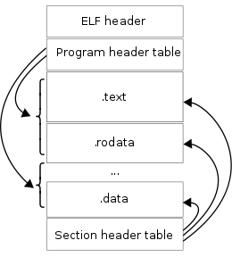

## Disassembly

### Implementation Goal: Implementing Disassembly

Disassembly is an essential part of instruction-level debugging. While symbol-level debugging needs to display source code information, instruction-level debugging needs to display assembly instructions.

Assembly instructions are closely related to hardware. In fact, assembly instructions are just mnemonics. The opcode and operands of an assembly instruction are encoded according to specified encoding methods to obtain machine instructions. Different instructions may have the same or different number of bytes for their opcodes, and the same applies to operands.

Factors such as different hardware platforms, instruction set architectures, numerous assembly instructions, and fixed-length or variable-length instruction encoding make disassembly quite challenging. It's not an easy task to implement disassembly single-handedly.

Fortunately, there's already a disassembly framework [Capstone](http://www.capstone-engine.org/) specifically designed to solve this problem. For Go language, we can consider using the Go version [Gapstone](https://github.com/bnagy/gapstone). Alternatively, we can use the official Go disassembly tool class [arch/x86/x86asm](https://golang.org/x/arch/x86/x86asm). Note that the popular Go debugger dlv also uses x86asm for disassembly operations.

For simplicity, we will use arch/x86/x86asm to complete the disassembly task. Of course, using Capstone or Gapstone is also possible. If readers are interested, they can experiment with these alternatives.

### Code Implementation

To implement disassembly operations, we mainly need to master these operations:

- How to read complete instruction data from a specified process;
- How to perform disassembly operations on a complete program;
- How to perform disassembly operations on breakpoint instructions.

#### Finding the Executable Program by PID

Many operations of tracer controlling tracee depend on the tracee's PID. If we want to read the complete instruction data of the executable program corresponding to the PID, we must first find the corresponding executable program path through the PID. How do we do this?

> Reading the memory data of the process instance corresponding to the PID directly is useless because the instruction data inside may be incomplete. Process instruction data is loaded on demand. For details, you can learn about Linux PageFault related content.

Under Linux systems, the virtual file system path `/proc/<pid>/exe` is a symbolic link that points to the absolute path of the executable program corresponding to process `pid`. In Go programs, we can read this symbolic link information to get the program path.

For example:

```go
package main

// GetExecutable gets the executable program path by PID
func GetExecutable(pid int) (string, error) {
	exeLink := fmt.Sprintf("/proc/%d/exe", pid)
	exePath, err := os.Readlink(exeLink)
	if err != nil {
    	return "", fmt.Errorf("find executable by pid err: %w", err)
	}
	return exePath, nil
}
```

#### Implementing Disassembly of Complete Program

After finding the executable program file path by PID, we can try to read the file content to prepare for disassembly. However, it's important to note that Linux binary executable program files are organized according to the `ELF (Executable and Linkable Format)` format, with a structure roughly as shown below. To read and parse ELF file data, we can use the standard library `debug/elf`.



We can see that an ELF file contains ELF Header, Program Header Table, Section Header Table, and a series of Sections. Program Header Table and Section Header Table reference these Sections.

Program Header Table and Section Header Table are specifically designed to construct two different views:

- Program Header Table constructs the segments view, describing how the loader maps referenced sections to memory space through mmap when loading the program;
- Section Header Table constructs the sections view, describing the sequential position of sections in the binary program and guiding the linker on how to perform linking;

These two views don't interfere with each other and are used to guide the design and implementation of loader and linker respectively.

> **What You Need To Know About ELF for CS452**
>
> **Two views of the world**
>
> There are two views of an ELF file. 1) The *section view* sees the file as a bunch of sections, which are to be linked or loaded in some manner. 2) The *program view* sees the file as a bunch of *ELF segments* (not to be confused with Intel segments) which are to be loaded into memory in order to execute the program.
>
> This split is designed to allow someone writing a linker to easily get the information they need (using the section view) and someone writing a loader (that's you) easily get the information they need without worrying about a lot of the complications of linking (using the program view).
>
> Because you are writing a loader, not a linker, **you can completely ignore the section view**. You only care about the program view. This throws away around 80% of the ELF spec. Doesn't that make you feel good?
>
> see: https://student.cs.uwaterloo.ca/~cs452/W18/elf/elf.html

Now, to implement disassembly, we must first parse the executable program (ELF format in Linux) according to the ELF format, then read the machine instructions from the .text segment.

Let's do this:

```go
package main

import (
	"debug/elf"
	"fmt"
	"os"
	"strconv"

	"golang.org/x/arch/x86/x86asm"
)

func main() {

    // go run main.go <pid>
	if len(os.Args) != 2 {
		panic("invalid params")
	}

	// pid
	pid, err := strconv.Atoi(os.Args[1])
	if err != nil {
		panic(err)
	}

	// Find executable program path by PID
	exePath, err := GetExecutable(pid)
	if err != nil {
		panic(err)
	}
	fmt.Println(exePath)

	// Read instruction information and disassemble
	elfFile, err := elf.Open(exePath)
	if err != nil {
		panic(err)
	}
	section := elfFile.Section(".text")
	buf, err := section.Data()
	if err != nil {
		panic(err)
	}

	// Parse machine instructions one by one, disassemble them, and print them
	offset := 0
	for {
        // Use 64-bit mode
		inst, err := x86asm.Decode(buf[offset:], 64)
		if err != nil {
			panic(err)
		}
		fmt.Printf("%8x %s\n", offset, inst.String())
		offset += inst.Len
	}
}
```

The code logic here is quite complete. It receives a PID, then gets the corresponding executable file path, and then uses the elf package provided by the standard library to read and parse the file according to the ELF file format. It reads the data from the .text section. As we all know, the data inside the .text section is the program's instructions.

After getting the instructions, we can use `golang.org/x/arch/x86/x86asm` to perform disassembly operations. Since instructions are variable-length encoded, after successful disassembly, the returned information includes the number of bytes of the current instruction data. We use this to adjust the offset and can continue disassembling subsequent instructions.

#### Disassembling at Breakpoint Location

To disassemble at a breakpoint location, the primary task is to obtain the current breakpoint position.

Dynamic breakpoints are often implemented through instruction patching, which means saving the first byte of any complete machine instruction and then replacing it with the `0xCC (int 3)` instruction. After the processor executes 0xCC, it will stop itself, which is the effect of a breakpoint.

Breakpoints implemented through instruction patching must cover the first byte of the instruction, not other bytes. The reason is simple: to improve decoding efficiency and support more operation types, instructions often use variable-length encoding. If we don't write the first byte, the processor might generate errors during execution. For example, if an instruction's opcode has multiple bytes, but due to patching, it becomes an incorrect opcode, there will be exceptions during execution. Or if an instruction is only one byte long, but we insist on writing to the second byte, it won't serve as a breakpoint because when execution reaches this breakpoint, the one-byte instruction that shouldn't have been executed before will be executed.

We have systematically introduced the concept and application scenarios of instruction patching earlier (such as debuggers, mock testing frameworks like gomonkey, etc.). If you're not familiar with these, please refer back to the relevant chapters.

If our current breakpoint is at offset, and we want to perform disassembly, the steps are roughly as follows:

```bash
Before breakpoint is added:
offset:  0x0 0x1 0x2 0x3 0x4

After breakpoint is added:
offset: 0xcc 0x1 0x2 0x3 0x4   | orig: <offset,0x0>
```

- First, we need to know that after 0xCC is executed, execution will pause, meaning PC=offset+1 at this point
- Second, we need to know that the instruction at PC-1 is not a complete instruction, as its first byte has been patched and needs to be restored
- Finally, we need to know that PC is a special register value pointing to the position of the instruction to be executed. Currently PC=offset+1, which is the position of the next byte after the original instruction's starting byte. We need to start reading the complete instruction from the memory location PC-1, then disassemble it

This is roughly what's needed to perform disassembly at a breakpoint location. If the location is not a breakpoint, we don't need to execute `pc=pc-1`.

#### Put It Together

After the above discussion, the disassemble command disassCmd is implemented as follows:

```go
package debug

import (
	"fmt"
	"os"
	"syscall"

	"github.com/spf13/cobra"
	"golang.org/x/arch/x86/x86asm"
)

var disassCmd = &cobra.Command{
	Use:   "disass <locspec>",
	Short: "Disassemble machine instructions",
	Annotations: map[string]string{
		cmdGroupKey: cmdGroupSource,
	},
	RunE: func(cmd *cobra.Command, args []string) error {

		// Read PC value
		regs := syscall.PtraceRegs{}
		err := syscall.PtraceGetRegs(TraceePID, &regs)
		if err != nil {
			return err
		}

		buf := make([]byte, 1)
		n, err := syscall.PtracePeekText(TraceePID, uintptr(regs.PC()-1), buf)
		if err != nil || n != 1 {
			return fmt.Errorf("peek text error: %v, bytes: %d", err, n)
		}
		fmt.Printf("read %d bytes, value of %x\n", n, buf[0])
		// If the byte before PC is 0xCC, PC needs to be decremented by 1 to read complete instruction data
		if buf[0] == 0xCC {
			regs.SetPC(regs.PC() - 1)
		}

		// Look up, if a breakpoint was set before, restore it
		dat := make([]byte, 1024)
		n, err = syscall.PtracePeekText(TraceePID, uintptr(regs.PC()), dat)
		if err != nil {
			return fmt.Errorf("peek text error: %v, bytes: %d", err, n)
		}
		fmt.Printf("size of text: %d\n", n)
  
		// TODO After implementing breakpoint functionality, note that if dat[0] is 0xCC,
		// we need to restore the instruction data, otherwise the disassembly will be incorrect.

		// Disassemble the instruction data here
		offset := 0
		for offset < n {
            // Use 64-bit mode
			inst, err := x86asm.Decode(dat[offset:], 64)
			if err != nil {
				return fmt.Errorf("x86asm decode error: %v", err)
			}
			fmt.Printf("%8x %s\n", offset, inst.String())
			offset += inst.Len
		}
	},
}

func init() {
	debugRootCmd.AddCommand(disassCmd)
}

// GetExecutable gets the executable program path by PID
func GetExecutable(pid int) (string, error) {
	exeLink := fmt.Sprintf("/proc/%d/exe", pid)
	exePath, err := os.Readlink(exeLink)
	if err != nil {
    	return "", fmt.Errorf("find executable by pid err: %w", err)
	}
	return exePath, nil
}
```

### Code Testing

Let's write a simple Go program, let it run, check its PID as 2507, then execute `godbg attach 2507` to start debugging the target process.

```bash
$ godbg attach 2507
process 2507 attached succ
process 2507 stopped: true

godbg> disass
read 1 bytes, value of 89
size of text: 1024
       0 MOV [RSP+Reg(0)+0x20], EAX
       4 RET
       5 INT 0x3
      ..........
      1e INT 0x3
      1f INT 0x3
      20 MOV EDI, [RSP+Reg(0)+0x8]
      24 MOV RSI, 0x2
      2b MOV RDX, 0x1
      32 MOV EAX, 0x48
      37 SYSCALL
      39 RET
      ..........
     100 CMP [RAX+0x8], RCX
     104 JE .+60
     106 XOR ECX, ECX
     108 TEST CL, CL
     10a JNE .+16
     10c XOR EAX, EAX
     10e MOV [RSP+Reg(0)+0x40], AL
     112 MOV RBP, [RSP+Reg(0)+0x20]
     117 ADD RSP, 0x28
     11b RET
     11c LEA RCX, [RDX+0x18]
     120 MOV [RSP+Reg(0)], RCX
     124 ADD RAX, 0x18
      ..........
     3fd INT 0x3
     3fe INT 0x3
     3ff INT 0x3
     Error: x86asm decode error: truncated instruction
```

We also notice that the last line has an error message, indicating "truncated instruction", because we fixed the buffer size to 1024 bytes, and there might be a last instruction that wasn't fully read, so the decode failed.

This failure is expected and harmless. We don't display so many assembly instructions in the debugging session. We only display a few instructions around the breakpoint. For the decode-failed buffer tail few instructions, we simply ignore them.

Now we have implemented the disassembly function. Next, we will use instruction patching to implement dynamic breakpoint addition and removal.

> ps: In our example program ``golang-debugger-lessons/5_disassemble `, we provided a standalone program that can disassemble all instructions in the program, including handling possible errors such as unrecognized instructions and out-of-bounds issues.

### More Related Content

Assembly instructions have three common styles: go, intel, gnu. The gnu style is also known as at&t style.

To facilitate different developers to read the corresponding disassembled instructions smoothly, we added the option `disass -s <syntax>` to the disass command to specify the assembly instruction style. If you prefer to read at&t format assembly instructions, you can use `disass -s gnu` to view the corresponding style assembly instructions.

The function `instSyntax(inst x86asm.Inst, syntax string) (string, error)` implements support for converting different assembly styles:

```go
func instSyntax(inst x86asm.Inst, syntax string) (string, error) {
	asm := ""
	switch syntax {
	case "go":
		asm = x86asm.GoSyntax(inst, uint64(inst.PCRel), nil)
	case "gnu":
		asm = x86asm.GNUSyntax(inst, uint64(inst.PCRel), nil)
	case "intel":
		asm = x86asm.IntelSyntax(inst, uint64(inst.PCRel), nil)
	default:
		return "", fmt.Errorf("invalid asm syntax error")
	}
	return asm, nil
}
```

We also added the option `disass -n <num>` to specify the number of instructions to decode in one disassembly operation. Because in the debugging session, we are more concerned with the current pending instruction, so there's no need to disassemble thousands of instructions at once.

You can view the complete disassembly implementation in the project `hitzhangjie/godbg` source file `godbg/cmd/debug/disass.go`.

### Reference

1. What You Need To Know About ELF, https://student.cs.uwaterloo.ca/~cs452/W18/elf/elf.html
2. dissecting go binaries, https://www.grant.pizza/blog/dissecting-go-binaries/
3. how many x86-64 instructions are there anyway, https://stefanheule.com/blog/how-many-x86-64-instructions-are-there-anyway/
