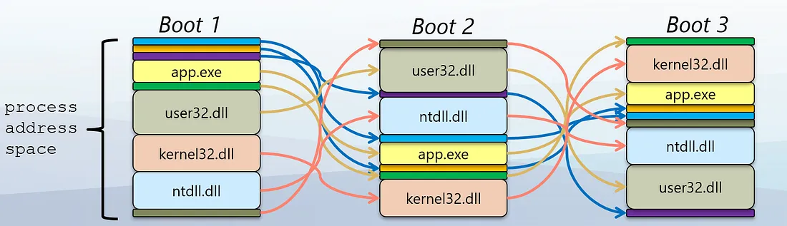

## Extended Reading: Address Space Layout Randomization

### What is ASLR



ASLR is an operating system-level security technology that primarily works by randomizing the memory loading positions of programs to increase the difficulty for attackers to predict target addresses and exploit software vulnerabilities for malicious operations. Its core mechanism includes dynamically randomizing the positions of various parts in the process address space, such as base addresses, library files, heap, and stack.

### Its Value

The core value of ASLR lies in enhancing system security, specifically manifested in the following aspects:

1. **Enhanced System Defense Capability**: By introducing unpredictability, it makes it impossible for attackers to accurately predict the location of key functions or data in memory. This is particularly important for vulnerability exploitation methods that rely on fixed addresses, such as buffer overflows.
2. **Mitigation of Specific Types of Attacks**: ASLR effectively counters techniques such as stack spraying, Return-Oriented Programming (ROP), and other methods that directly control program execution flow, which typically require precise knowledge of target address information.
3. **Improved Effectiveness of Overall Security Framework**: When combined with other security mechanisms like Data Execution Prevention (DEP), ASLR can significantly enhance the overall system's protection capabilities. For example, when DEP prevents code execution in stack or heap memory, if an attacker still attempts to control program flow through buffer overflow, they must know the exact addresses of certain specific locations, and the presence of ASLR makes this situation more difficult.

### Its Implementation Principle

Taking Linux system as an example, here are the ASLR kernel parameter configurations and their meanings:

```bash
$ cat /proc/sys/kernel/randomize_va_space
2
```

- 0: Disable ASLR (unsafe, not recommended to disable).
- 1: Limited conservative randomization support (only supports stack, heap, libraries);
- 2: Complete randomization support (including stack, heap, libraries, and executable).

The operating system's kernel configuration above is 2, meaning the kernel has enabled complete randomization support. However, for executable program randomization support, the executable program must be built with PIE mode enabled.

How randomization is implemented:

- Stack: The stack pointer (RSP or ESP) is initialized to a random offset within a predefined range.
- Heap: The starting address for dynamic memory allocation (brk or mmap) is randomized.
- Shared Libraries: The loader uses mmap to load libraries at random addresses.
- Executable: If compiled with PIE, the code's base address is also randomized.

How is the executable address randomized? This refers to the randomization of the text segment's loading address:

- If the executable program has PIE mode disabled, then the text segment's loading address `VirtAddress` is fixed
- If the executable program has PIE mode enabled, then `VirtAddress` is just an offset, and the loader will choose a random address,
  add this offset to it, and finally calculate the actual loading address.

### Impact on Debugging

Why do we introduce ASLR? Because it does affect the debugging process. The executable program built with `go build` has fixed instruction addresses for the same function after each startup, but the address of the same stack variable changes after each startup... We know some readers might be confused about this, so we need to explain it.

The reason for this issue is that current Linux distributions generally have complete randomization support enabled by default, meaning that even if the Go program is not compiled with PIE mode, stack, heap, and shared library addresses will still be randomized, which is why we observe different addresses for the same stack variable after multiple startups. However, randomization of executable program code requires PIE mode to be enabled during build to be supported, which is why we observe fixed code segment addresses after multiple startups. If we use `go build -buildmode=pie` and test again, we'll find that the code segment address is also randomized.

Some debuggers support recording certain debugging processes as scripts, which can be loaded directly when restarting the debugger next time. If the script recorded some instruction addresses or variable addresses during the last debugging session, the ASLR effect will cause these addresses to become invalid when debugging the process again after restart.

OK, we'll introduce this generally here, just so everyone knows the potential impact of ASLR on the debugging process. If you want to learn more, you can check the relevant materials.

> Note: You can use pmap or /proc/<pid>/maps to view the distribution and location of code segments, stack, heap, and shared libraries in the process address space. You can also verify this using debugger capabilities.

### References

- [https://en.wikipedia.org/wiki/Address_space_layout_randomization](https://en.wikipedia.org/wiki/Address_space_layout_randomization)
- [Early Security Stories — ASLR](https://medium.com/@johnlatwc/early-security-stories-aslr-4c6bafe0dda1)
- [Demystifying ASLR: Understanding, Exploiting, and Defending Against Memory Randomization](https://securitymaven.medium.com/demystifying-aslr-understanding-exploiting-and-defending-against-memory-randomization-4dd8fe648345)
- [ASLR: Address Space Layout Randomization](https://medium.com/@syedishrarali/aslr-address-space-layout-randomization-eb94203a0e7d)
- [Introduction to x64 Linux Binary Exploitation (Part 5)- ASLR](https://valsamaras.medium.com/introduction-to-x64-linux-binary-exploitation-part-5-aslr-394d0dc8e4fb)
