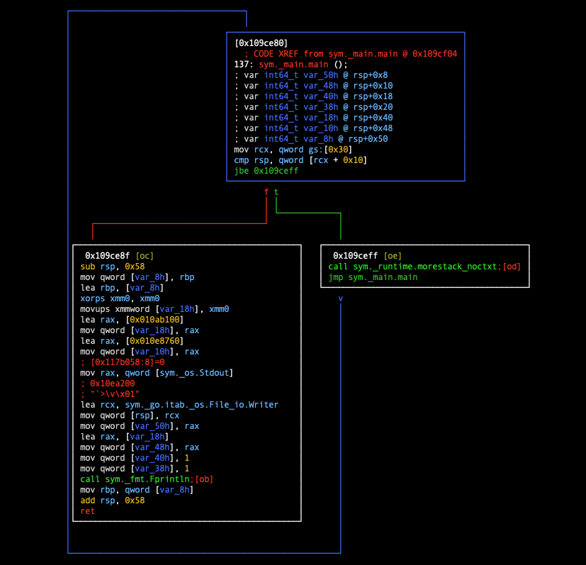

### Instruction-Level Debugging

This chapter begins the development of an instruction-level debugger. We will implement instruction-level debugging operations step by step.

#### Instruction-Level vs. Symbol-Level Debugging

Instruction-level debugging is relative to symbol-level debugging. It only concerns debugging at the machine instruction level and does not rely on debug symbols or source program information. The lack of debug symbol information makes debugging somewhat difficult and harder to understand the meaning of the code being debugged.

However, instruction-level debugging technology is the foundation of symbol-level debugging technology. It can be said that symbol-level debugging operations are improvements built upon instruction-level debugging. Most debuggers that developers encounter in software development are symbol-level debuggers, such as gdb, lldb, and dlv, but they also possess instruction-level debugging capabilities. Of course, there are also specialized instruction-level debuggers like radare2, IDA Pro, OllyDbg, and Hopper.

#### Practical Applications of Instruction-Level Debugging

Since we're going to support instruction-level debugging capabilities, let's discuss this a bit more.

Instruction-level debugging technology is widely used in software reverse engineering. Of course, this requires the debugger to have more powerful capabilities, far beyond just supporting step-by-step instruction execution, memory reading/writing, and register reading/writing. Let's demonstrate how powerful it can be using radare2 as an example.

Take the following program main.go as an example:

```go
package main
import "fmt"

func main() {
  fmt.Println("vim-go")
}
```

After compiling with `go build -o main main.go`, execute `radare2 main`:

```bash
$ go build -o main main.go
$ 
$ r2 main
[0x0105cba0]> s sym._main.main             ; Note: first locate the main.main function
[0x0109ce80]> af                           ; Analyze the current function
[0x0109ce80]> pdf                          ; Disassemble and print the current function
            ; CODE XREF from sym._main.main @ 0x109cf04
┌ 137: sym._main.main ();
│           ; var int64_t var_50h @ rsp+0x8
│           ; var int64_t var_48h @ rsp+0x10
│           ; var int64_t var_40h @ rsp+0x18
│           ; var int64_t var_38h @ rsp+0x20
│           ; var int64_t var_18h @ rsp+0x40
│           ; var int64_t var_10h @ rsp+0x48
│           ; var int64_t var_8h @ rsp+0x50
│       ┌─> 0x0109ce80      65488b0c2530.  mov rcx, qword gs:[0x30]
│       ╎   0x0109ce89      483b6110       cmp rsp, qword [rcx + 0x10]
│      ┌──< 0x0109ce8d      7670           jbe 0x109ceff
│      │╎   0x0109ce8f      4883ec58       sub rsp, 0x58
│      │╎   0x0109ce93      48896c2450     mov qword [var_8h], rbp
│      │╎   0x0109ce98      488d6c2450     lea rbp, [var_8h]
│      │╎   0x0109ce9d      0f57c0         xorps xmm0, xmm0
│      │╎   0x0109cea0      0f11442440     movups xmmword [var_18h], xmm0
│      │╎   0x0109cea5      488d0554e200.  lea rax, [0x010ab100]
│      │╎   0x0109ceac      4889442440     mov qword [var_18h], rax
│      │╎   0x0109ceb1      488d05a8b804.  lea rax, [0x010e8760]
│      │╎   0x0109ceb8      4889442448     mov qword [var_10h], rax
│      │╎   0x0109cebd      488b0594e10d.  mov rax, qword [sym._os.Stdout] ; [0x117b058:8]=0
│      │╎   0x0109cec4      488d0d35d304.  lea rcx, sym._go.itab._os.File_io.Writer ; 0x10ea200 ; "`>\v\x01"
│      │╎   0x0109cecb      48890c24       mov qword [rsp], rcx
│      │╎   0x0109cecf      4889442408     mov qword [var_50h], rax
│      │╎   0x0109ced4      488d442440     lea rax, [var_18h]
│      │╎   0x0109ced9      4889442410     mov qword [var_48h], rax
│      │╎   0x0109cede      48c744241801.  mov qword [var_40h], 1
│      │╎   0x0109cee7      48c744242001.  mov qword [var_38h], 1
│      │╎   0x0109cef0      e87b99ffff     call sym._fmt.Fprintln
│      │╎   0x0109cef5      488b6c2450     mov rbp, qword [var_8h]
│      │╎   0x0109cefa      4883c458       add rsp, 0x58
│      │╎   0x0109cefe      c3             ret
│      └──> 0x0109ceff      e87cc4fbff     call sym._runtime.morestack_noctxt
└       └─< 0x0109cf04      e977ffffff     jmp sym._main.main
[0x0109ce80]> 
```

We executed three commands in the radare2 debugging session:

- s sym._main.main, locate the main.main function;
- af, analyze the current function;
- pdf, disassemble and print the current function;

As you can see, unlike the disass command in ordinary symbol-level debuggers, radare2 not only shows assembly information but also marks the start and end points of function calls with arrows.

You can even execute the command `vV` to convert the assembly instructions into a callgraph form:



Readers might find this feature somewhat magical, but once you understand concepts like ABI, function prologue, and function epilogue, you'll become accustomed to how such functionality is implemented. In fact, this kind of functionality can be implemented at both the instruction level and high-level language level.

The power of radare2 goes far beyond these features, as evident from its supported commands and options. Its steep learning curve is also a testament to its popularity among reverse engineers and those interested in binary analysis.

```bash
[0x0109ce80]> ?
Usage: [.][times][cmd][~grep][@[@iter]addr!size][|>pipe] ; ...   
Append '?' to any char command to get detailed help
Prefix with number to repeat command N times (f.ex: 3x)
| %var=value              alias for 'env' command
| *[?] off[=[0x]value]    pointer read/write data/values (see ?v, wx, wv)
| (macro arg0 arg1)       manage scripting macros
| .[?] [-|(m)|f|!sh|cmd]  Define macro or load r2, cparse or rlang file
| _[?]                    Print last output
| =[?] [cmd]              send/listen for remote commands (rap://, raps://, udp://, http://, <fd>)
| <[...]                  push escaped string into the RCons.readChar buffer
| /[?]                    search for bytes, regexps, patterns, ..
| ![?] [cmd]              run given command as in system(3)
| #[?] !lang [..]         Hashbang to run an rlang script
| a[?]                    analysis commands
| b[?]                    display or change the block size
| c[?] [arg]              compare block with given data
| C[?]                    code metadata (comments, format, hints, ..)
| d[?]                    debugger commands
| e[?] [a[=b]]            list/get/set config evaluable vars
| f[?] [name][sz][at]     add flag at current address
| g[?] [arg]              generate shellcodes with r_egg
| i[?] [file]             get info about opened file from r_bin
| k[?] [sdb-query]        run sdb-query. see k? for help, 'k *', 'k **' ...
| l [filepattern]         list files and directories
| L[?] [-] [plugin]       list, unload load r2 plugins
| m[?]                    mountpoints commands
| o[?] [file] ([offset])  open file at optional address
| p[?] [len]              print current block with format and length
| P[?]                    project management utilities
| q[?] [ret]              quit program with a return value
| r[?] [len]              resize file
| s[?] [addr]             seek to address (also for '0x', '0x1' == 's 0x1')
| t[?]                    types, noreturn, signatures, C parser and more
| T[?] [-] [num|msg]      Text log utility (used to chat, sync, log, ...)
| u[?]                    uname/undo seek/write
| v                       visual mode (v! = panels, vv = fcnview, vV = fcngraph, vVV = callgraph)
| w[?] [str]              multiple write operations
| x[?] [len]              alias for 'px' (print hexadecimal)
| y[?] [len] [[[@]addr    Yank/paste bytes from/to memory
| z[?]                    zignatures management
| ?[??][expr]             Help or evaluate math expression
| ?$?                     show available '$' variables and aliases
| ?@?                     misc help for '@' (seek), '~' (grep) (see ~??)
| ?>?                     output redirection
| ?|?                     help for '|' (pipe)
[0x0109ce80]> 
```

If readers further explore radare2's detailed features, its power will surely amaze you.

ps: If readers want to learn about using radare2, you can first look at a practical article I wrote earlier: [monkey patching in golang](hitzhangjie.pro/blog/2020-08-23-monkey_patching_in_go/), which describes the application of instruction patching technology in golang mock testing and how to use radare2 to demonstrate the instruction patching process.

#### Limited Instruction-Level Debugging Support

In this book, we will only introduce how to support limited instruction-level debugging capabilities. Our original intention is to learn and share, not to replace or create a comprehensive engineering solution. If space permits, we will also appropriately compare with other instruction-level debuggers and discuss the implementation methods of certain features.