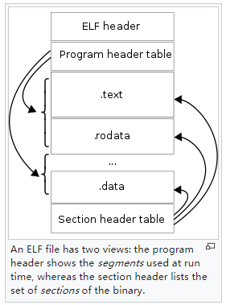

## Understanding ELF Files

ELF ([Executable and Linkable Format](https://en.wikipedia.org/wiki/Executable_and_Linkable_Format)) is a common file format in Unix and Linux environments, used for executable programs, object files, shared libraries, core files, etc.

### ELF File Structure

The ELF file structure is shown in the figure below, including the ELF Header, Program Header Table, Section Header Table, and Sections. Sections are located between the Program Header Table and Section Header Table, and are referenced by both tables.



* **File Header**: The ELF File Header describes the type of the current ELF file (executable program, relocatable file, dynamic linking file, core file, etc.), 32-bit/64-bit addressing, ABI, ISA, program entry address, Program Header Table start address and element size, Section Header Table start address and element size, etc.
* **Program Header Table**: The Program Header Table defines the "**execution view**" of the program, describing how to create the process image. Each entry defines a "segment" that references 0, 1, or more sections. Segments have types, such as PT_LOAD indicating that the sections referenced by this segment need to be loaded into memory at runtime. The Program Header Table is mainly used to guide the loader in loading.
  For example, the .text section belongs to a segment with Type=PT_LOAD, meaning it will be loaded into memory; and the segment's permissions are RE (Read+Execute), meaning that after the instruction part is loaded into memory, the process's access permissions for this area are "read+execute". The loader (/lib64/ld-linux-x86-64.so) should load the referenced sections into the specified location in the process address space according to the virtual address range and permissions defined by the segment, and set the corresponding read, write, and execute permissions (vm_area_struct.vm_flags).
* **Section Header Table**: The Section Header Table defines the "**linkable view**" of the program, describing the location, size, type, linking order, etc., of each section in the binary executable file, mainly to guide the linker in linking.
  For example, a project contains multiple source files, each source file is a compilation unit, each compilation unit will eventually generate an object file (*.o), each object file is an ELF file and contains its own sections. The linker merges the same sections from dependent object files and library files (such as merging all *.o files' .text sections together), and then resolves symbol references into correct offsets or addresses.
* **Sections**: The section data in the ELF file, sandwiched between the Program Header Table and Section Header Table, is referenced by both tables. The number of sections included in different programs is not fixed: some programming languages have special sections to support corresponding language runtime features, such as go .gopclntab, gosymtab; programs using static linking or dynamic linking will generate different sections, such as dynamic linking often generating .got, .plt, .rel.text.

Below, we will introduce each part in detail.

### File Header (ELF File Header)

#### Type Definition

Each successfully parsed ELF file corresponds to the go standard library type debug/elf.File, which includes the FileHeader, Sections, and Progs:

```go
// A File represents an open ELF file.
type File struct {
	FileHeader
	Sections    []*Section
	Progs       []*Prog
	...
}

// A FileHeader represents an ELF file header.
type FileHeader struct {
	Class      Class
	Data       Data
	Version    Version
	OSABI      OSABI
	ABIVersion uint8
	ByteOrder  binary.ByteOrder
	Type       Type
	Machine    Machine
	Entry      uint64
}
```

Note that the go standard library FileHeader has fewer fields than the ELF file header in the man manual that are useful during parsing. To better understand the role of each field in the file header, let's look at the definition in the man manual:

```c
#define EI_NIDENT 16

typedef struct {
    unsigned char e_ident[EI_NIDENT];
    uint16_t      e_type;
    uint16_t      e_machine;
    uint32_t      e_version;
    ElfN_Addr     e_entry;
    ElfN_Off      e_phoff;
    ElfN_Off      e_shoff;
    uint32_t      e_flags;
    uint16_t      e_ehsize;
    uint16_t      e_phentsize;
    uint16_t      e_phnum;
    uint16_t      e_shentsize;
    uint16_t      e_shnum;
    uint16_t      e_shstrndx;
} ElfN_Ehdr;
```

- e_ident[EI_NIDENT]
  - EI_MAG0: 0x7f
  - EI_MAG1: E
  - EI_MAG2: L
  - EI_MAG3: F
  - EI_Class: Addressing type (32-bit or 64-bit addressing);
  - EI_Data: How processor-specific data is encoded in the file (little-endian or big-endian);
  - EI_VERSION: Version of the ELF specification;
  - EI_OSABI: The OS and ABI the binary targets (sysv, hpux, netbsd, linux, solaris, irix, freebsd, tru64 unix, arm, stand-alone (embedded));
  - EI_ABIVERSION: The ABI version the binary targets (same OSABI may have multiple incompatible ABI versions);
  - EI_PAD: From this position to the end of EI_NIDENT is filled with 0, should be ignored when reading;
  - EI_NIDENT: Length of the e_ident array;
- e_type: File type (relocatable file, executable program, dynamic linking file, core file, etc.);
- e_machine: Machine type (386, spark, ppc, etc.);
- e_version: File version;
- e_entry: Program entry address (if the current file has no entry address, fill with 0);
- e_phoff: Offset of the Program Header Table relative to the start of the current file;
- e_shoff: Offset of the Section Header Table relative to the start of the current file;
- e_flags: Processor-specific flags;
- e_ehsize: Size of the ELF file header structure;
- e_phentsize: Size of space occupied by each entry in the Program Header Table;
- e_phnum: Number of entries in the Program Header Table;
- e_shentsize: Size of space occupied by each entry in the Section Header Table;
- e_shnum: Number of entries in the Section Header Table;
- e_shstrndx: Index of the section storing section names in the Section Header Table (may be .strtab or .shstrtab);

> ps: Other fields in the ELF file header are relatively easy to understand. Regarding .shstrtab, its data storage is similar to .strtab, but it's used to store section names (the man manual shows that .strtab can store both symbol names and section names).
>
> **String Table (.strtab section)**
>
> | Index        | +0     | +1     | +2    | +3    | +4     | +5     | +6     | +7    | +8    | +9    |
> | ------------ | ------ | ------ | ----- | ----- | ------ | ------ | ------ | ----- | ----- | ----- |
> | **0**  | `\0` | `n`  | `a` | `m` | `e`  | `.`  | `\0` | `V` | `a` | `r` |
> | **10** | `i`  | `a`  | `b` | `l` | `e`  | `\0` | `a`  | `b` | `l` | `e` |
> | **20** | `\0` | `\0` | `x` | `x` | `\0` | ` ` |        |       |       |       |
>
> Assuming the above .strtab, then idx=0 corresponds to the string "none", idx=1 corresponds to the string "name.", and idx=7 corresponds to the string "Variable". For .shstrtab, its storage method is the same as .strtab, but it stores the names of all sections, and the index of the section name in .shstrtab is specified by Elf32/Elf64_Shdr.s_name.

### Program Header Table

The Program Header Table can be understood as the executable point of view of the program, mainly used to guide the loader in loading. From the perspective of an executable program, when the process runs, it needs to know how to load different parts of the program into different areas of the process's virtual memory address space. The memory layout of process address space in Linux is familiar to everyone, such as the data segment and text segment. The information contained in each segment is actually predefined by the Program Header Table, including its position in virtual memory space, which sections data should be included, and their read, write, and execute permissions.

#### Type Definition

The Program Header Table is of course an array. Let's look at the definition of each "segment":

```c
typedef struct {
    uint32_t   p_type;
    Elf32_Off  p_offset;
    Elf32_Addr p_vaddr;
    Elf32_Addr p_paddr;
    uint32_t   p_filesz;
    uint32_t   p_memsz;
    uint32_t   p_flags;
    uint32_t   p_align;
} Elf32_Phdr;

typedef struct {
    uint32_t   p_type;
    uint32_t   p_flags;
    Elf64_Off  p_offset;
    Elf64_Addr p_vaddr;
    Elf64_Addr p_paddr;
    uint64_t   p_filesz;
    uint64_t   p_memsz;
    uint64_t   p_align;
} Elf64_Phdr;
```

Below is a detailed explanation of the above two structures, which are for 32-bit and 64-bit systems respectively. The meaning of each field is as follows:

- p_type: Segment type
  - PT_NULL: This table entry describes an undefined segment, can be ignored;
  - PT_LOAD: This table entry describes a loadable segment;
  - PT_DYNAMIC: This table entry describes dynamic linking information;
  - PT_INTERP: This table entry specifies the path of an interpreter;
  - PT_NOTE: This table entry specifies the location of notes;
  - PT_SHLIB: This type is reserved but its semantics are unspecified. Programs containing segment table entries of this type do not conform to the ABI specification;
  - PT_PHDR: This table entry specifies the location and size of the Program Header Table itself;
  - PT_LOPROC, PT_HIPROC: This table entry specifies a range [PT_LOPROC, PTHIPROC], where data in this range is used to save processor-specific mechanism information;
  - PT_GNU_STACK: GNU extension, Linux kernel uses this field to set the Stack state in p_flags; TODO
- p_offset: Indicates the offset of this segment relative to the start of the file;
- p_vaddr: Indicates the virtual address where this segment's data will be loaded into memory;
- p_paddr: Indicates the physical address where this segment will be loaded in memory;
- p_filesz: Indicates the size occupied by this segment in the file;
- p_memsz: Indicates the size occupied by this segment in memory;
- p_flags: Indicates the attributes of this segment, in the form of bit masks:
  - PF_X: Executable;
  - PF_W: Writable;
  - PF_R: Readable;
- p_align: Indicates the alignment method of this segment;

> Note, there are some places where terminology is not rigorous enough, which may lead to misunderstandings:
>
> - In the memory address space layout, the area where code is located is often called the code segment (code segment, addressed by CS register) or text segment (text segment), and the data segment is also often called the data segment (data segment, addressed by DS register).
> - The terms text segment and data segment in the memory layout are not the .text section and .data section in the ELF file, please distinguish them.
>
> The Program Header Table definition below gives such an example. The text segment actually contains the .text section and other sections, and the data segment actually contains sections other than the .data section.
>
> ```bash
> // text segment, segment index 02, you can see it contains .text and other sections
> LOAD        0x0000000000000000 0x0000000000400000 0x0000000000400000
>             0x0000000000000a70 0x0000000000000a70  R E    0x200000
>
> // data segment, segment index 03, you can see it contains .data and other sections
> LOAD        0x0000000000000df0 0x0000000000600df0 0x0000000000600df0
>             0x000000000000025c 0x0000000000000260  RW     0x200000
>
> 02     .interp .note.ABI-tag .note.gnu.build-id .gnu.hash .dynsym .dynstr .gnu.version .gnu.version_r .rela.dyn .rela.plt .init .plt .text .fini .rodata
> 03     .init_array .fini_array .dynamic .got .got.plt .data .bss
> ```

#### Tool Demonstration

The following example shows the complete Program Header Table definition of the test program golang-debugger-lessons/testdata/loop2. Running `readelf -l` to view its Program Header Table, there are 7 entries, each segment definition includes type, address in virtual memory, read-write-execute permissions, and referenced sections. Through the `Section to Segment mapping: Segment Sections...` part, we can see that the final organization is:

- text segment (segment number 02 with Flags R+E, meaning readable and executable, this is the text segment) contains the following sections `.text .note.go.buildid`;
- rodata segment (segment number 03 with Flags R, meaning read-only, this is the rodata segment) contains `.rodata .typelink .itablink .gosymtab .gopclntab` which are data needed by the go runtime;
- data segment (segment number 04 with Flags RW, meaning readable and writable, this is the data segment) contains `.data .bss` and other readable and writable data;

```bash
$ readelf -l testdata/loop2

Elf file type is EXEC (Executable file)
Entry point 0x475a80
There are 6 program headers, starting at offset 64

Program Headers:
  Type           Offset             VirtAddr           PhysAddr
                 FileSiz            MemSiz              Flags  Align
  PHDR           0x0000000000000040 0x0000000000400040 0x0000000000400040
                 0x0000000000000150 0x0000000000000150  R      0x1000
  NOTE           0x0000000000000f9c 0x0000000000400f9c 0x0000000000400f9c
                 0x0000000000000064 0x0000000000000064  R      0x4
  LOAD           0x0000000000000000 0x0000000000400000 0x0000000000400000
                 0x00000000000af317 0x00000000000af317  R E    0x1000
  LOAD           0x00000000000b0000 0x00000000004b0000 0x00000000004b0000
                 0x00000000000a6e70 0x00000000000a6e70  R      0x1000
  LOAD           0x0000000000157000 0x0000000000557000 0x0000000000557000
                 0x000000000000a520 0x000000000002e0c0  RW     0x1000
  GNU_STACK      0x0000000000000000 0x0000000000000000 0x0000000000000000
                 0x0000000000000000 0x0000000000000000  RW     0x8

 Section to Segment mapping:
  Segment Sections...
   00
   01     .note.go.buildid
   02     .text .note.go.buildid
   03     .rodata .typelink .itablink .gosymtab .gopclntab
   04     .go.buildinfo .noptrdata .data .bss .noptrbss
   05
   06 
```

Whether the data in a section will eventually be loaded into memory is also determined by the type of segment that references it: PT_LOAD type will be loaded into memory, otherwise it won't.

Taking the above go program demo as an example:

1) The segment (segment index 03) to which .gosymtab and .gopclntab belong is of type PT_LOAD, indicating that its data will be loaded into memory, because the go runtime depends on this information to calculate stacktrace, such as `runtime.Caller(skip)` or `runtime.Stack(buf)` when panic occurs.

2) The segment (segment index 01) to which .note.go.buildid belongs is of type NOTE. Looking at this segment alone, section .note.go.buildid won't be loaded into memory, but

3) Note that .note.go.buildid is also referenced by segment index 02 with PT_TYPE=LOAD, so this section will eventually be loaded into memory.

> ps: Generally, .note.* sections are for external tools to read and use, and are generally not loaded into memory, unless the go designers want to directly read this information from process memory, or want core dumps to include this information for later extraction and use.

Later in this chapter, we will continue to introduce how ELF Program Header Table information guides the loader to load program data into memory to build the process image.

### Section Header Table

Each compilation unit generates an object file (ELF format) that divides code and data into different sections, such as instructions in .text, read-only data in .rodata, readable and writable data in .data, and other vendor-defined sections, etc., achieving reasonable organization of different data.

On this basis, the Section Header Table defines the linkable point of view of the program, used to guide the linker in how to link sections from multiple compilation units (merging same sections, symbol resolution, relocation).

Here we have to mention shared library types: static shared libraries (commonly known as static link libraries) and dynamic shared libraries (commonly known as dynamic link libraries). Static shared libraries can be understood as containing multiple *.o files; dynamic shared libraries are equivalent to merging the same sections, merging not including *.o files. When linking to generate the final executable program, the same sections also need to be merged. As for more details, we won't expand here.

#### Type Definition

The Section Header Table is actually an array of section entries. Let's look at the definition of each description entry. Section data can be read according to its address and size.

```c
typedef struct {
    uint32_t   sh_name;
    uint32_t   sh_type;
    uint32_t   sh_flags;
    Elf32_Addr sh_addr;
    Elf32_Off  sh_offset;
    uint32_t   sh_size;
    uint32_t   sh_link;
    uint32_t   sh_info;
    uint32_t   sh_addralign;
    uint32_t   sh_entsize;
} Elf32_Shdr;

typedef struct {
    uint32_t   sh_name;
    uint32_t   sh_type;
    uint64_t   sh_flags;
    Elf64_Addr sh_addr;
    Elf64_Off  sh_offset;
    uint64_t   sh_size;
    uint32_t   sh_link;
    uint32_t   sh_info;
    uint64_t   sh_addralign;
    uint64_t   sh_entsize;
} Elf64_Shdr;
```

The above are definitions for 32-bit and 64-bit respectively. Below is a detailed explanation of the meaning of each field:

- sh_name: Offset of the section name, that is, the offset of the section's name in .strtab;
- sh_type: Section type
  - SHT_NULL: Empty section, contains no data;
  - SHT_PROGBITS: Code segment, data segment;
  - SHT_SYMTAB: Symbol table;
  - SHT_STRTAB: String table;
  - SHT_RELAG: Relocation table;
  - SHT_HASH: Symbol hash table;
  - SHT_DYNAMIC: Dynamic linking table;
  - SHT_NOTE: Symbol notes;
  - SHT_NOBITS: Empty section, contains no data;
  - SHT_REL: Relocation table;
  - SHT_SHLIB: Reserved but lacks clear definition;
  - SHT_DYNSYM: Dynamic symbol table;
  - SHT_LOPROC, SHT_HIPROC: Defines a range [SHT_LOPROC, SHT_HIPROC] for processor-specific mechanisms;
  - SHT_LOUSER, SHT_HIUSER: Defines a range [SHT_LOUSER, SHT_HIPROC] reserved for applications;
- sh_flags: Section flags
  - SHF_WRITE: Writable during process execution;
  - SHF_ALLOC: Needs to be allocated and occupy memory during process execution;
  - SHF_EXECINSTR: Contains instruction data during process execution;
  - SHF_MASKPROC: Reserved for processor-related mechanisms;
- sh_addr: If the current section needs to be loaded into memory, indicates its virtual address in memory;
- sh_offset: Indicates the offset of the current section relative to the start of the file;
- sh_size: Section size;
- sh_link: Indicates the index of the next Section Header Table to be linked, used for section linking order;
- sh_info: Additional section information, specific interpretation depends on sh_type;
- sh_addralign: Alignment method;
- sh_entsize: Indicates the size of each section;

#### Tool Demonstration

OK, taking the test program golang-debugger-lessons/testdata/loop2 as an example, let's look at its linker's point of view. We can see that it contains 25 sections, each section has type, offset, size, linking order, alignment and other information, used to guide the linker in completing the linking operation.

```bash
$ readelf -S testdata/loop2 
There are 25 section headers, starting at offset 0x1c8:

Section Headers:
  [Nr] Name              Type             Address           Offset
       Size              EntSize          Flags  Link  Info  Align
  [ 0]                   NULL             0000000000000000  00000000
       0000000000000000  0000000000000000           0     0     0
  [ 1] .text             PROGBITS         0000000000401000  00001000
       0000000000098294  0000000000000000  AX       0     0     32
  [ 2] .rodata           PROGBITS         000000000049a000  0009a000
       00000000000440c7  0000000000000000   A       0     0     32
       .............................................................
  [ 4] .typelink         PROGBITS         00000000004de2a0  000de2a0
       0000000000000734  0000000000000000   A       0     0     32
  [ 5] .itablink         PROGBITS         00000000004de9d8  000de9d8
       0000000000000050  0000000000000000   A       0     0     8
  [ 6] .gosymtab         PROGBITS         00000000004dea28  000dea28
       0000000000000000  0000000000000000   A       0     0     1
  [ 7] .gopclntab        PROGBITS         00000000004dea40  000dea40
       000000000005fe86  0000000000000000   A       0     0     32
       .............................................................
  [10] .data             PROGBITS         000000000054d4e0  0014d4e0
       0000000000007410  0000000000000000  WA       0     0     32
       .............................................................
  [14] .zdebug_line      PROGBITS         0000000000588119  00155119
       000000000001cc0d  0000000000000000           0     0     1
  [15] .zdebug_frame     PROGBITS         00000000005a4d26  00171d26
       00000000000062e9  0000000000000000           0     0     1
       .............................................................
  [22] .note.go.buildid  NOTE             0000000000400f9c  00000f9c
       0000000000000064  0000000000000000   A       0     0     4
  [23] .symtab           SYMTAB           0000000000000000  001d0000
       0000000000011370  0000000000000018          24   422     8
  [24] .strtab           STRTAB           0000000000000000  001e1370
       00000000000109fb  0000000000000000           0     0     1
Key to Flags:
  W (write), A (alloc), X (execute), M (merge), S (strings), I (info),
  L (link order), O (extra OS processing required), G (group), T (TLS),
  C (compressed), x (unknown), o (OS specific), E (exclude),
  l (large), p (processor specific)
```

### Sections

#### Type Definition

Here, section refers to the data in the ELF section, which is just a bunch of bytes, referenced by the Section Header Table and Program Header Table. For example, the Section Header Table entry has an address and size pointing to the corresponding section data.

#### Common Sections

ELF files contain many sections, and the test example given earlier contains 25 sections. Let's first understand the role of some common sections, to prepare for a deeper understanding of how the linker, loader, and debugger work.

- .text: Compiled program instructions;
- .rodata: Read-only data, such as constant strings in the program;
- .data: Initialized global variables;
- .bss: Uninitialized global variables, just a placeholder in the ELF file, doesn't occupy actual space;
- .symtab: Symbol table, each relocatable file has a symbol table, storing information about global functions and global variables defined in the program. Note that it doesn't contain local variable information, local non-static variables are managed by the stack, they don't help with linker symbol resolution and relocation.
- .debug_*: Debug information, read by the debugger to support symbol-level debugging (such as generated by gcc -g, go build generates by default);
- .strtab: String table, including string values and section names referenced by .symtab and .[z]debug_* sections;
- .rel.text: A list of locations and symbols referenced in a .text section. When the linker tries to link this object file with other files, it needs to resolve and relocate the symbols to correct addresses;
- .rel.data: A list of locations and symbols of some referenced global variables, similar to .rel.text, also needs symbol resolution and relocation to correct addresses;

If you want to learn more about supported sections and their roles, you can check the man manual: `man 5 elf`. We won't list them all here.

#### Custom Sections

ELF also supports custom sections, such as Go language adding .gosymtab, .gopclntab, .note.build.id to support some operations of the Go runtime and Go toolchain.

#### Tool Demonstration

Here we'll briefly introduce how to view the contents of sections:

- Print as string: `readelf --string-dump=<section> <prog>`;
- Print as hexadecimal: `readelf --hex-dump=<section> <prog>`;
- Complete relocation first, then print as hexadecimal: `readelf --relocated-dump=<section> <prog>`;
- Print DWARF debug information: `readelf --debug-dump=<section> <prog>`;

Taking Go language as an example, first `go tool buildid <prog>` extracts buildid information, which is actually stored in the .note.go.buildid section. Let's verify this. First, extract buildid information through `go tool buildid`:

```bash
$ go tool buildid testdata/loop
_Iq-Pc8WKArkKz99o-e6/6mQTe-5rece47rT9tQco/8IOigl4fPBb3ZSKYst1T/QZmo-_A8O3Ec6NVYEn_1
```

Next, directly read the data from the ELF file through `readelf --string-dump=.note.go.buildid <prog>`:

```bash
$ readelf --string-dump=.note.go.buildid testdata/loop
String dump of section '.note.go.buildid':
  [     4]  S
  [     c]  Go
  [    10]  _Iq-Pc8WKArkKz99o-e6/6mQTe-5rece47rT9tQco/8IOigl4fPBb3ZSKYst1T/QZmo-_A8O3Ec6NVYEn_1
```

The result shows that the buildid data is consistent, confirming our above judgment.

This section on ELF content ends here. On this basis, we will gradually introduce how the linker, loader, and debugger work.

### Summary

This article introduced the ELF file structure in detail, including the definitions of the ELF file header, Program Header Table, and Section Header Table, and demonstrated through examples how the Program Header Table and Section Header Table reference sections, and how to view them using the readelf command. We also introduced the roles of some common sections and some sections that Go language has extended on its own to support advanced features. After reading this section, readers should have a preliminary understanding of the ELF file structure.

Next, we will introduce the content of symbol tables and symbols. Let's mention it briefly here. Speaking of symbols, both ELF .symtab and DWARF .debug_* sections provide "symbol" information. During compilation, it records which symbols exist, and during the linking process, the linker decides which of the above symbols to generate into .symtab, and which debug-type symbols need to generate information into .debug_* sections. Now looking at it, .debug_* sections are specifically prepared for debugging, generated by the linker strictly according to the DWARF standard, language design, and debugger agreement. .symtab mainly contains symbols needed for linker symbol resolution and relocation. .symtab can actually also contain symbol information for supporting debugging, mainly depending on what strategy the linker uses.

For example, gdb, as a debugger born in an early era, relies heavily on symbol information in .symtab for debugging. DWARF is a latecomer. Although gdb is gradually moving towards DWARF, for compatibility (such as supporting debugging of old binaries and toolchains), it still retains the implementation method of debugging using symbol tables. If you want gdb to also debug go programs, you need to understand gdb's working mechanism and generate the information it needs in .symtab and .debug_* sections, see: [Why GDB Uses Both .symtab and DWARF](./92-why-gdb-uses-symtab.md).

### References

1. Executable and Linkable Format, https://en.wikipedia.org/wiki/Executable_and_Linkable_Format
2. How to Fool Analysis Tools, https://tuanlinh.gitbook.io/ctf/golang-function-name-obfuscation-how-to-fool-analysis-tools
3. Go 1.2 Runtime Symbol Information, Russ Cox, https://docs.google.com/document/d/1lyPIbmsYbXnpNj57a261hgOYVpNRcgydurVQIyZOz_o/pub
4. Some notes on the structure of Go Binaries, https://utcc.utoronto.ca/~cks/space/blog/programming/GoBinaryStructureNotes
5. Buiding a better Go Linker, Austin Clements, https://docs.google.com/document/d/1D13QhciikbdLtaI67U6Ble5d_1nsI4befEd6_k1z91U/view
6. Time for Some Function Recovery, https://www.mdeditor.tw/pl/2DRS/zh-hk
7. Computer System: A Programmer's Perspective, Randal E.Bryant, David R. O'Hallaron, p450-p479
8. 深入理解计算机系统, 龚奕利 雷迎春 译, p450-p479
9. Learning Linux Binary Analysis, Ryan O'Neill, p14-15, p18-19
10. Linux二进制分析, 棣琦 译, p14-15, p18-19
11. 字符串表示例, https://refspecs.linuxbase.org/elf/gabi4+/ch4.strtab.html
12. Introduction of Shared Libraries, https://medium.com/@hitzhangjie/introduction-of-shared-libraries-df0f2299784f
