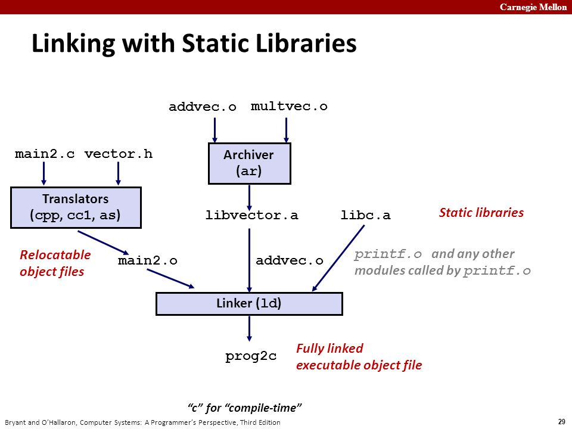
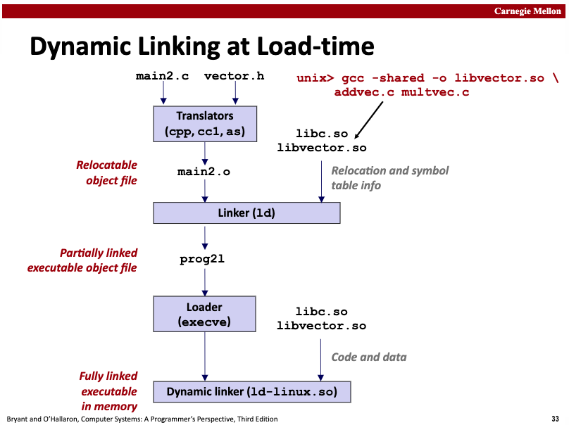

## Symbol Resolution & Relocation

In the previous sections, we covered the basics of symbols and symbol tables. Here, we'll continue by introducing symbol resolution and relocation.

### Content Overview

Each relocatable object module m has a symbol table that contains information about symbols defined and referenced by m. In the context of the linker, there are three different types of symbols:

- Global symbols defined by m that can be referenced by other modules;
- Global symbols defined by other modules that can be referenced by the current module m;
- Local symbols that are only defined and referenced within the module (such as global functions or variables marked as static in C);

> Whether it's a *.o file, *.a file, or *.so file... *.o files contain .symtab, each *.o file in *.a files contains .symtab, and *.so files contain .dynsym. These sections record which symbols are defined.

**Symbol resolution** refers to the process where the linker needs to find the definition of each referenced symbol. Where does it look? It checks the symbol tables of each relocatable object file in the input list to find the symbol definition corresponding to the reference. For symbols defined in *.o and *.a files, the static linker can perform relocation immediately after symbol resolution; for symbols defined in *.so files, the static linker handles them differently, only recording relocation entries in the `.rel.dyn` section to guide the subsequent dynamic linker in completing resolution and relocation, also known as lazy binding.

**Relocation** refers to two steps after the compiler generates instruction and data sections for each compilation unit: 1) The static linker needs to merge identical sections and assign addresses to them (relocating sections), and also assign addresses to each defined symbol (relocating symbol definitions); 2) After the linker resolves references to their corresponding symbol definitions, it needs to replace the references with relative or absolute addresses of the symbol definitions (relocating symbol references within sections). The relocation process differs between symbols defined in *.o and *.a files versus those defined in *.so files. For the former, the static linker directly replaces the reference location with a relative or absolute address; for the latter, when the loader loads the program, it calls the dynamic linker to load the corresponding *.so file, and symbol resolution is triggered when accessing variables or functions defined in the *.so file. At this point, it searches for the corresponding symbol definition in the .dynsym of the relevant so file. After finding it, it prepares for relocation, using the description in the .rel.dyn section (such as relocation type) to complete the relocation and update the corresponding address in .got or .got.plt.

Symbol resolution and relocation are part of a collaborative process in the toolchain. Usually, computer books split these topics due to space constraints. However, considering that symbol resolution and relocation are closely related steps, and the working principles are not very intuitive, inappropriate content segmentation (between symbol resolution and relocation, and different handling methods for static and dynamic libraries) can make it harder for readers to understand. Therefore, I'll take the opposite approach and explain symbol resolution and relocation thoroughly in one article. Let's begin with the detailed introduction. If you feel that the above summary has already given you an "aha" moment, you can skip ahead selectively.

### Resolving Symbol Types

#### Local Symbol Resolution

For references to local symbols defined in the current module, symbol resolution is very straightforward. The compiler only allows one definition of each local symbol in each module. The compiler also ensures that static local variables have local link symbols with unique names. Local symbol resolution is relatively simple.

#### Global Symbol Resolution

However, resolving global symbols is more challenging:

1. When the compiler encounters a symbol not defined in the current module (which could be a variable name or function name), it assumes the symbol is defined in some other module. The compiler generates a linker symbol table entry for each such symbol and passes it to the linker for processing.
2. When linking, the linker reads this relocatable symbol table and searches for corresponding symbol definitions from all input modules. If a referenced symbol is not found, the linker outputs an error.
3. If the linker finds multiple definitions of a referenced symbol (multiple definitions), should it throw an error directly, or is there a way to know which one to choose? This involves the issue of strong and weak symbol rules.

During compilation, the compiler outputs each global symbol to the assembler as either strong or weak, and the assembler records this information in the symbol table of the current relocatable object file, specifically in the `Elf_symbol.binding` field of the corresponding symbol.

- Strong symbol: `(binding & global != 0) && (binding & weak == 0)`
- Weak symbol: `binding & weak == 1`

Based on the definition of strong and weak symbols, Unix linkers use the following rules to handle multiply defined symbols:

- Rule 1: Multiple strong symbols are not allowed
- Rule 2: If there is one strong symbol and multiple weak symbols, choose the strong symbol
- Rule 3: If there are multiple weak symbols, arbitrarily choose one from these weak symbols

By strictly following these rules, global symbol resolution can be correctly completed.

### Multiple Symbol Definitions

In the compilation and linking process, the distinction between **Strong Symbols** and **Weak Symbols** is mainly determined by compiler and linker rules, as follows.

#### Strong & Weak Symbols

- **Strong Symbols**:
  - Defined by ordinary global variables or functions (not explicitly marked as weak, with initialization or non-`extern` declaration).
    ```c
    int global_var = 42;  // Strong symbol
    void func() { ... }   // Strong symbol
    ```
- **Weak Symbols**:
  - Explicitly marked as weak through compiler options (such as GCC's `__attribute__((weak))`).
    ```c
    __attribute__((weak)) int y;  // Weak symbol
    __attribute__((weak)) void bar() {}  // Weak symbol
    ```
  - Uninitialized global variables (in C, uninitialized global variables are strong symbols by default, but may be treated as weak symbols in some compilers, requiring specific analysis).
  - Special cases (such as C++ template instantiation conflicts may generate weak symbols).

#### Linker Behavior

- **Strong Symbol Priority**: If a strong symbol and weak symbol have the same name, the linker chooses the strong symbol.
- **Multiple Weak Symbols**: If only weak symbols have the same name, the linker can choose any one (usually reports an error unless using options like `--allow-shlib-undefined`).

Here's an example:

```c
  // file1.c
  __attribute__((weak)) int global = 1;  // Weak symbol

  // file2.c
  int global = 2;                        // Strong symbol (overrides weak symbol)
```

After linking, the value of `global` is `2`.

#### Application Scenarios and Verification

- **Dynamic Libraries (.so/.dll)**: Weak symbols allow dynamic libraries to override symbols in the main program (such as plugin mechanisms).
- **Avoid Duplicate Definitions**: Weak symbols can be used to provide default implementations, allowing users to override them with strong symbols.
- **Compatibility Handling**: Weak symbols can be used to resolve symbol conflicts in different libraries (such as compatibility layers for older APIs).

Use `nm` to view symbol types:

```bash
nm your_object_file.o | grep ' T '  # T indicates strong symbol (function)
nm your_object_file.o | grep ' W '  # W indicates weak symbol
```

The compiler determines symbol strength through syntax (whether explicitly marked as `weak`) and context (such as initialization state), while the linker handles symbol conflicts based on strength rules. The core purpose of weak symbols is to provide a flexible symbol override mechanism.

### Symbol Resolution & Relocation (Static Library)

#### Static Library Introduction

So far, we've assumed that the linker reads a set of relocatable object files and links them together to form an executable file. In fact, all compilation systems provide a mechanism to package all related object modules into a single file, called a **static shared library** (static library for short), which can also be used as input to the linker.


Static libraries are stored on disk in a special file format called an archive. An archive file is a collection of connected relocatable object files, where each module file has a header describing its size and position. Archive filenames are identified by the .a suffix. We can create static libraries using the `ar` command. If you're using the go tool to create static libraries for object modules, you can use `go tool pack`.

When the linker links to output an executable file, it only copies the object modules from the static library that are referenced by the application. Static libraries improve code reuse and save disk storage space that would be wasted by copying reusable modules to each application.

Here's a diagram of the static linking process:



main2.c calls functions from vector.h, whose implementations are in the static library file libvector.a. addvec is implemented in addvec.o, and multvec is implemented in multvec.o. main2.c also uses libc's io functions, whose implementations are in libc.a. Now, through static linking `gcc -static -o prog2c main2.o ./libvector.a`, we construct a fully linked executable program that doesn't need to perform dynamic linking during loading and runtime.

The linker detects that the function call to addvec is implemented in addvec.o, so it only extracts addvec.o from libvector.a for final linking, rather than also linking multvec.o. This approach also saves storage space.

#### Symbol Resolution Process

**How does the linker use static libraries for symbol resolution?** The process is actually quite simple.

In the symbol resolution phase, the linker scans the relocatable object files and static library archive files listed in the compilation command from left to right (listed .c files are converted to corresponding .o files). During this scan, the linker maintains a set E of relocatable object files (files in this set will be merged to form the executable file), a set U of unresolved symbols (symbols that are referenced but not yet defined), and a set D of symbols already defined in previous input files. Initially, E, U, and D are all empty.

- For each input file f in the command, the linker determines whether f is an object file or an archive file. If f is an object file, the linker adds f to E, modifies U and D to reflect the symbol definitions and references in f, and continues processing the next file;
- If f is a static library archive file, the linker tries to match unresolved symbols in U to see if it can find corresponding defined symbols in the archive file. If a member m of the archive file defines a symbol that resolves a symbol reference in U, then m is added to E, and the linker modifies U and D to reflect the symbol definitions and references in m. This process is repeated for all member object files in the archive file until U and D no longer change. At this point, any member object files not included in E are simply discarded, and the linker continues processing the next input file;
- If after the linker completes scanning the input files on the command line, U is non-empty, indicating that there are unresolved symbols, the linker outputs an error and terminates. Otherwise, it merges and relocates the object files in E to construct the complete executable program file.

This processing method requires attention to the order of libraries and object files on the command line, otherwise it may lead to symbol resolution failure.

Additionally, we mentioned extracting object files from static libraries for linking, but the linker can do even better, such as only linking referenced functions or variables and removing other unused parts. This reduces the size of the object file and saves precious memory resources during future loading. If interested, you can read my article: [dead code elimination: a linker's perspective](https://medium.com/@hitzhangjie/dead-code-elimination-a-linkers-perspective-d098f4b8c6dc).

#### Relocation Process

Once the linker completes the symbol resolution step, it knows which input module and position each reference in the code corresponds to. At this point, the linker needs to do two things:

- **Relocate sections and symbol definitions**: In this step, **the linker merges all sections of the same type into a new aggregate section of that type**. For example, .data sections from input object files will all be merged into one section, which becomes the .data section of the output executable file. Then the linker assigns runtime memory addresses to the new merged sections, and **each section and symbol definition defined in the input modules will also get a newly assigned runtime address**. When this step is complete, each instruction and global variable in the program has a unique runtime memory address.
- **Relocate symbol references**: In this step, **the linker modifies each symbol reference in the .text section and .data section to point to the correct runtime address**. To perform this step, the linker relies on a data structure in relocatable object modules called "**relocation entries**", which we will describe next.

When the assembler generates an object module, it doesn't know where the data and code will ultimately be placed in memory. It also doesn't know the location of any externally defined functions or global variables referenced by this module. So, whenever the assembler encounters a **reference to a target whose final location is unknown**, it generates a **relocation entry, telling the linker how to modify this reference when merging the object file into an executable file**.

**.text instruction-related relocation entries are placed in .rel.text, and .data initialized data relocation entries are placed in .rel.data.**

The following type definition Elf32_Rel is the format of ELF relocation entries:

```c
type struct {
    int offset;		// offset of the reference to relocate
    int symbol:24;	// symbol the reference should point to
    int type:8;		// relocation type
} Elf32_Rel;
```

- offset indicates the position of the reference to be relocated (relative to section .text or .data)
- symbol indicates the symbol that the reference to be relocated should actually point to
- type indicates the relocation type that should be used for the reference to be relocated, telling the linker how to modify the new reference

In short, when the linker encounters a symbol reference that is not defined in the current compilation unit, it records a relocation entry, and later when the linker relocates, it will correct the reference to the correct address.
It's like saying: Hey linker, after you finish linking, please fill in the correct symbol address offset at the offset position, and the symbol address calculation rule refers to the relocation type.

ELF defines 11 different types of relocation types, some of which are quite mysterious. We only need to care about two of the most basic relocation types:

- **R_386_PC32**: Relocates a reference using a 32-bit PC-relative address. A PC-relative address is an offset relative to the current program counter (PC). When the CPU executes an instruction using PC-relative addressing, it adds this offset to the current PC value at execution time to get the effective address (such as the target of a call instruction). The PC value stores the address of the next instruction to be executed;
- **R_386_32**: Relocates a reference using a 32-bit absolute address. With absolute addressing, the CPU directly uses the 32-bit value encoded in the instruction as the effective address, without further modification;

OK, at this point, if we don't involve dynamic link libraries, this content is quite comprehensive for understanding symbol resolution and relocation. However, although static shared libraries have advantages, they also have some drawbacks. Let's introduce the advantages of dynamic shared libraries and how symbol resolution and relocation are specifically implemented when using dynamic shared libraries.

### Symbol Resolution & Relocation (Dynamic Library)

#### Dynamic Library Introduction

We mentioned some advantages of static libraries earlier, but they also have obvious disadvantages. When various applications reuse static libraries, they extract the object files they need from the static library and link them with other object files to form an executable program, which means each application copies some code to some extent. Large code volume wastes both disk space and memory space. Although we mentioned linker features related to dead code elimination, we still copy the same code.

For example, for system-provided io-related libraries, there's no need for each application to copy them to itself. It's sufficient to reference the same implementation of this code. Dynamic libraries are used to solve these shortcomings of static libraries.

> ps: Strictly speaking, we should use the term dynamic shared library. On some systems, it's also called a dynamic link library .dll. On Linux, it has the extension *.so and is often called a shared library or dynamic library.

Shared libraries achieve sharing through two methods:

- First, in the file system, there is only one .so file for a library, and all executable programs that reference this library share the code and data in this .so file, rather than copying and embedding the content of the static library into the executable program files that reference them;
- Second, in memory, the same copy of a shared library's .text section can be shared by different running processes. Think about how mmap can map a specified file to a specified memory area, while also restricting the access permissions of that memory area to "shared access" or "exclusive access";

Create static libraries using the `ar` command, and create dynamic shared libraries using the `gcc -shared -fPIC` command.

#### Lazy Binding

Here's a diagram of the dynamic linking process:



main2.c uses functions from vector.h, whose implementations are in the shared library libvector.so. Now we're using dynamic linking technology for linking, and then generating an executable program.

The idea here is that when creating an executable program, the static linker performs partial processing, and then when the program is loaded, the loader calls the dynamic linker to complete the final linking, becoming a complete runnable program.

- Static linker processing logic refers to the fact that at this stage, if multiple object files need to be statically linked, static linking is performed. At this time, no shared library code or data is copied to the executable file, only some relocation and symbol table information is copied to guide the subsequent dynamic linker to continue completing the reference and relocation operations for symbols defined in libvector.so.
- When the loader (part of the kernel) loads and runs the executable file, after loading the partially linked executable file, it notices that it contains an .interp section. This section contains the pathname of the dynamic linker. The dynamic linker itself is a shared library (such as ld-linux.so on Linux). **Unlike loading statically linked programs, the loader no longer passes control directly to the application at this time, but first loads and runs this dynamic linker ld-linux.so to complete dynamic linking**.

**The dynamic linker performs the following relocation operations to complete the linking task:**

- Load and relocate libc.so's text and data to some memory segment;
- Load and relocate libvector.so's text and data to another memory segment;
- Relocate references in the executable program, replacing them with addresses of symbols defined in libc.so and libvector.so;
  This operation is not completed all at once, but as the program executes, when accessing references (data or functions) defined in the dynamic library, the instructions for accessing these contents are actually rewritten by the linker to access `.got .got.plt`. On first access, the addresses in the corresponding table entries are not valid addresses, but will trigger the intervention of the dynamic linker to complete symbol resolution (.dynsym), and then refer to the relocation entries in the .rel.dyn section to perform relocation, writing the correct address to `.got .got.plt`. On subsequent accesses, there's no need to repeat the resolution.

After completing the above operations, the dynamic linker passes control to the application. From this point on, the positions of shared libraries are fixed and will not change during the process execution.

#### Position Independent Code

In dynamic linking, Position Independent Code (PIC) becomes very important.

**Why is position independent code so important?**

A main purpose of shared libraries is to allow multiple running processes to share the same library code in memory, thus saving precious memory resources. So how do multiple processes share a copy of the program?

**One method is to allocate a pre-prepared dedicated address space chunk for each shared library, and then require the loader to always load the shared library at this address.** Although this method is simple, it also causes some serious problems.

- First, it's not efficient in using address space, because even if a process doesn't use this library, that space will still be allocated;
- Second, it's difficult to manage. We would have to ensure that no chunks overlap. Every time a library is modified, we must confirm that its allocated chunk still fits its size. If it doesn't fit, we have to allocate a new chunk. And if we create a new library, we need to allocate a new chunk for it.

As time goes by, assuming a system has hundreds of libraries and various library versions, it's difficult to avoid the address space being split into many small, unused and no longer usable holes. Even worse, for each system, the allocation of libraries in memory is different, which causes more headache-inducing management problems.

**A better method is to compile library code so that it can be loaded and executed at any address without the linker modifying the library code. Such code is called Position Independent Code (PIC).** Users can use `gcc -fPIC` to generate position independent code.

In an IA32 system, calls to procedures in the same object module don't need special treatment because the reference address is an offset relative to the PC value, which is already PIC. However, calls to externally defined procedures and references to global variables are usually not PIC, they all require symbol resolution and relocation at link time.

#### PIC Data References

The compiler generates PIC references to global variables by using the following fact: No matter where we load an object module (including shared object modules) in memory, **the data segment is always allocated immediately after the code segment. Therefore, the distance between any instruction in the code segment and any variable in the data segment is a runtime constant, independent of the physical addresses of the code and data segments**.

To use this fact, the compiler creates a table at the beginning of the data segment, called the **Global Offset Table (GOT)**. In the GOT, there is an entry for each global data object referenced by this object file (module). The compiler also generates a relocation record for each entry in the GOT. At load time, the dynamic linker will relocate each entry in the GOT so that it contains the correct absolute address. Each object file (module) that references global data has its own GOT.

> The next section will introduce how the linker completes relocation operations based on relocation records.

At runtime, each global variable is referenced indirectly through the GOT using code of the following form:

```asm
		call L1
L1:		popl %ebx               ; ebx contains the current PC
		addl $VAROFF, %ebx	; ebx points to the GOT entry for var
		movl (%ebx), %eax	; reference indirect through the GOT
		movl (%eax), %eax
```

This code is quite interesting. First, call L1 pushes the return address (L1 address) onto the stack, then popl %ebx pops the pushed return address into %ebx. $VAROFF is a constant offset, adding this constant offset to %ebx makes it point to the appropriate entry in the GOT table. This entry contains the absolute address of the data item. Then through two movl instructions (indirectly through the GOT), the content of the global variable is loaded into register %eax.

- How does the GOT table entry contain the absolute address of the data item? When the dynamic linker relocates GOT table entries one by one, it calculates the absolute address of each GOT table entry based on the fixed offset relationship between instructions and data, plus the starting physical address of the code segment;
- How is $VAROFF obtained? As mentioned earlier, the distance between instructions and data is a fixed offset, which is calculated during static link relocation. Now we just add this fixed offset to the instruction's physical address to get the absolute address of the data;

It's obvious that **accessing a global variable now uses 5 instructions instead of one instruction, PIC code has performance defects**. Additionally, an extra memory reference to the GOT is needed, and PIC also needs an extra register to maintain the address of the GOT entry. On machines with large register files, this isn't a big problem, but in IA32 systems with insufficient registers, it may be problematic.

#### PIC Function Calls

PIC code can also use the same method to resolve external procedure calls:

```asm
		call L1
L1: 	        popl %ebx		; ebx contains the current pc
		addl $PROCOFF, %ebx	; ebx points to GOT entry for proc
		call *(%ebx)		; call indirect through the GOT
```

However, **this method requires 3 extra instructions for each runtime procedure call, which definitely doesn't perform well**.

> ps: Why do Go programs use static linking instead of dynamic linking?
>
> - Static linking doesn't have the problem of dynamic link libraries being tampered with, so it's relatively more robust;
> - There's also no need for dynamic linking when the program starts, so the startup speed may be faster;
> - Function calls don't have the problem of extra multiple instructions introduced here, so function call overhead is smaller;
>
> For point 3, we can actually optimize it with some thought. For example, we only need multiple instructions when using the GOT for the first time. At this time, the calculated address can be reused for subsequent calls.
>
> This is the "lazy binding" technology that will be mentioned next.

Compared to the previous method, **lazy binding** solves the call overhead problem more cleverly. **It postpones the binding of procedure addresses until the first time the procedure is called. The first call to the procedure has a large runtime overhead, but each subsequent call only costs one instruction and one indirect memory reference.**

Lazy binding is implemented through a concise but somewhat complex interaction between two data structures: the **GOT** and the **Procedure Linkage Table (PLT)**. If an object file has calls to functions defined in shared libraries, it will have its own GOT and PLT. The GOT is part of the .data section, and the PLT is part of the .text section.

> Note: Some compilation toolchains organize them in independent sections, such as ELF sections **.got .got.plt**.

The following figure shows the format of the GOT of the example program main2.o. The first three GOT entries are special: GOT[0] contains the address of the .dynamic section, which contains information used by the dynamic linker to bind procedure addresses, such as the location of the symbol table and relocation information. GOT[1] contains some information about the module that defines this. GOT[2] contains the entry point of the dynamic linker's lazy binding code.


Each procedure defined in a shared library and called by main2.o has a GOT entry, starting from GOT[3]. For the example program, we show GOT entries for printf and addvec. printf is defined in libc.so, and addvec is defined in libvector.so.

The following figure shows the PLT of the example program. The PLT is an array, where each PLT entry is 16 bytes. The first entry PLT[0] is a special entry that jumps to the dynamic linker. Each called procedure has a PLT entry in the PLT, starting from PLT[1]. In the figure, PLT[1] corresponds to printf, and PLT[2] corresponds to addvec.

Initially, after the program is dynamically linked and starts executing, procedures printf and addvec are bound to the first instruction of their corresponding PLT entries. Now if there's a call to addvec in the instructions, it has the following form:

```asm
80485bb:	e8 a4 fe ff ff		call 8048464 <addvec>
```

When addvec is called for the first time, control is passed to the first instruction of PLT[2] (address 8048464), which executes an indirect jump through GOT[4]. Initially, each GOT entry contains the address of the pushl instruction in the corresponding PLT entry, so initially the content of GOT[4] entry is 0x804846a. Now after executing `jmp *GOT[4]`, it goes around in a circle back to the second instruction of PLT[2]. This instruction pushes the ID of the addvec symbol onto the stack, and the third instruction jumps to PLT[0].

The show begins. The code in PLT[0] pushes the value of the identification information in GOT[1] onto the stack, then indirectly jumps to the dynamic linker (ld-linux.so) through GOT[2]. The dynamic linker uses the two parameters on the top of the stack to determine the location of addvec, then uses this calculated new address to overwrite GOT[4], and jumps to execute, passing control to addvec.


The next time addvec is called in the program, control is passed to PLT[2] as before, but this time the indirect jump through GOT[4] can directly pass control to addvec. From this moment on, the only extra overhead is the memory reference for the indirect jump. It no longer goes around in a big circle, and the function call efficiency has been significantly improved.

In simple terms, for dynamically linked programs, if the program involves calling functions defined in shared libraries, the first time the function is executed, it will trigger the ld-linux dynamic linking operation through the interaction of PLT and GOT. After completion, it will overwrite the correct address into GOT[idx]. When the function is called again through PLT's `jmp *GOT[idx]`, it will directly jump to the function address without going around in circles to calculate. Of course, the efficiency will be qualitatively improved compared to relocating every time!

### Symbol Resolution & Relocation (Runtime)

We've introduced the symbol resolution and relocation processing process during static linking, and also introduced the symbol resolution and relocation processing process during dynamic linking when the program is loaded.

**In addition to linking-time and loading-time linking, dynamic linking also has runtime linking situations:**

- Load a shared library through `dlopen`;
- Resolve a symbol through `dlsym`;
- Unload a shared library through `dlclose`;

This part is just for simple understanding. I believe everyone can guess the general implementation method even without in-depth understanding, so we won't expand too much.

### Summary

At the beginning of this article, we first summarized the general tasks of symbol resolution & relocation, then we expanded with a comprehensive and systematic introduction. From local symbol resolution and global symbol resolution, to how to solve the problem of multiple symbol definitions and application scenarios, we introduced the strong and weak symbol rules and how compilers and linkers handle them. With these foundations, we provided a very detailed, in-depth, and恰到好处的 explanation of symbol resolution and relocation in the static linking and dynamic linking processes. I believe that after reading this article, readers should have a deeper understanding of how linkers (static linker + dynamic linker) work.

And our seemingly aimless learning, although it seems that this content is unrelated to debuggers, has deepened our understanding of the compilation toolchain, and we've eliminated various misunderstandings about "symbols". This is its value. When we learn about debugger-related content later, and we mention debug symbols again, we won't fall into basic questions like "what kind of thing is the symbol you're talking about".

### References

1. Go: Package objabi, https://golang.org/pkg/cmd/internal/objabi/
2. Go: Object File & Relocations, Vincent Blanchon, https://medium.com/a-journey-with-go/go-object-file-relocations-804438ec379b
3. Golang Internals, Part 3: The Linker, Object Files, and Relocations, https://www.altoros.com/blog/golang-internals-part-3-the-linker-object-files-and-relocations/
4. Computer System: A Programmer's Perspective, Randal E.Bryant, David R. O'Hallaron, p450-p479
5. Understanding Computer Systems, translated by Gong Yili and Lei Yingchun, p450-p479
6. Linker and Libraries Guide, Object File Format, File Format, Symbol Table, https://docs.oracle.com/cd/E19683-01/816-1386/chapter6-79797/index.html
7. Linking, https://slideplayer.com/slide/9505663/
8. Dead Code Elimination: A Linker's Perspective, https://medium.com/@hitzhangjie/dead-code-elimination-a-linkers-perspective-d098f4b8c6dc
9. Learning Linux Binary Analysis, Ryan O'Neill, p14-15, p18-19
10. Linux Binary Analysis, translated by Di Qi, p14-15, p18-19
