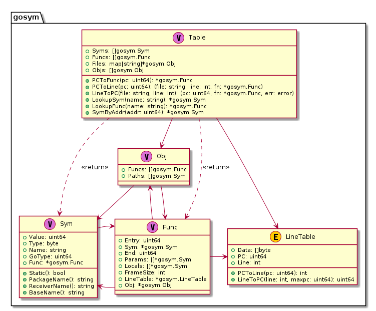

## Using pkg debug/gosym

### Data Types and Relationships

The standard library provides the `debug/gosym` package to read special section data generated by the Go toolchain, such as .gosymtab and .gopclntab. It provides Go runtime with an efficient and fast method to calculate call stacks, which is very helpful when Go programs encounter panics and need to print stack information.

The important data structures in package debug/gosym are shown in the following diagram:



Regarding the symbol information design of Go's custom .gosymtab and .gopclntab, you can refer to [Go 1.2 Runtime Symbol Information](https://docs.google.com/document/d/1lyPIbmsYbXnpNj57a261hgOYVpNRcgydurVQIyZOz_o/pub). Overall, the most important is the "**Table**" data structure, which has several very useful exported methods that we can use to **quickly convert between instruction addresses and source file locations**. By querying this table based on the Caller PC values during runtime stack traceback, we can implement a way to obtain the current call stack. This is also the main purpose of .gosymtab and .gopclntab.

### Go Custom Sections

In ELF files, symbol table information is typically stored in the `.symtab` section. Go programs are special - before Go 1.2, they had a special .gosymtab that stored symbol table structure information similar to Plan9 style. However, after Go 1.3, .gosymtab no longer contains any symbol information.

Additionally, ELF files store debugging information like line numbers and call stack information. If using DWARF debug information format, these are typically stored in .[z]debug_line and .[z]debug_frame. Go programs are special in that the Go compilation toolchain generates a section called `.gopclntab` to store line number table information for Go programs, enabling reliable call stack tracking during runtime.

So why doesn't Go use .[z]debug_line and .[z]debug_frame sections? Why add separate .gosymtab and .gopclntab sections? What are the differences between these sections?

- We know that sections starting with .[z]debug_ contain debugging information for use by debuggers, while .gosymtab and .gopclntab are for use by the Go runtime.
- When a Go program executes, its runtime loads .gosymtab and .gopclntab data into process memory to perform stack tracebacks, such as in runtime.Callers. However, .symtab and .[z]debug_* sections are not loaded into memory - they are read and loaded by external debuggers like GDB and Delve.

  ```bash
  $ readelf -l <prog>

  Program Headers:
    Type           Offset             VirtAddr           PhysAddr
                   FileSiz            MemSiz              Flags  Align
    PHDR           ...
    NOTE           ...
    LOAD           ...// 02 .note.go.builid
    LOAD           ...// 03 .rodata ... .gosymtab .gopclntab
    LOAD           ...// 04 .go.buildinfo ...
    GNU_STACK      ...
    LOOS+5041580   ...

   Section to Segment mapping:
    Segment Sections...
     00   
     01     .note.go.buildid 
     02     .text .note.go.buildid 
     03     .rodata .typelink .itablink .gosymtab .gopclntab 
     04     .go.buildinfo .noptrdata .data .bss .noptrbss 
     05   
     06 
  ```

  When we run the command `readelf -l <prog>` on a built Go program, we can see that segments 02, 03, and 04 are of type LOAD, meaning they are to be loaded into memory. These segments' corresponding sections include .gosymtab and .gopclntab but not .[z]debug_* related sections.

  This follows both common programming language and toolchain conventions, and also enables more efficient conversion between instruction addresses and source code lines, which we'll discuss later.

In fact, Go's early core developers came from Bell Labs, many with Plan9 experience. They had already experimented with something similar to pclntab during Plan9 development, as can be seen in Plan9's man pages.

**Plan9's man a.out**

```bash
NAME
    a.out - object file format

 SYNOPSIS
    #include <a.out.h>

DESCRIPTION
    An executable Plan 9 binary file has up to six sections: a
    header, the program text, the data, a symbol table, a PC/SP
    offset table (MC68020 only), and finally a PC/line number
    table.  The header, given by a structure in <a.out.h>, con-
    tains 4-byte integers in big-endian order:

   ....

   A similar table, occupying pcsz-bytes, is the next section
   in an executable; it is present for all architectures.  The
   same algorithm may be run using this table to recover the
   absolute source line number from a given program location.
   The absolute line number (starting from zero) counts the
   newlines in the C-preprocessed source seen by the compiler.
   Three symbol types in the main symbol table facilitate con-
   version of the absolute number to source file and line num-
   ber:
```

Many of Go's core developers were themselves Plan9 developers, so it's not surprising that Go borrowed from Plan9's experience. Early pclntab storage structure was very similar to Plan9's pclntab, but now they are quite different. You can refer to the Go 1.2 pclntab design proposal: [Go 1.2 Runtime Symbol Information](https://docs.google.com/document/d/1lyPIbmsYbXnpNj57a261hgOYVpNRcgydurVQIyZOz_o/pub).

> Note: Additionally, parts of the program involving cgo cannot be tracked through .gosymtab and .gopclntab.

Through package `debug/gosym`, we can build the pcln table. Using its methods PcToLine, LineToPc, etc., we can quickly query the relationship between instruction addresses and source file locations, and further analyze call stacks. For example, when a program panics, we want to print the call stack to locate the error.

**Support for call stack information is the main problem that .gosymtab and .gopclntab solve**. After Go 1.3, call stack data should be fully supported by .gopclntab, so .gosymtab became empty. This is quite different from the design purpose of .[z]debug_line and .[z]debug_frame needed by debuggers. .[z]debug_frame can not only track call stack information but also track register data changes in each stack frame, with more complex data encoding, parsing, and computation logic.

Can .gosymtab and .gopclntab be used for debugging? They're not completely useless, but compared to DWARF debugging information, they lack some information needed for debugging. We still need DWARF to fully solve debugging scenarios.

Now we should understand the purpose of package debug/gosym and its corresponding .gosymtab and .gopclntab sections, as well as their differences from .symtab and debugging-related .[z]debug_* sections.

### Common Operations and Examples

This is our test program testdata/loop2.go. Let's first show its source file information, then execute `go build -gcflags="all=-N -l" -o loop2 loop2.go` to compile it into an executable program loop2. Later we'll read loop2 and continue our experiments.

#### PC and Source File Conversion

**testdata/loop2.go：**

```go
     1  package main
     2  
     3  import (
     4      "fmt"
     5      "os"
     6      "time"
     7  )
     8  
     9  func init() {
    10      go func() {
    11          for {
    12              fmt.Println("main.func1 pid:", os.Getpid())
    13              time.Sleep(time.Second)
    14          }
    15      }()
    16  }
    17  func main() {
    18      for {
    19          fmt.Println("main.main pid:", os.Getpid())
    20          time.Sleep(time.Second * 3)
    21      }
    22  }
```

Below we'll write a test program using `debug/gosym` to implement conversion between virtual memory address pc and source file locations and functions.

**main.go：**

```go
package main

import (
    "debug/elf"
	"debug/gosym"
)

func main() {
    if len(os.Args) != 2 {
		fmt.Fprintln(os.Stderr, "usage: go run main.go <prog>")
		os.Exit(1)
	}
	prog := os.Args[1]

	// open elf
	file, err := elf.Open(prog)
	if err != nil {
		panic(err)
	}
  
	gosymtab, _ := file.Section(".gosymtab").Data()
	gopclntab, _ := file.Section(".gopclntab").Data()

	pclntab := gosym.NewLineTable(gopclntab, file.Section(".text").Addr)
	table, _ := gosym.NewTable(gosymtab, pclntab)

    // table.LineToPC(line, num), here `line` must be absolute path
	pc, fn, err := table.LineToPC("/root/debugger101/testdata/loop2.go", 3)
	if err != nil {
		fmt.Println(err)
	} else {
		fmt.Printf("pc => %#x\tfn => %s\n", pc, fn.Name)
	}
  
	pc, fn, _ = table.LineToPC("/path-to/testdata/loop2.go", 9)
	fmt.Printf("pc => %#x\tfn => %s\n", pc, fn.Name)
  
	pc, fn, _ = table.LineToPC("/path-to/testdata/loop2.go", 11)
	fmt.Printf("pc => %#x\tfn => %s\n", pc, fn.Name)
  
	pc, fn, _ = table.LineToPC("/path-to/testdata/loop2.go", 17)
	fmt.Printf("pc => %#x\tfn => %s\n", pc, fn.Name)

    // here 0x4b86cf is hardcoded, it's the address of loop2.go:9
	f, l, fn := table.PCToLine(0x4b86cf)
	fmt.Printf("pc => %#x\tfn => %s\tpos => %s:%d\n", 0x4b86cf, fn.Name, f, l)
}
```

Run the test with `go run main.go ../testdata/loop2`. Note that in the above program, we used absolute paths when specifying source files. We'll get the following output:

```bash
$ go run main.go ../testdata/loop2
no code at /root/debugger101/testdata/loop2.go:3
pc => 0x4b86cf  fn => main.init.0.func1
pc => 0x4b8791  fn => main.init.0.func1
pc => 0x4b85b1  fn => main.main
pc => 0x4b86cf  fn => main.init.0.func1 pos => /root/debugger101/testdata/loop2.go:9
```

In the above test program, we initially specified a source file location at loop2.go:3. Looking at the source code, this location contains import declarations without any functions, so no corresponding instruction was found, resulting in the error message "no code at ....loop2.go:3". The remaining test cases specified valid source code locations and output the corresponding instruction addresses.

Then we used the pc value 0x4b86cf from the first test case loop2.go:9 as the parameter for table.PCToLine(...) to test conversion from pc to source file location, and the program correctly output the source file location.

#### Runtime Stack Trace

Go programs can propagate errors not only through error returns but also through panic. Since the panic propagation path might be quite long, it continues until it's either recovered by the current goroutine or causes the process to crash.

When a panic occurs, if we actively recover it, we also want to print the call stack to track the source of the problem. If it's not recovered and causes the process to crash, the runtime will also print the call stack information for each goroutine. Both methods aim to help us easily locate the source of the panic.

Here's an example demonstrating how to recover from a panic and print call stack information:

**main.go**

```go
1  package main
2  
3  import (
4      "runtime/debug"
5  )
6  
7  func main() {
8      defer func() {
9          if e := recover(); e != nil {
10              debug.PrintStack()
11          }
12      }()
13      f1()
14  }
15  
16  func f1() {
17      f2()
18  }
19  
20  func f2() {
21      panic("let's panic")
22  }
```

Run `go run main.go` to test:

```bash
$ go run main.go

goroutine 1 [running]:
runtime/debug.Stack(0xc00001408b, 0x8, 0xc000096df0)
	/usr/local/go/src/runtime/debug/stack.go:24 +0x9f
runtime/debug.PrintStack()
	/usr/local/go/src/runtime/debug/stack.go:16 +0x25
main.main.func1()
	/Users/zhangjie/main.go:10 +0x45
panic(0x1084480, 0x10aff40)
	/usr/local/go/src/runtime/panic.go:969 +0x175
main.f2(...)
	/Users/zhangjie/main.go:21
main.f1(...)
```

How to read the above call stack information:

- First, looking from top to bottom, runtime/debug.Stack->runtime/debug.PrintStack->main.main.func1, this is where the panic was recovered;
- Continuing down, we can see where the panic was generated, panic->main.f2, notice that this function called the panic method on line 21, we've found where the panic occurred;
- The rest of the call stack doesn't need to be examined;

We've mentioned several times that **Go runtime call stack information is built based on .gopclntab**, but how?

#### How Stack Trace is Implemented

##### Common Methods for Implementing Stack Trace

How is stack unwinding implemented? Let's first discuss the general approach:

- First, get the current program's pc information. Once pc is determined, we can determine the stack frame corresponding to the current function f;
- Then get the current program's bp information (called fp in Go), which allows us to get the return address;
- The return address is usually in the stack frame of the caller's function. Use this return address as the new pc;
- Repeat the previous steps until the stack trace depth requirement is met;

##### Go Runtime Uses .gopclntab to Implement Stack Trace

To understand this, we should first understand the design of .gopclntab. This content can be referenced in [Go 1.2 Runtime Symbol Information](https://docs.google.com/document/d/1lyPIbmsYbXnpNj57a261hgOYVpNRcgydurVQIyZOz_o/pub). Then we can look at the implementation, specifically the structure of gosym.Table and related types.

At the beginning of this article, we've already shown the design of package debug/gosym. From this, we can see that the Table structure contains many Syms, Funcs, Files, and Objs. Further combining with its exposed methods, it's not difficult to see that we can easily convert between pc, file, lineno, and func.

Consider what a call stack is - it's a series of caller-callee relationships in method calls. This Table doesn't contain that, it's just used for auxiliary queries.

- To get the call stack, first you need to be able to get the current pc value of the goroutine, which Go runtime can definitely get. With pc, we can find the current function name through gosym.Table;
- Then we need to know the return address of the current function call, which requires getting bp (called fp in Go) through Go runtime, and using it to find the location storing the return address;
- In most cases, the return address returns to the function call in the caller (unless tail recursion optimization doesn't return, but Go compiler doesn't support tail recursion optimization, so we can ignore this). Use this return address as pc, find the corresponding function definition in gosym.Table, thus determining a caller;
- Repeat the above process until the stack trace depth requirement is met.

Go standard library `runtime/debug.PrintStack()` is implemented this way, but it considers more comprehensively, such as needing STW when printing all goroutines' call stacks, call stack information might exceed goroutine stack limit, so it switches to systemstack first to generate call stack information, considers impact on gc, etc.

##### Debugger Uses .gopclntab + FDE to Implement Stack Trace

Based on the previous analysis of gosym.Table, we can easily understand that if we only use .gopclntab to implement stack unwinding, it's impossible - we at least need pc and bp information. Moreover, in the debugger, it's difficult to control goroutines as flexibly as Go runtime, such as getting various context information of goroutines.

**So how should the debugger do it?**

**Researching delve source code reveals that in [go-delve/delve@913153e7](https://sourcegraph.com/github.com/go-delve/delve@913153e7ffb62512ccdf850bc37bf3abd3aecc2b/-/blob/pkg/proc/stack.go?subtree=true#L115) and earlier versions, it was implemented using gosym.Table combined with DWARF FDE**:

- dlv first uses DWARF .debug_frame section to build FDE list;
- dlv gets the tracee's pc value, then traverses the FDE list to find the FDE whose address range covers pc, this FDE is the stack frame of the function corresponding to pc;
- Then to find the caller, dlv gets the bp value, calculates the return address location, reads the return address from that location, then traverses the FDE list to find the FDE whose address range covers this return address, this FDE corresponds to the caller;
- Repeat the above process until the stack trace depth requirement is met;

**To find caller-callee relationships, dlv processes according to the above process. As for the callee's current pc and the pc at the caller's call to the current function, the conversion between these virtual memory addresses and function names, source file location information is still implemented through gosym.Table.**

**Actually, go-delve/delve's implementation took a bit of a "shortcut" here. Originally, it could have used .[z]debug_line to implement pc and file:lineno conversion, and could have used .[z]debug_frame to determine the call stack.**

It needs to be clear that **.gopclntab only records pc and source file location mapping information for pure Go programs, it doesn't include parts of cgo programs, because C compilers don't understand these things, so it has certain limitations.** However, generating .[z]debug_line and .[z]debug_frame information is supported by common compilers and can better solve these limitation problems.

In [go-delve/delve@6d405179](https://sourcegraph.com/github.com/go-delve/delve@6d405179/-/blob/pkg/proc/stack.go?subtree=true#L113), project core developer aarzilli solved this problem and specifically emphasized in the commit record the issue of using .[z]debug_line to replace .gosymtab and .gopclntab:

```bash
commit 6d40517944d40113469b385784f47efa4a25080d
Author: aarzilli <alessandro.arzilli@gmail.com>
Date:   Fri Sep 1 15:30:45 2017 +0200

    proc: replace all uses of gosymtab/gopclntab with uses of debug_line
  
    gosymtab and gopclntab only contain informations about go code, linked
    C code isn't there, we should use debug_line instead to also cover C.
  
    Updates #935
```

Ok, everyone should understand the implementation principle now. We will practice this in the next chapter during debugger development.

### Section Summary

This section introduced the design of the standard library debug/gosym package and demonstrated how to convert between instruction addresses and source code locations. It also introduced how the standard library debug.PrintStack() implements runtime call stack tracing based on .gosymtab and .gopclntab. It also introduced how the famous delve debugger initially used .gosymtab and .gopclntab + DWARF FDE to implement stack tracing, and how it later migrated to DWARF .[z]debug_line and .[z]debug_frame to more comprehensively support debugging for cgo compatibility.

Everyone should have some understanding of this content now. Next, we will start learning about the debugging information standard DWARF.

### References

1. How to Fool Analysis Tools, https://tuanlinh.gitbook.io/ctf/golang-function-name-obfuscation-how-to-fool-analysis-tools
2. Go 1.2 Runtime Symbol Information, Russ Cox, https://docs.google.com/document/d/1lyPIbmsYbXnpNj57a261hgOYVpNRcgydurVQIyZOz_o/pub
3. Some notes on the structure of Go Binaries, https://utcc.utoronto.ca/~cks/space/blog/programming/GoBinaryStructureNotes
4. Buiding a better Go Linker, Austin Clements, https://docs.google.com/document/d/1D13QhciikbdLtaI67U6Ble5d_1nsI4befEd6_k1z91U/view
5. Time for Some Function Recovery, https://www.mdeditor.tw/pl/2DRS/zh-hk
