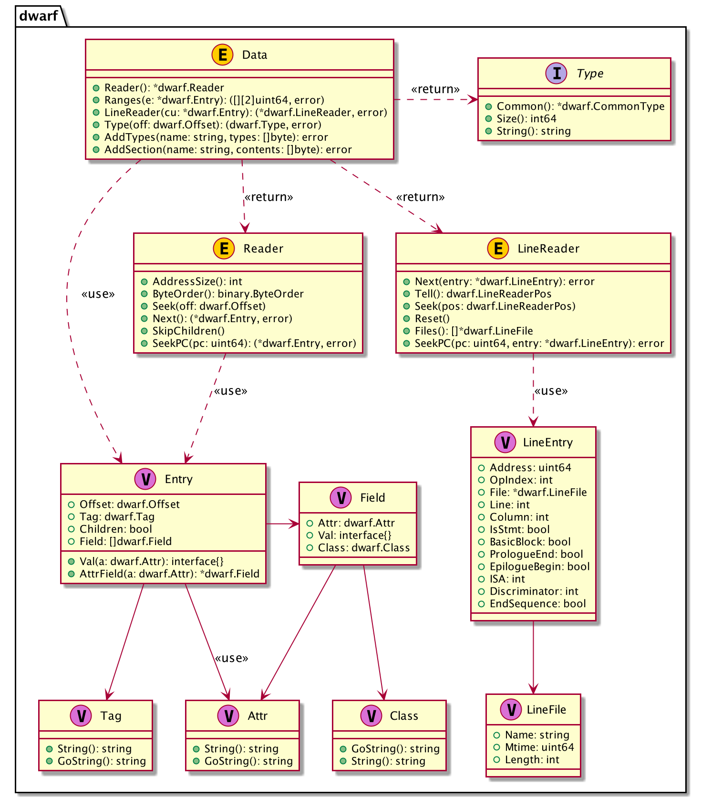

## Using pkg debug/dwarf

### DWARF Data Storage

The standard library provides package `debug/dwarf` to read DWARF data generated by the Go compilation toolchain, such as .debug_info, .debug_line, etc.

When Go generates DWARF debugging information, it compresses the DWARF information before storing it in different sections. For example, data describing types, variables, and function definitions is stored in .debug_info before compression, and in .zdebug_info after compression, typically using the zlib compression algorithm. This was done in early versions of `go-delve/delve`, but in reality, ELF sections have a `Compressed` flag field to indicate whether the data in the section is compressed. In newer versions of Go, compressed debugging information is no longer written to .zdebug_ related sections, but uniformly written to .debug_ sections with the `Compressed=true` flag set.

When compiling Go programs, you can specify the linker option `go build -ldflags="dwarfcompress=false"` to disable DWARF data compression. Some DWARF information viewing tools are outdated and don't support decompression, in which case you might want to disable DWARF data compression. `debug/dwarf` provides the ability to read DWARF information and has compatibility handling for these past design implementations. The only shortcoming is that `debug/dwarf` **does not provide call stack information reading**, which needs to be implemented separately.

### Data Types and Relationships

The important data structures in package `debug/dwarf` are shown in the following diagram:



After opening an elf.File, we can read DWARF data. When we call `elf.File.Data()`, it returns the read and parsed DWARF data (i.e., Data in the class diagram). We can then further read various types of information from DWARF and combine it with our understanding of the source code.

Through Data, we can get a reader that can read and parse the data in the .[z]debug_info section. Using this reader, we can traverse DIE (i.e., Entry in the class diagram). Each DIE consists of a Tag and a series of Attrs.

When we read a DIE with Tag type DW_TAG_compile_unit, it indicates a compilation unit. Each compilation unit has its own line number table. Through Data (i.e., this DIE), we can get a LineReader for reading .[z]debug_line. Using it, we can read records in the line number table (i.e., LineEntry in the class diagram), which records the correspondence between virtual memory addresses, source filenames, line numbers, column numbers, etc.

### Common Operations and Examples

We've roughly introduced the support and limitations provided by the standard library, as well as the general usage of the standard library. Next, we'll provide several examples to demonstrate how to read and parse DWARF debugging information and extract the content we care about.

#### Reading DWARF Data

First, we need to open the ELF file, then read and parse multiple DWARF-related section data. The Go standard library has already implemented handling for whether DWARF data is compressed and needs decompression.

The following program opens an ELF file and returns the parsed DWARF data:

```go
import (
    "debug/elf"
    "fmt"
)
func main() {
    if len(os.Args) != 2 {
        fmt.Fprintln(os.Stderr, "usage: go run main.go <prog>")
        os.Exit(1)
    }
    prog := os.Args[1]

    // open elf
    file, err := elf.Open(prog)
    if err != nil {
        panic(err)
    }
  
    // dwarf debugging information traversal
    dw, err := file.DWARF()
    if err != nil {
        panic(err)
    }
    fmt.Println("read dwarf ok")
}
```

Run the test with `go run main.go ../testdata/loop2`. The program simply prints a line indicating successful reading. Based on this, we will implement reading of various types of information from DWARF data.

#### Reading Compilation Unit Information

After getting the DWARF data dwarf.Data from the ELF file, we can read the data we're interested in from dwarf.Data. Before reading, we need to understand how DWARF data is organized and some content of the Go standard library implementation.

A project may contain multiple source files, each source file is a compilation unit, and an object file may contain multiple compilation units. When generating debugging information, each object file corresponds to a DIE with tag type DW_TAG_compile_unit. The children of this DIE contain other rich information, such as functions, variables in functions, etc. All this information is expressed through DWARF DIE.

> How are Go compilation units generated? `go tool compile *.go`, is each source file a compilation unit? Does each source file correspond to an object file after compilation? Think about C and C++, where each source file is an independent compilation unit, and each source file corresponds to an object file. Go is somewhat different in this aspect, as you can see when running the tests below.
>
> // A CompilationUnit represents a set of source files that are compiled
> // together. Since all Go sources in a Go package are compiled together,
> // there's one CompilationUnit per package that represents all Go sources in
> // that package, plus one for each assembly file.
> //
> // Equivalently, there's one CompilationUnit per object file in each Library
> // loaded by the linker.
> //
> // These are used for both DWARF and pclntab generation.
> type CompilationUnit struct {
> 	Lib       *Library      		// Our library
> 	PclnIndex int           	// Index of this CU in pclntab
> 	PCs       []dwarf.Range 	// PC ranges, relative to Textp[0]
> 	DWInfo    *dwarf.DWDie  // CU root DIE
> 	FileTable []string      	// The file table used in this compilation unit.
>
>     Consts    LoaderSym   	// Package constants DIEs
> 	FuncDIEs  []LoaderSym // Function DIE subtrees
> 	VarDIEs   []LoaderSym 	// Global variable DIEs
> 	AbsFnDIEs []LoaderSym // Abstract function DIE subtrees
> 	RangeSyms []LoaderSym // Symbols for debug_range
> 	Textp     []LoaderSym 	// Text symbols in this CU
> }
>
> In Go, it's organized by package. One package corresponds to one compilation unit. If there are assembly files, each assembly file is a separate compilation unit, and each compilation unit corresponds to an object file.

`rd := dwarf.Data.Reader()` returns a reader object. Through `rd.Next()`, we can traverse all DIEs in the ELF file. Since all compilation units, types, variables, and functions are represented by DIE, we have the ability to traverse all compilation units in the ELF file and the types, variables, and functions defined in the compilation units.

Let's first try to traverse all compilation unit information.

```go
package main

import (
    "debug/dwarf"
    "debug/elf"
    "fmt"
    "os"
    "text/tabwriter"
)

func main() {
    ...
    dw, err := file.DWARF()
    ...
  
    err = iterateComplilationUnit(dw)
    if err != nil {
        fmt.Println(err)
    }
}

func iterateComplilationUnit(dw *dwarf.Data) error {
    rd := dw.Reader()

    tw := tabwriter.NewWriter(os.Stdout, 0, 4, 3, ' ', 0)
    fmt.Fprintf(tw, "No.\tTag\tName\tLanguage\tStmtList\tLowPC\tRanges\tOthers\n")
    defer tw.Flush()

    for idx := 0; ; idx++ {
        entry, err := rd.Next()
        if err != nil {
            return fmt.Errorf("iterate entry error: %v", err)
        }
        if entry == nil {
            fmt.Println("iterate entry finished")
            return nil
        }
        if entry.Tag != dwarf.TagCompileUnit {
            continue
        }
        fmt.Fprintf(tw, "%d\t%s\t%v\t%v\t%v\t%v\t%v\n",
            idx,
            entry.Tag.String(), entry.Field[0].Val,
            entry.Field[1].Val, entry.Field[2].Val,
            entry.Field[3].Val, entry.Field[4].Val, )
    }
}
```

Run the test with `go run main.go ../testdata/loop2`. The program outputs the following information:

```bash
 $ go run main.go ../testdata/loop2

Tag           Name                      Language   StmtList   LowPC     Ranges   Others
CompileUnit   sync                      22         0          4724928   0
CompileUnit   internal/cpu              22         3626       4198400   32
CompileUnit   internal/cpu              22         4715       4201888   80
CompileUnit   runtime/internal/sys      22         4846       4202336   112
CompileUnit   fmt                       22         5513       4906048   144
CompileUnit   runtime/internal/atomic   22         14330      4202560   176
CompileUnit   strconv                   22         160219     4653184   944
...........   .......                   ..         ......     .......   ...
CompileUnit   syscall                   22         167358     4883104   992
CompileUnit   internal/oserror          22         170142     4882624   1040
CompileUnit   io                        22         170356     4881888   1072
CompileUnit   internal/fmtsort          22         170746     4873280   1104
CompileUnit   sort                      22         171968     4870400   1136    // <= 1 CU, but multiple go files in the path
CompileUnit   unicode/utf8              22         172957     4676128   1168
CompileUnit   reflect                   22         174048     4767616   1200
CompileUnit   sync/atomic               22         194816     4658240   1248
CompileUnit   sync/atomic               22         195127     4658976   1280
CompileUnit   unicode                   22         195267     4742624   1312
CompileUnit   runtime                   22         195635     4631616   1344
CompileUnit   reflect                   22         195725     4855840   1376
```

This shows information about each compilation unit, such as name, programming language (22 is Go), number of statement lists, and address ranges.

#### Reading Function Definitions

DIE describes code. As mentioned earlier, compilation units are described by DIE with tag DW_TAG_compile_unit. After reading this DIE, we can continue to read function definitions in the compilation unit, which are a series of DIEs with tag DW_TAG_subprogram. When reading each function, the function also contains some local variable definitions, which are a series of DIEs with tag DW_TAG_variable.

Their relationship is roughly as follows:

```bash
  DW_TAG_compile_unit
    ...
    DW_TAG_subprogram
      ...
      DW_TAG_variable
        DW_AT_name: "a"
        DW_AT_type: (signature) 0xd681845c 21a14576
        DW_AT_location: ...
    ...
```

Here we'll use reading main.main as an example to demonstrate how to read functions and variables in a compilation unit.

**main.go**

```go
package main

import (
    "debug/dwarf"
    "debug/elf"
    "fmt"
    "os"
)

func main() {
    ...
    dw, err := file.DWARF()
    ...
  
    err = parseDwarf(dw)
    if err != nil {
        fmt.Println(err)
    }
}

// Variable represents function local variable information
type Variable struct {
    Name string
}

// Function represents function information, including function name, source file where it's defined, and variables it contains
type Function struct {
    Name      string
    DeclFile  string
    Variables []*Variable
}

// CompileUnit represents a compilation unit, including a series of source files and function definitions
type CompileUnit struct {
    Source []string
    Funcs  []*Function
}

var compileUnits = []*CompileUnit{}

func parseDwarf(dw *dwarf.Data) error {
    rd := dw.Reader()

    var curCompileUnit *CompileUnit
    var curFunction *Function

    for idx := 0; ; idx++ {
        entry, err := rd.Next()
        if err != nil {
            return fmt.Errorf("iterate entry error: %v", err)
        }
        if entry == nil {
            return nil
        }

        // parse compilation unit
        if entry.Tag == dwarf.TagCompileUnit {
            lrd, err := dw.LineReader(entry)
            if err != nil {
                return err
            }

            cu := &CompileUnit{}
            curCompileUnit = cu
    
            // record the files contained in this compilation unit
            for _, v := range lrd.Files() {
                if v == nil {
                    continue
                }
                cu.Source = append(cu.Source, v.Name)
            }
            compileUnits = append(compileUnits, cu)
        }

        // pare subprogram
        if entry.Tag == dwarf.TagSubprogram {
            fn := &Function{
                Name:     entry.Val(dwarf.AttrName).(string),
                DeclFile: curCompileUnit.Source[entry.Val(dwarf.AttrDeclFile).(int64)-1],
            }
            curFunction = fn
            curCompileUnit.Funcs = append(curCompileUnit.Funcs, fn)

            // 如果是main.main函数，打印一下entry，方便我们印证
            if fn.Name == "main.main" {
                printEntry(entry)
                fmt.Printf("main.main is defined in %s\n", fn.DeclFile)
            }
        }

        // parse variable
        if entry.Tag == dwarf.TagVariable {
            variable := &Variable{
                Name: entry.Val(dwarf.AttrName).(string),
            }
            curFunction.Variables = append(curFunction.Variables, variable)
            // 如果当前变量定义在main.main中，打印一下entry，方便我们印证
            if curFunction.Name == "main.main" {
                printEntry(entry)
            }
        }
    }
    return nil
}

// 打印每个DIE的详细信息，调试使用，方便我们根据具体结构编写代码
func printEntry(entry *dwarf.Entry) {
    fmt.Println("children:", entry.Children)
    fmt.Println("offset:", entry.Offset)
    fmt.Println("tag:", entry.Tag.String())
    for _, f := range entry.Field {
        fmt.Println("attr:", f.Attr, f.Val, f.Class)
    }
}
```

在执行测试之前，我们也说一下用来测试的源程序，注意我们在main.main中定义了一个变量pid。

**testdata/loop2.go**

```go
 1  package main
 2  
 3  import "fmt"
 4  import "os"
 5  import "time"
 6  
 7  func init() {
	....
14  }
15  func main() {
16      pid := os.Getpid()
17      for {
18          fmt.Println("main.main pid:", pid)
19          time.Sleep(time.Second * 3)
20      }
21  }

```

Run the test with `go run main.go ../testdata/loop2`. The program outputs the following information:

```bash
$ go run main.go ../testdata/loop2 
children: true
offset: 324423
tag: Subprogram
attr: Name main.main ClassString
attr: Lowpc 4949376 ClassAddress
attr: Highpc 4949656 ClassAddress
attr: FrameBase [156] ClassExprLoc
attr: DeclFile 2 ClassConstant
attr: External true ClassFlag

main.main is defined in /root/debugger101/testdata/loop2.go

children: false
offset: 324457
tag: Variable
attr: Name pid ClassString
attr: DeclLine 16 ClassConstant
attr: Type 221723 ClassReference
attr: Location [145 160 127] ClassExprLoc
```

The program successfully found the main.main function and its source file location. Since this function doesn't have any local variables, the Variables field is empty.

The process of traversing the compilation unit (CompileUnit), reading each function (Subprogram) from the compilation unit, and reading a series of variables (Variable) defined in the functions is roughly covered by the above example. Of course, we still need to extract more information, such as the line number information of function definitions in the source file, and the line and column number information of variables in the source file, etc.
#### Reading Line Number Table Information

Each compilation unit (CompileUnit) has its own line number table information. When we read a DIE with tag type DW_TAG_compile_unit from the DWARF data, we can try to read the line table information from the .[z]debug_line section. The debug/dwarf package provides corresponding implementation - dwarf.LineReader reads one line of table information (dwarf.LineEntry) at a time from the specified compilation unit.

Using this line table data, we can easily implement conversion between source file locations and virtual addresses.

Let's first implement reading the line number table. We only need to make a few changes to the previous code:

```go
func main() {
    ...
    err = parseDwarf(dw)
    ...
    pc, err := find("/root/debugger101/testdata/loop2.go", 16)
    if err != nil {
        panic(err)
    }

    fmt.Printf("found pc: %#x\n", pc)
}

type CompileUnit struct {
    Source []string
    Funcs  []*Function
    Lines  []*dwarf.LineEntry
}

func parseDwarf(dw *dwarf.Data) error {}
    ...
    for idx := 0; ; idx++ {
        ...
  
        if entry.Tag == dwarf.TagCompileUnit {
            lrd, err := dw.LineReader(entry)
            ...

            for {
                var e dwarf.LineEntry
                err := lrd.Next(&e)
                if err == io.EOF {
                    break
                }
                if err != nil {
                    return err
                }
                curCompileUnit.Lines = append(curCompileUnit.Lines, &e)
            }
        }
        ...
    }
}

func find(file string, lineno int) (pc uint64, err error) {
    for _, cu := range compileUnits {
        for _, e := range cu.Lines {
            if e.File.Name != file {
                continue
            }
            if e.Line != lineno {
                continue
            }
            if !e.IsStmt {
                continue
            }
            return e.Address, nil
        }
    }
    return 0, errors.New("not found")
}
```

Let's look up the virtual address corresponding to the source file location `testdata/loop2.go:16` (currently hardcoded), by running the test `go run main.go ../testdata/loop2`:

```bash
$ go run main.go ../testdata/loop2

found pc: 0x4b85af
```

The program successfully found the virtual memory address corresponding to the source file location.

Readers may wonder why the example program doesn't show the function definition corresponding to the source file location? This involves reading and parsing the call stack information table in .[z]debug_frame. This information is needed to construct the FDE (Frame Descriptor Entry), which allows us to find the Frame containing the instruction's virtual memory address, and further obtain the function name corresponding to this stack frame.

Unfortunately, the Go standard library does not support parsing these sections like .debug_frame, so we need to implement this ourselves.

#### Reading Call Stack Information

In ELF files, call stack information is stored in the .[z]debug_frame section. The Go standard library `debug/dwarf` does not support parsing this information. We will explain how to read, parse, and apply call stack information in subsequent chapters.

Getting the current call stack is very important for debugging. For now, just be aware of this concept - we'll explore it together later.

### Section Summary 

This section introduced the design and application of the Go standard library debug/dwarf, with examples of reading DWARF data and parsing compilation units, function definitions, variables, and line number table information.

This section also introduced many DWARF-related technical terms that readers may not fully understand yet. As this section is part of the Go standard library debug/*, we covered it here comprehensively, inevitably including DWARF-related concepts. However, these concepts weren't explained in detail beforehand (mainly due to space constraints making it impractical to cover everything in one section). It's perfectly normal if readers don't understand everything - focus on grasping the basic usage for now.

In Chapter 8, we will dive deep into the DWARF debugging information standard. Understanding the DWARF debugging information standard is essential for becoming proficient in symbolic debugger development.

### References

1. How to Fool Analysis Tools, https://tuanlinh.gitbook.io/ctf/golang-function-name-obfuscation-how-to-fool-analysis-tools
2. Go 1.2 Runtime Symbol Information, Russ Cox, https://docs.google.com/document/d/1lyPIbmsYbXnpNj57a261hgOYVpNRcgydurVQIyZOz_o/pub
3. Some notes on the structure of Go Binaries, https://utcc.utoronto.ca/~cks/space/blog/programming/GoBinaryStructureNotes
4. Buiding a better Go Linker, Austin Clements, https://docs.google.com/document/d/1D13QhciikbdLtaI67U6Ble5d_1nsI4befEd6_k1z91U/view
5. Time for Some Function Recovery, https://www.mdeditor.tw/pl/2DRS/zh-hk
