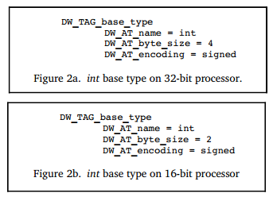

## Describing Data and Types

During software debugging, we often print variable values, view variable types, and modify variable values, such as the `print`, `whatis`, and `set` operations in `dlv`. The implementation of these operations relies on DWARF's description of data and data types.

Different programming languages define built-in data types and provide methods for custom data types. In different programming languages, even basic data types that appear to have the same name may differ on the same hardware and OS, let alone on different hardware and OS. For example, `int` differs between C and Go, and Go's `int` differs between 32-bit and 64-bit systems.

How should DWARF achieve precise low-level representation and description for different programming languages? DWARF first abstracts several basic types (numeric types) based on machine hardware, and then constructs other composite data types by combining these basic data types. These new data types can further be used to build other custom data types.

Let's see how to use DIE to describe data and data types.

### Basic Types

Each programming language defines some basic data types and integrates them into the language's type system. For example, C, Go, and Java all define `int`. Java provides a clear definition where `int` is 4 bytes on any platform, but C and Go only specify some general characteristics, allowing the compiler to choose the most suitable actual specifications for the target platform. For instance, Go's `int` is 4 bytes on 32-bit systems and 8 bytes on 64-bit systems. Some languages are more special, like Pascal, which even allows defining new basic types, such as an integer type that can hold values between 0 and 100.

```go
// see: src/cmd/compile/internal/types2/sizes.go
var gcArchSizes = map[string]*gcSizes{
    "386":      {4, 4},  // 32-bit
    "amd64":    {8, 8},  // 64-bit
    "amd64p32": {4, 8},  // 32-bit pointers on 64-bit CPU
    // ...
}

type gcSizes struct {
    WordSize int64 // word size in bytes - must be >= 4 (32bits)
    MaxAlign int64 // maximum alignment in bytes - must be >= 1
}
```

In short, different programming languages and platforms have the following facts:

- The same language on different hardware platforms may have different sizes for the same data type.
- Different languages on the same hardware platform may have different sizes for the same data type.

In DWARF v1 and other debugging information formats, the compiler and debugger should agree on how many bytes `int` is, similar to a hardcoded approach. However, this becomes awkward when the same hardware can support different integer sizes or when different compilers make different implementation decisions for the same target processor. These assumptions, often not documented in debugging information, make it difficult to achieve compatibility between different compilers or debuggers, or even between different versions of the same tool.

How can DWARF flexibly map basic types in programming languages to different software and hardware platforms? C language also supports bit fields, where even if N bytes are allocated for storage, only a portion of the bits may be used. How can this be described? DWARF v2 solved this problem by providing a low-level mapping scheme that achieves flexible mapping between "**simple data types**" and "**implementations on target software and hardware platforms**."

**DW_TAG_base_type**, corresponding attributes include (refer to DWARFv2-Appendix: Current Attributes by Tag Value):

| Attributes       | Description                                                                                                           |
| :--------------- | :-------------------------------------------------------------------------------------------------------------------- |
| DW_AT_name       | Type name, such as int                                                                                                |
| DW_AT_encoding   | Indicates how the data should be encoded and interpreted, such as address, boolean, float, signed, unsigned, signed char, unsigned char, packed, UTF, etc. |
| DW_AT_byte_size  | How many bytes it occupies                                                                                            |
| DW_AT_bit_size   | How many bits are actually used                                                                                       |
| DW_AT_bit_offset | The starting offset of the actual used bitsize bits in the bytesize bytes                                             |
| DW_AT_sibling    | Points to a sibling DIE. When generating DWARF information, if it is considered more important to quickly skip children and scan siblings, this attribute will be generated. |

The attribute `DW_AT_encoding` reflects the differences between different basic data types, indicating how different basic data types should be encoded and interpreted. Here are a few examples to help deepen understanding. The corresponding language compilation toolchain can refer to this when generating DWARF information, and the debugger can refer to this when reading and interpreting data.

Figure 2a defines the type `int` as a 4-byte signed number on a 32-bit processor, and Figure 2b defines the type `int` as a 2-byte signed number on a 16-bit processor.



Figure 3 defines the type `word` as a 16-bit signed value, but this type actually occupies 4 bytes, with only the high 2 bytes being used, and the low 2 bytes all being 0.


Note that the above examples are taken from the official examples of DWARF v2. In DWARF v4, `DW_AT_bit_offset` has been deprecated and replaced by `DW_AT_data_bit_offset`. In DWARF v2 and v3, the attribute `DW_AT_bit_offset` was used to represent bit fields on big-endian machines, which was somewhat wasteful for little-endian machines.

### Composite Types

As shown in Figure 4, let's first look at an example describing a named variable. There is a DIE of type `DW_TAG_variable` describing the variable `x`. The attribute `DW_AT_name=x` indicates that the variable name is `x`, and `DW_AT_type=<1>` indicates that this attribute is a type reference, with the variable type determined by the DIE pointed to by `<1>`. The DIE `<1>` represents a 4-byte signed integer. Finally, we can determine that a variable `x` of type 4-byte signed integer is defined here.


Next, let's continue to see how we can construct more complex composite data types by combining these basic data types. In Figure 5, a variable `px` is defined, and its type is referenced by `DW_AT_type=<2>` to another DIE numbered `<2>`.

The DIE numbered `<2>` has a TAG of `DW_TAG_pointer_type`, indicating that it is a pointer type. This DIE internally references another DIE numbered `<3>` describing the data type through the attribute `DW_AT_type=<3>`. The DIE `<3>` has a TAG of `DW_TAG_base_type`, indicating that it is a basic data type, specifically a 4-byte signed integer. Basic data types do not depend on any other types, so the analysis ends here.

Thus, through a series of analyses, we can determine that the variable `px` is a 4-byte wide pointer, and this pointer points to a 4-byte signed integer `int`.


Other data types can also be defined by linking multiple DIEs (`DW_TAG... + DW_AT_type...`). For example, you can extend `DW_TAG_pointer_type` to support describing C++ reference types, or extend basic types to support describing Go's `uintptr`, and thus `Unsafe.Pointer`.

> Note: **A supplement on the value of reference attributes?**
>
> For better understanding, a natural number is used when referencing a DIE. In the actual DWARF data storage, this is not a number but an offset (the offset of the DIE's position from the beginning of the compilation unit containing it).

### Array Types

**DW_TAG_array_type**, combined with some related attributes, describes arrays.

The DIE corresponding to the array includes attributes to describe the array elements:

- **DW_AT_ordering**: Describes whether the array is stored in "**row-major order**" or "**column-major order**". For example, Fortran stores arrays in column-major order, while C and C++ store arrays in row-major order. If this attribute value is not specified, the default array arrangement rule of the programming language specified by `DW_AT_language` is used.
- **DW_AT_type**: Describes the type information of each element in the array.
- **DW_AT_byte_stride/DW_AT_bit_stride**: If the actual size of each element in the array is different from the allocated space size, these two attributes can be used to explain.
- **Array index range**: The DIE also needs to specify the minimum and maximum index values to give a valid index range. This way, DWARF can describe both C-style arrays (using 0 as the array starting index) and Pascal and Ada arrays (where the minimum and maximum index values can vary).

  Array dimensions are generally described by a DIE with a TAG of **DW_TAG_subrange_type** or **DW_TAG_enumeration_type**.
- Others;

Through the above attributes and DIEs describing array dimensions, an array is clearly described.

For example, we create an array, then compile and build `go build -o main -gcflags 'all=-N -l' main.go`, and then use the author's tool `dwarfviewer` to visualize the dependency relationships between DIEs in the file.

```go
$ cat main.go
package main

func main() {
    var nums [16]int
    _ = nums
}
```

Run `dwarfviewer -file main -webui`, then search for `main.main` and expand the DIE definitions related to `nums` level by level. The author has already annotated the important information related to arrays in the screenshot, and it should not be difficult to understand with the above text description.


### Struct, Class, Union, and Interface

Most programming languages allow defining a new data type by combining multiple different data types. DWARF also needs to support describing this capability, so DWARF defines the following TAG types:

- **DW_TAG_structure_type**, describing structs;
- **DW_TAG_class_type**, describing classes;
- **DW_TAG_union_type**, describing unions;
- **DW_TAG_interface_type**, describing interfaces;

Structs allow combining multiple members of different types. In C, unions also allow this, but different members share the same storage space. C++ structs add some features compared to C, allowing the addition of member functions. C++ classes and Java interfaces and classes have similarities but also differences. Additionally, different languages generally have similar composite data types, but the names may differ. For example, in C++, they are called classes and class members, while in Pascal, they are called records and fields. When abstracting these descriptions, DWARF also needs to choose a suitable name, and DWARF adopts the terminology from C++. The DIE describing a class is the parent DIE of the many DIEs describing the class members. Each class has a name and possible attributes (members). If the size of a class instance can be determined at compile time, the DIE describing the class will have an additional attribute `DW_AT_byte_size`. The description of classes and class members is not much different from the description of basic data types, but may include additional descriptive information, such as access modifiers for class members. C/C++ also supports bit fields in structs, where multiple members can share the same byte, but different members can use different numbers of adjacent bits. This needs to be described through multiple attributes: `DW_AT_byte_size` describes how many bytes the struct actually occupies, and the attributes `DW_AT_bit_offset` and `DW_AT_bit_size` describe which bits the bit field actually occupies, starting from which bit, and how many bits it occupies.

Due to the differences in the program constructs described by these types, DWARF needs to define corresponding attributes to accurately describe the commonalities and differences in these languages. Due to space constraints, we won't list and compare them one by one. If interested, you can refer to Chapter $5.5 of DWARF v4 for detailed information.

Here, let's look at an example of type definition in Go. We define a struct type `Student` and an anonymous nested `CollegeStudent`, and then create variables for both in the `main` function.

```go
$ cat main.go
package main

type Student struct {
    Name   string
    Age    int
    Sex    int
    Grades map[string]float32
}

type CollegeStudent struct {
    Student
    Clubs []string
}

func main() {
    var s1 Student
    var s2 CollegeStudent
    _ = s1
    _ = s2
}
```

Note that when compiling and building, we still turn off inlining and other optimizations. Let's visualize the generated DIE information. The author has already annotated the important information in the screenshot, and it should be easy to understand with the previous introduction:


### Variable Definitions

**DW_TAG_variable**, used to describe variables, has been mentioned multiple times in the previous examples. Variables are usually very simple. A variable has a variable name (`DW_AT_name`), and the program uses the variable name to refer to the value of the variable in memory or registers. The variable's type describes the type of the value and access modifiers (such as read-only `const`). Additionally, it's important to note that DWARF divides variables into three categories: constants, formal parameters, and variables. Here, we will only focus on variables, and we will have opportunities to encounter constants and formal parameters later.

The two elements that distinguish variables are the **storage location** and **scope** of the variable:

- **Storage location of the variable**: A variable can be stored in the global data area (`.data` section), stack, heap, or registers.
- **Scope of the variable**: Describes when it is visible in the program. To some extent, the variable's scope is determined by its declaration location. DWARF describes the variable declaration location through a triple (file name, line number, column number).

During debugging, since we can obtain the location information of the variable in memory, we can read the corresponding data through the `PTRACE_PEEKDATA` operation. How much data to read and how to interpret this data requires referring to the type information referenced by the variable. With data and type information, those with experience in reflection will naturally find it easy to handle. Right?

In the previous demo screenshots, sharp-eyed readers should have noticed a problem: the variable address value displayed looks more like gibberish? That's correct. The value of the `DW_AT_location` attribute is a byte array. When the `dwarfviewer` server returns the packet, it first encodes it in base64, and then directly displays it on the front end, so the address value is displayed as a strange string. Can we directly display this byte array? No. This is the content to be introduced next. The byte array does not store an address value but a location expression, a set of address calculation rules. We need to execute these calculation rules to get a valid address. We have adjusted the `dwarfviewer` logic so that it can convert the above byte array into a readable location expression.

Variable location demo: The following example and screenshot normally display the variable's location information. In our example, the variable's location expression is based on the `fbreg` addressing rule. We won't expand on this here, but after introducing the location expression content, everyone will naturally understand.

```go
package main

func main() {
    var a string = "helloworld"
    var b int = 100
    _ = a
    _ = b
}
```


Variable scope demo: We also need to show a situation where variables are defined in different scopes. Let's slightly adjust the example code and run the test again.

```go
package main

func main() {
    var a string = "helloworld"
    var b int = 100
    _ = a
    _ = b
    {
        var a string = "helloworld2"
        _ = a
    }
}
```

Then, let's visualize the generated DIE information again to see what's different. We notice that the scope is represented through `DW_TAG_lexical_block`:


### Learn More

- Debugging Using DWARF (2012), https://www.scribd.com/document/403070136/Debugging-Using-DWARF-2012
- Types of Declarations, refer to DWARF v2 Chapter 3.2.2.1 and Chapter 3.2.2.2;
- Accessibility of Declarations, some languages provide access control for objects or other entities, which can be achieved by specifying the attribute `DW_AT_accessibility`, with possible values `DW_ACCESS_public`, `DW_ACCESS_private`, `DW_ACCESS_protected`;
- Visibility of Declarations, specifies the visibility of declarations, whether they are visible in other modules or only in the current declaration module, which can be achieved by specifying the attribute `DW_AT_visibility`, with possible values `DW_VIS_local`, `DW_VIS_exported`, `DW_VIS_qualified`;
- Virtuality of Declarations, C++ provides support for virtual functions and pure virtual functions, which can be achieved by specifying the attribute `DW_AT_virtuality`, with possible values `DW_VIRTUALITY_none`, `DW_VIRTUALITY_virtual`, `DW_VIRTUALITY_pure_virtual`;
- Artificial Entries, the compiler may wish to add debugging information entries for objects or types not declared in the program source code. For example, in C++, class member functions (non-static members) have a formal parameter description entry for each formal parameter, and an additional entry describing the implicitly passed `this` pointer;
- Declaration coordinates, each DIE (debugging information entry) describing an object, module, function, or type will have the following attributes: `DW_AT_decl_file`, `DW_AT_decl_line`, `DW_AT_decl_column`. These attributes describe the location where the declaration appears in the source file;

### Summary of This Article

This article introduces how DWARF describes data and data types. The main content includes:

- DWARF constructs complex data types by combining basic types to adapt to the needs of different programming languages and platforms;
- Uses `DW_TAG_base_type` and its attributes to describe basic data types, including type name, encoding method, size, and other information;
- Uses the `DW_AT_type` attribute to reference the type DIE used;
- Uses `DW_AT_byte_size`, `DW_AT_bit_size`, `DW_AT_bit_offset` to represent the allocated bytes, actual bits used, and offset;
- The scope of variables is represented through `DW_TAG_lexical_block`, which can accurately describe variables with the same name in different scopes;
- Describes the variable's location information through the `DW_AT_location` attribute, which stores a location expression rather than a direct address value;

This flexible type description mechanism allows DWARF to precisely express data types in various programming languages and supports debuggers in correctly accessing and displaying variable information. At the same time, through the description of location expressions and scopes, variables can be accurately located and distinguished. In the next section, we will introduce in detail how the `DW_AT_location` location information is designed.

### References

1. DWARF, https://en.wikipedia.org/wiki/DWARF
2. DWARFv1, https://dwarfstd.org/doc/dwarf_1_1_0.pdf
3. DWARFv2, https://dwarfstd.org/doc/dwarf-2.0.0.pdf
4. DWARFv3, https://dwarfstd.org/doc/Dwarf3.pdf
5. DWARFv4, https://dwarfstd.org/doc/DWARF4.pdf
6. DWARFv5, https://dwarfstd.org/doc/DWARF5.pdf
7. DWARFv6 draft, https://dwarfstd.org/languages-v6.html
8. Introduction to the DWARF Debugging Format, https://dwarfstd.org/doc/Debugging-using-DWARF-2012.pdf
9. dwarfviewer, https://github.com/hitzhangjie/dwarfviewer
