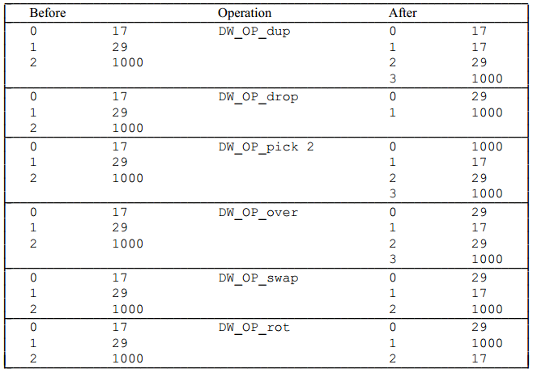

## Location Data

Debugging information must provide a method for the debugger to find the location of program variables, determine the range of dynamic arrays and strings, and find the base address of the function stack frame or the return address of the function. Additionally, to meet the requirements of the latest computer architectures and optimization techniques, debugging information must be able to describe the location of objects, and it should be noted that the location of the object may change during its lifecycle.

DWARF provides a very general mechanism to describe how to determine the actual location of a variable in memory, which is through the attribute **DW_AT_location**. This attribute allows specifying a sequence of operations to inform the debugger how to determine the address of the variable.

### Multiple Addressing Modes

Below is a demo from the DWARF v2 official example, showing how to use the attribute `DW_AT_location` to locate the address of a variable. Variables can be defined in registers, memory (heap, stack, global storage area), and the corresponding addressing rules also differ (considering the correctness and efficiency of addressing).


In Figure 7, this example:

- Variable `b` is defined in a register, `DW_AT_location = (DW_OP_reg0)`, directly stored in the register corresponding to `reg0`;
- Variable `c` is stored on the stack, `DW_AT_location = (DW_OP_fbreg: -12)`, EA=fbreg-12, fbreg (framebase register), indicating that the variable is located at the current `stack base - 12` position;
- Variable `a` is stored at a fixed address (in the `.data` section), `DW_AT_location = (DW_OP_addr: 0)`, stored at the beginning of `.data`;

The methods for describing location information can be mainly divided into two categories:

- **Location Expressions**, which are language-independent representations of addressing rules, composed of some basic building blocks and operation sequences of arbitrary complexity. They are sufficient to describe the location of any object as long as the object's lifecycle is static or the same as the lexical block that owns it, and it does not move throughout its lifecycle.
- **Location Lists**, used to describe objects with a limited lifecycle or objects whose address may change throughout their lifecycle.

### "Location Expressions" Describe a Single Location

If a variable's location does not change throughout its lifecycle, only a single location expression is needed. The DWARF expression directly describes the storage location of the variable, such as "in register X" or "at stack offset Y". Location expressions consist of zero or more location operations and can be divided into "register names" and "address operations" for addressing.

> Note: If there is no location operation expression, it means that the object exists in the source code but not in the target file, as it has been optimized away by the compiler.

#### Register Names

Register names (register numbers) always appear alone and indicate that the referenced object is contained in a specific register. Note that register numbers are specific mappings in DWARF from numbers to actual registers of a given architecture. The `DW_OP_reg${n} (0<=n<=31)` operation encodes 32 registers, indicating that the object's address is in register `n`. The `DW_OP_regx` operation has an unsigned LEB128 encoded operand, which represents the register number.

#### Address Operations

Address operations are calculation rules for memory addresses. All operation codes (opcodes) and operands of location operations are encoded in the same operation stream. Each opcode is followed by zero or more operands, and the number of operands is determined by the opcode. It looks like this: `[opcode1][operand1][operand2][opcode2][opcode3][operand3]...`.

Note: When we previously checked the variable address, we introduced that `DW_AT_location` is a byte array, and decoding is done from this byte array.

Each addressing operation represents a "**postfix operation on a stack-based machine**", where the stack is often called the "Location Stack" or "Addressing Stack":

- Each element on the stack is a value of an address on the target machine (or an intermediate result during expression calculation);
- After executing the location expression, the value of the top element of the stack is the calculation result (the address of the object, or the length of the array, or the length of the string).

**The address calculation methods in location expressions mainly include the following:**

1. **Register Addressing**

   Register addressing calculates the sum of the value in the target register and the specified offset, and pushes the result onto the stack:

   - `DW_OP_fbreg \$offset`, calculates the sum of the value in the stack base register (rbp) and the offset `$offset`;
   - `DW_OP_breg\${n} \${offset}`, calculates the sum of the value in register `n` and the offset `$offset` (LEB128 encoded);
   - `DW_OP_bregx \${n} \${offset}`, calculates the sum of the value in register `n` (LEB128 encoded) and the offset `$offset` (LEB128 encoded).

2. **Stack Operations**

   The following operations will push a value onto the Location Stack after execution:

   - `DW_OP_lit\${n} (0<=n<=31)`, encodes an unsigned literal value `\${n}`;
   - `DW_OP_addr`, encodes a machine address matching the target machine;
   - `DW_OP_const1u/1s/2u/2s/4u/4s/8u/8s`, encodes a 1/2/4/8-byte unsigned or signed integer;
   - `DW_OP_constu/s`, encodes an LEB128 unsigned or signed integer.

   The following operations manipulate the Location Stack, with the top index value being 0:

   - `DW_OP_dup`, duplicates the top entry and pushes it back onto the stack;
   - `DW_OP_drop`, pops the top entry;
   - `DW_OP_pick`, uses a 1-byte index value `\${index}` to find the corresponding entry from the stack and pushes it back onto the stack;
   - `DW_OP_over`, duplicates the entry at index 2 and pushes it back onto the stack;
   - `DW_OP_swap`, specifies two index values `index1\index2` and swaps the entries corresponding to these two index values;
   - `DW_OP_rot`, rotates the top three entries of the stack;
   - `DW_OP_deref`, pops the value obtained from the stack as a valid address, reads data of size `sizeof(ptrOfTargetMachine)` from this address, and pushes the data onto the stack;
   - `DW_OP_deref_size`, similar to `DW_OP_deref`, but the amount of data to read is specified by a 1-byte operand, and the read data will be zero-padded to `sizeof(ptrOfTargetMachine)` before being pushed onto the stack;
   - `DW_OP_xderef & DW_OP_xderef_size`, similar to `DW_OP_ref`, but extends the dereferencing mechanism. When dereferencing, the popped top entry data is used as the address; continue to pop the stack to get the second top data as the address space identifier. Perform some calculations to get the valid address, read data from it, and push it onto the stack.

3. **Arithmetic and Logical Operations**

   `DW_OP_abs`, `DW_OP_and`, `DW_OP_div`, `DW_OP_minus`, `DW_OP_mod`, `DW_OP_mul`, `DW_OP_neg`, `DW_OP_not`, `DW_OP_or`, `DW_OP_plus`, `DW_OP_plus_uconst`, `DW_OP_shl`, `DW_OP_shr`, `DW_OP_shra`, `DW_OP_xor`, these operations work similarly, popping operands from the stack, calculating, and pushing the result onto the stack.

4. **Control Flow Operations**

   The following operations provide simple control over the flow of location expressions:

   - Relational operators, these six operators pop the top two stack elements and compare the first with the second entry, pushing 1 if the result is true, and 0 if false;
   - `DW_OP_skip`, unconditional branch, its operand is a 2-byte constant, indicating the number of bytes to skip from the current location expression, starting after the 2-byte constant;
   - `DW_OP_bra`, conditional branch, this operation pops an element from the stack, and if the popped value is not zero, it skips some bytes to jump to the location expression. The number of bytes to skip is specified by its operand, which is a 2-byte constant, indicating the number of bytes to skip from the current location expression (starting from the 2-byte constant).

5. **Special Operations**

   There are two special operations in DWARF v2 (whether there are new ones in DWARF v4, we will not focus on for now):

   - `DW_OP_piece`, many compilers store a single variable in a set of registers, or partially in registers and partially in memory. `DW_OP_piece` provides a way to describe which part of the variable pointed to by a specific address location and how large that part is;
   - `DW_OP_nop`, it is a placeholder and has no effect on the location stack or any of its values;

> Note: For calculating the address of a struct member, before executing the location expression, the starting address of the struct containing the member needs to be pushed onto the stack.

#### Operation Examples

The addressing operations mentioned above are conventional descriptions. Below are some examples.

- Stack Operation Example



- Location Expression Example

  Below are some examples of how to use location operations to form location expressions.

  

### "Location Lists" Can Describe Multiple Locations

If an object's location may change during its lifecycle or has a limited lifecycle, a location list can be used instead of a location expression to describe its location. In practice, it uses a set of intervals (PC ranges) and corresponding DWARF expressions to describe the storage location of the variable in different code intervals. Under what circumstances will the "storage location of the variable change in different code intervals"? For example, due to optimization, register allocation, variable spilling to the stack, etc.

For example, if variable `b` is saved in register `rbx` in the first half of the function and spilled to the stack (e.g., `rbp-8`) in the second half, a location list should be used to track the changes in the object's address.

```
[0x100, 0x120): DW_OP_reg3         // Between 0x100 and 0x120, b is in rbx
[0x120, 0x140): DW_OP_fbreg -8     // Between 0x120 and 0x140, b is at rbp-8
```

> Note: Some readers might think of moving garbage collection in some programming languages, but that is completely different and cannot be solved this way.

Each entry in the location list (`.debug_loc` section) includes:

- Starting address, relative to the base address of the compilation unit referencing this location list, marking the start of the address range where this location is valid;
- Ending address, also relative to the base address of the compilation unit referencing this location list, marking the end of the address range where this location is valid;
- A location expression, describing the location expression of the object in memory when the PC is within the range specified by the starting and ending addresses;

The location list ends with a special list entry, where both the starting and ending addresses are 0, and there is no location description.
DWARF v5 will replace `.debug_loc` and `.debug_ranges` with `.debug_loclists` and `.debug_rnglists`, achieving more compact data representation and eliminating relocations.

### Generation of Location Information

The design of DWARF location expressions is indeed relatively intuitive. When generating debugging information, the compiler can directly generate corresponding location expressions based on the storage arrangement of variables (such as registers, stack, global storage area, etc.). Specifically:

1. **Compiler Knows Variable Location**: During compilation, the compiler performs syntax analysis, symbol table management, storage allocation, etc., so it can determine the storage location of each variable (e.g., local variables on the stack, global variables in the `.data` segment, register allocation, etc.).
2. **Generation of Location Expressions**: The compiler can directly generate DWARF location expressions based on these known information. For example:

   * If variable `a` is stored in the global data segment, the compiler will generate a location expression like `DW_OP_addr: 0`.
   * If variable `b` is stored in register `reg0`, the compiler will generate `DW_OP_reg0`.
   * If variable `c` is stored on the stack, the compiler will generate `DW_OP_fbreg: -12`, indicating the stack base register (e.g., `rbp`) minus the offset 12.
3. **Simplicity of Location Expressions**: The design of DWARF location expressions is based on postfix operations on a stack, allowing flexible description of complex address calculations while maintaining simplicity. The compiler only needs to generate corresponding opcodes and operands based on the storage arrangement of variables.
4. Of course, the compiler also knows what optimizations and register allocations it has made, and under what circumstances variables will spill to the stack, so it can naturally know what location information (location list) should be generated when the PC is in different ranges.

This process belongs to the compiler's work scope and is not that complex. Understanding this part is sufficient.

### Summary of This Article

This article introduces the location description mechanism in DWARF. We learned that DWARF uses location expressions and location lists to describe the location information of variables:

- Location expressions are stack-based postfix expressions, calculating the actual address of the variable through a series of operations.
- Location lists are used to describe the location information of variables that may change during their lifecycle, represented by PC ranges and corresponding location expressions.

This flexible location description mechanism allows the debugger to accurately locate and access variables in the program, even under compilation optimization, register allocation, etc. When generating debugging information, the compiler can directly generate corresponding location expressions or location lists based on the storage arrangement of variables.

### References

1. DWARF, https://en.wikipedia.org/wiki/DWARF
2. DWARFv1, https://dwarfstd.org/doc/dwarf_1_1_0.pdf
3. DWARFv2, https://dwarfstd.org/doc/dwarf-2.0.0.pdf
4. DWARFv3, https://dwarfstd.org/doc/Dwarf3.pdf
5. DWARFv4, https://dwarfstd.org/doc/DWARF4.pdf
6. DWARFv5, https://dwarfstd.org/doc/DWARF5.pdf
7. DWARFv6 draft, https://dwarfstd.org/languages-v6.html
8. Introduction to the DWARF Debugging Format, https://dwarfstd.org/doc/Debugging-using-DWARF-2012.pdf
9. dwarfviewer, https://github.com/hitzhangjie/dwarfviewer
