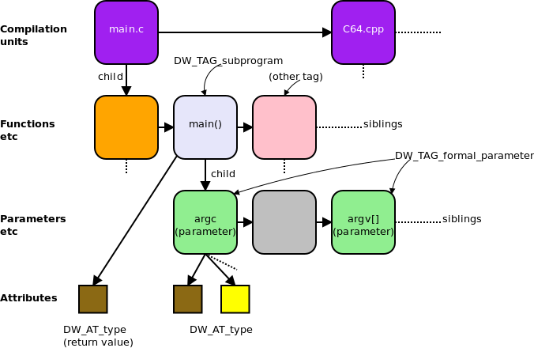

## Describing Executable Code

In the previous sections, we discussed how DIEs describe data and types, and how to describe data locations. This section will continue to explore how to describe executable code. We will mainly introduce the description of functions and compilation units.

### Describing Functions

Different programming languages and developers may have varying terms for functions, such as functions with return values (function) and routines without return values (subroutine). We consider them as two different variants of the same thing, and DWARF uses `DW_TAG_subprogram` to describe them. This DIE has a name, a triplet representing the location in the source code (`DW_AT_decl_file`, `DW_AT_del_line`), and an attribute indicating whether the subprogram is visible externally (compilation unit) (`DW_AT_external`).

> In different programming languages, functions have different terms, such as routine, subroutine, subprogram, function, method, or procedure. For more details, refer to: https://en.wikipedia.org/wiki/Subroutine. We won't delve into the details of these differences here, just understand that `DW_AT_subprogram` is used to describe functions.

#### Function Address Range

The function DIE has attributes `DW_AT_low_pc` and `DW_AT_high_pc` to give the upper and lower bounds of the memory address space occupied by the function. In some cases, the memory address of the function may be continuous or not. If not continuous, there will be a list of memory ranges. Generally, the value of `DW_AT_low_pc` is the function entry point address, unless another address is explicitly specified.

#### Function Return Type

The return type of the function is described by the attribute `DW_AT_type`. If there is no return value, this attribute does not exist. If the return type is defined within the same scope as this function, the return type DIE will be a sibling DIE of this function DIE.

> Note: In practice, testing with Go, it is found that the Go compilation toolchain does not use `DW_AT_type` for the return type, as Go supports multiple return values, and this attribute alone is insufficient. Therefore, Go uses other solutions, which will be introduced below.

#### Function Parameter List

A function may have zero or more formal parameters, described by the DIE `DW_TAG_formal_parameter`. These parameter DIEs are placed after the function DIE, and the order of the parameter DIEs follows the order in which they appear in the parameter list, although the parameter type DIEs may be scattered. Typically, these formal parameters are stored in registers.

#### Function Local Variables

The function body may contain local variables, listed by the DIE `DW_TAG_variables` after the parameter DIEs. Usually, these local variables are allocated on the stack.

#### Lexical Blocks

Most programming languages support lexical blocks. A function may have some lexical blocks, which can be described by the DIE `DW_TAG_lexcical_block`. Lexical blocks can also contain variable and lexical block DIEs.

#### Example Explanation

Below is an example describing a C language function. You can see a DIE `<5>` named `strndup` of type `DW_TAG_subprogram`, which is the DIE describing the function `strndup`. The return type of this C function is determined by the `DW_AT_type` attribute to be `*char`, a 4-byte pointer. Continuing, we see two parameter DIEs of type `DW_TAG_formal_parameter` corresponding to the parameters `s` and `n`, where `s` is determined to be of type `const char *` and `n` is of type `unsigned int`. The positions of `s` and `n` in memory are at `fbreg+0` and `fbreg+4`, respectively.

The generated DWARF debugging information is shown below:

This example is taken from DWARF v4, sections 5.3.3.1.1 to 5.3.3.1.6. This example is not complex, and the author has highlighted the key information. Combined with the previous content, readers should not find it difficult to understand. If you still don't understand, you can refer to the detailed description in the relevant sections of DWARF v4.

### Compilation Unit

Most programs contain multiple source files. When generating a program, each source file is treated as an independent compilation unit and compiled into an independent `*.o` file (e.g., in C). The linker then links these object files, system-specific startup code, and system libraries together to generate the complete executable program.

> Note: In Go, each source file is not a compilation unit; instead, the package is considered a compilation unit.

DWARF uses the term "compilation unit" from C language as the name for the DIE `DW_TAG_compilation_unit`. The DIE contains general information about the compilation, including the directory and filename of the source file, the programming language used, the producer of the DWARF information, and offsets that help locate line numbers and macro information, etc.

If the compilation unit occupies continuous memory (i.e., it is loaded into a continuous memory area), the low and high memory addresses of the unit will have values, i.e., attributes: low address `DW_AT_low_pc`, high address `DW_AT_high_pc`. This helps the debugger more easily determine which compilation unit generated the instruction at a specific address. If the compilation unit occupies non-continuous memory, the compiler and linker will provide a list of memory addresses occupied by the code.

Each compilation unit is represented by a "**Common Information Entry (CIE)**", and besides the CIE, the compilation unit also contains a series of **Frame Description Entries (FDE)**.

### Go Multiple Return Values

Finally, a special note about Go: when describing the return type, Go does not use the attribute `DW_AT_type`.

The figure below shows the approach taken in C language. The C compiler adopts the method recommended by the DWARF standard here, such as **parameter lists being described by `DW_TAG_former_parameter`, and return types by `DW_AT_type`. If there is no return value, this attribute does not exist.**

However, Go language has special characteristics compared to C. **Go needs to support multiple return values**, so using `DW_AT_type` alone cannot fully describe the return value list. We can write a test program to verify that in Go v1.15, the recommended `DW_AT_type` in the DWARF specification is not used to describe the return type. In Go, the representation of return values, like the parameters in the parameter list, is still described by `DW_TAG_formal_parameter`, but it distinguishes whether the parameter belongs to the parameter list or the return value list through the attribute `DW_AT_variable_parameter`. A value of 0 (false) indicates it is a parameter, and 1 (true) indicates it is a return value.

### Summary of This Section

This section introduced how DWARF describes program constructs related to executable code, such as functions and compilation units. Finally, it pointed out the special aspects of describing return values in Go language functions that support multiple return values. By now, readers should have a deeper understanding of how DWARF describes executable programs.
