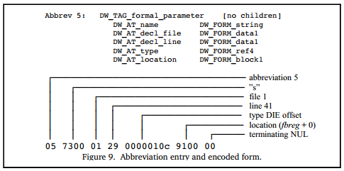

## DIE Data Encoding

All Debugging Information Entries (DIEs) in DWARF can be used to describe data, types, and code in a program. In previous content, we have seen DIE Tags and Attributes that describe different types of program constructs. DIEs also have two possible link or reference relationships: 1) Children relationship: represents the parent-child relationship between a DIE and its child DIEs; 2) Siblings relationship: represents the sibling relationship between DIEs at the same level. This structure allows DWARF to fully describe the debugging information of a program. However, if such a structure is stored without optimization, it can lead to data redundancy and storage space issues.

Therefore, this section will explore the encoding and storage methods of DIE data.

### Necessity of Data Compression

DWARF debugging information typically contains a large amount of repetitive and redundant data, for example:

- Variables of the same type may have the same attribute list.
- Similar functions may have similar structural information.
- A large amount of type information may be referenced multiple times.

To reduce storage space usage, DWARF provides several data compression measures.

### Measure 1: Tree Pre-order Traversal Flattening

**Principle**:

- Use pre-order traversal to access the DIE tree.
- Store DIEs in the order of access.
- No longer explicitly store the link relationships between DIEs.

**Implementation**:

- Use special attributes to maintain relationships between DIEs.
- `DW_AT_sibling`: Points to the next sibling DIE.
- `DW_AT_type`: Points to the type DIE.
- Other attributes: Maintain other relationships as needed.

**Advantages**:

- Eliminates explicit link pointers.
- Simplifies the data storage structure.
- Facilitates sequential access and parsing.

### Measure 2: Abbreviation Table Mechanism

**Principle**:

- Store the tag value and attribute types of DIEs in the abbreviation table.
- DIEs only store the index of the abbreviation table and attribute values.
- Reduce storage space by reusing the same tag and attribute lists.

**Abbreviation Table Structure**:
Each abbreviation includes:

- Tag value: The type of the DIE.
- Has_children flag: Indicates whether the DIE has child DIEs.
- Attribute list: Contains attribute types and value types.

**Example**:
Suppose there are multiple variable DIEs with the same tag (`DW_TAG_variable`) and attribute list (`DW_AT_name`, `DW_AT_type`), but different attribute values:

- Store the tag and attribute list once in the abbreviation table.
- Each DIE only stores the abbreviation table index and specific attribute values.
- Significantly reduces the storage of repetitive data.

**Figure 9 Abbreviation Table Example**:

### Measure 3: Cross-Compilation Unit References

DWARF v3 introduced a mechanism that allows cross-compilation unit references to DWARF data:

- Allows a compilation unit to reference a DIE in another compilation unit.
- Implemented through special reference attributes.
- This method is not commonly used but can further reduce data redundancy in certain scenarios.

### Summary

DWARF's data encoding and compression strategies mainly target the DIE tree structure: 1) Flattening storage reduces link overhead, 2) The abbreviation table mechanism reduces repetitive data, and 3) Cross-compilation unit references provide additional optimization space. Through the combined effect of these strategies, the storage space of debugging information in binary files is significantly reduced, while maintaining the integrity and accessibility of the debugging information.
