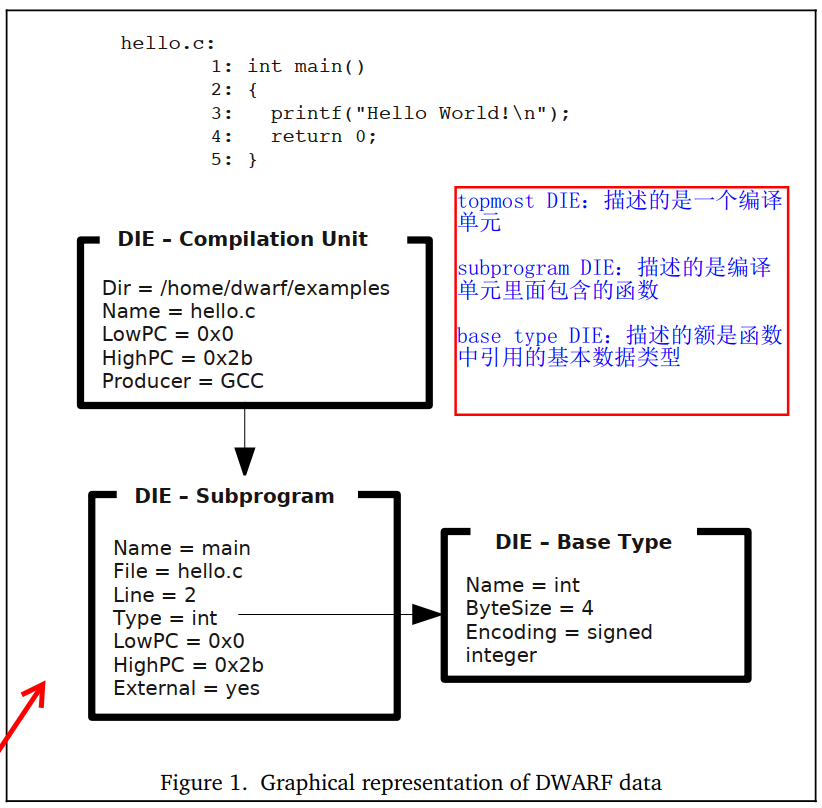

## Detailed Introduction to DIE

Like other standards that need continuous evolution, DWARF has gone through development stages from DWARF v1 to DWARF v5. As DWARF debugging information has improved and high-level languages have further abstracted and evolved, the Tag and Attribute enumeration values in the DWARF standard have gradually increased to better and more efficiently describe high-level languages. For example, in DWARF v1, 33 Tag enumeration values were defined, v2 increased to 47, v3 to 57, v4 to 60, and the latest v5 to 68. Attributes have also seen similar extensions and increases in number.

However, the increase in Tags and Attributes does not mean that understanding DWARF becomes more complex; this is a reflection of its "good extensibility." Due to space constraints, we will first present the Tags and Attributes from DWARF v2 to give you an intuitive understanding. Later examples will align with the DWARF v4 and v5 content most commonly used by the current Go toolchain, to avoid getting lost in the details of different versions before the necessary content is introduced.

### DIE Structure and Organization

DWARF uses a series of Debugging Information Entries (DIE) to describe program constructs. Each DIE consists of a tag and a series of attributes:

- The tag indicates the type of program construct the DIE describes, such as compilation unit, function, function parameters and return values, variables, constants, data types, etc.;
- Attributes define specific properties and characteristics of the DIE, such as the variable name (DW_ATTR_name) and the data type to which the variable belongs (DW_ATTR_type).

The relationships between DIEs can include sibling nodes (sibling DIEs, referenced by attributes DW_ATTR_type, DW_ATTR_sibling) and child nodes (Children, such as a compilation unit containing a series of function definitions, each of which includes input and output parameters). If only considering the Children relationship, DIEs form a tree; if also considering the Sibling relationship, they form a graph.

#### DIE Tags

Tags, whose enumeration values start with `DW_TAG_`, indicate the type of program construct the DIE describes. The table below lists the Tag enumeration values defined in DWARF v2. Most can be understood by their names, but for a detailed understanding, especially the Attributes that can be used by different Tag types of DIEs, it is recommended to read the DWARF standard for deeper insight.


#### DIE Attributes

Attributes, whose enumeration values start with `DW_AT_`, represent some properties and characteristic information of the DIE, further supplementing the information about the program construct the DIE describes.

Different attributes may have different value types, which can be a constant (such as a function name), a variable (such as the start address of a function), a reference to another DIE (such as the type DIE corresponding to a function's return value), etc. Even if the type of value is determined, its encoding method may vary, such as constant data having multiple representation forms (e.g., fixed-length data of 1, 2, 4, or 8 bytes, or variable-length data).

> Note: The specific representation of any type instance of an Attribute is encoded along with the attribute name to facilitate better understanding and interpretation of the DIE's meaning.

The table below lists the attributes defined in DWARF v2:


The values of attributes can be categorized into the following types:

1. **Address**, referencing a location in the address space of the described program;
2. **Block**, an uninterpreted arbitrary number of bytes of data;
3. **Constant**, uninterpreted data of 1, 2, 4, or 8 bytes, or data encoded in LEB128 form;
4. **Flag**, a small constant indicating the presence or absence of an attribute;
5. **lineptr**, referencing a location in the DWARF section storing line number information;
6. **loclistptr**, referencing a location in the DWARF section storing location lists, used to describe objects whose memory addresses may move during their lifecycle;
7. **macptr**, referencing a location in the DWARF section storing macro information;
8. **rangelistptr**, referencing a location in the DWARF section storing non-contiguous address range information;
9. **Reference**, referencing a DIE that describes the program;

   References can be divided into two types based on whether the referenced DIE is in the same compilation unit as the reference:

   - The first type of reference, where the referenced DIE is in the same compilation unit as the current one, references the DIE through an offset relative to the start of the compilation unit;
   - The second type of reference, where the referenced DIE can be in any compilation unit, not necessarily the same as the current one, references the DIE through the offset of the referenced DIE;
10. **String**, a sequence of characters ending with '\0', which may be directly represented in the DIE or referenced through an offset (index) in a separate string table.

#### Example Description

Below is a display of DIEs data corresponding to a simple C program. We see that the top level is a compilation unit DIE (representing the source file), which contains a Child DIE of type Subprogram (representing the main function). The return value description of this Subprogram type DIE corresponds to a DIE of type BaseType representing int.



### Classification of DIEs

Based on the different information they describe, all DIEs can be divided into two major categories:

1. Those describing **data and types**;
2. Those describing **functions and executable code**.

A DIE can have parent, sibling, and child DIEs. DWARF debugging information can be constructed as a tree, where each node is a DIE, and multiple DIEs together describe a specific program construct in the programming language (such as describing a function definition).

Describing different types of program constructs obviously requires DIEs of different Tag types, and the Attributes used by DIEs of different Tags are also necessarily different. To better understand how to describe program constructs of a specific language, one needs to understand the recommended practices in the DWARF standard and the actual description methods adopted by the compilation toolchain of the specific programming language.

From a learning perspective, we don't need to delve deeply into the DWARF generation details of the Go toolchain, as this is time-consuming and labor-intensive. We only need to write test code and use appropriate tools to observe which Tags and Attributes it contains.

In the following chapters, we will introduce how DIEs describe data and types in programs, and then how they describe functions and executable code.

### Storage Location of DIEs

Debugging information entries are stored in .debug_info. DIEs can describe different program constructs such as types, variables, functions, compilation units, etc. In DWARF v4, it was proposed to store type-related descriptions in .debug_types, with the original intention of avoiding duplicate type definitions in different compilation units, which would lead to duplicate DIE information when the linker merges and stores them in .debug_info. The solution is to write each type into an independent section, which is then merged and deduplicated by the linker and written to .debug_types. Even if not written to .debug_types, this can be achieved. In DWARF v5, type-related descriptions have been merged into .debug_info, and .debug_types has been deprecated.

See: DWARFv5 Page8:

```
1.4 Changes from Version 4 to Version 5
The following is a list of the major changes made to the DWARF Debugging
13 Information Format since Version 4 was published. The list is not meant to be
14 exhaustive.
15 • Eliminate the .debug_types section introduced in DWARF Version 4 and
16 move its contents into the .debug_info section.
   ...
```

Debugging information data is actually quite large, and if not compressed, it can significantly increase the binary size. Generally, the compilation toolchain is required to compress the debugging information when generating it. The compressed debugging information will be stored in: 1) sections with the ".zdebug_" prefix in the target file, such as .zdebug_info for compressed debugging information entries; 2) it may also still be stored in sections with the ".debug_" prefix, but with the Compressed flag set to true and the corresponding compression algorithm set, such as zlib or zstd. 3) Additionally, on some platforms, the toolchain may store the above debugging information in separate files or directories, such as writing to the corresponding `.dSYM/*` folder on macOS, which debuggers need to be aware of when reading.

### From Beginner to Expert

Seeing that the author mentions DWARF has gone through so many versions, and each new version is constantly expanding compared to the old one, you might feel a bit overwhelmed, "Can I master it?"

1) Do you find understanding **"reflection"** difficult? Reflection and DWARF here actually have a similar essence. With reflection, we can dynamically understand the type information of objects at runtime, and with type information, we can also dynamically construct objects and modify object property information. The type information used in reflection technology is some metadata information related to the type of objects at runtime, and the design and organization of this metadata information are specific to a particular language.

2) Do you find understanding the **.gopclntab** of the Go runtime difficult? You may not have seen the related implementation details, although we have mentioned multiple times that the Go runtime relies on it to implement runtime call stack tracing. The .gopclntab here is also a design specific to the Go language.

In contrast, DWARF is a descriptive language designed for all current and future high-level languages. It also describes type definitions and type information of objects. With it, we can know the type information of an object in memory, and we can also construct and modify objects if we wish. Line number tables and call stack information tables also need to be described for all high-level languages, not just for one language. Of course, DWARF is oriented towards the debugging domain, so its generated content will not be loaded into memory during program execution.

So, after this analogy, do you still find it difficult? The great way is simple, and the principles are相通. Being able to flexibly apply them to solve problems without being bound by form is what we should learn from the masters.

> Note: To facilitate your learning, I have written a DIE visualization tool [hitzhangjie/dwarfviewer](https://github.com/hitzhangjie/dwarfviewer). With this tool, you can easily view the DIE information in the .debug_info of an ELF file, including DIE Tags, Attributes, and Children DIEs, Sibling DIEs. You can write some simple code snippets, such as containing a function or a type, and then use this tool to compare the generated DWARF information to deepen your understanding.

### References

1. DWARF, https://en.wikipedia.org/wiki/DWARF
2. DWARFv1, https://dwarfstd.org/doc/dwarf_1_1_0.pdf
3. DWARFv2, https://dwarfstd.org/doc/dwarf-2.0.0.pdf
4. DWARFv3, https://dwarfstd.org/doc/Dwarf3.pdf
5. DWARFv4, https://dwarfstd.org/doc/DWARF4.pdf
6. DWARFv5, https://dwarfstd.org/doc/DWARF5.pdf
7. DWARFv6 draft, https://dwarfstd.org/languages-v6.html
8. Introduction to the DWARF Debugging Format, https://dwarfstd.org/doc/Debugging-using-DWARF-2012.pdf
9. dwarfviewer, https://github.com/hitzhangjie/dwarfviewer
