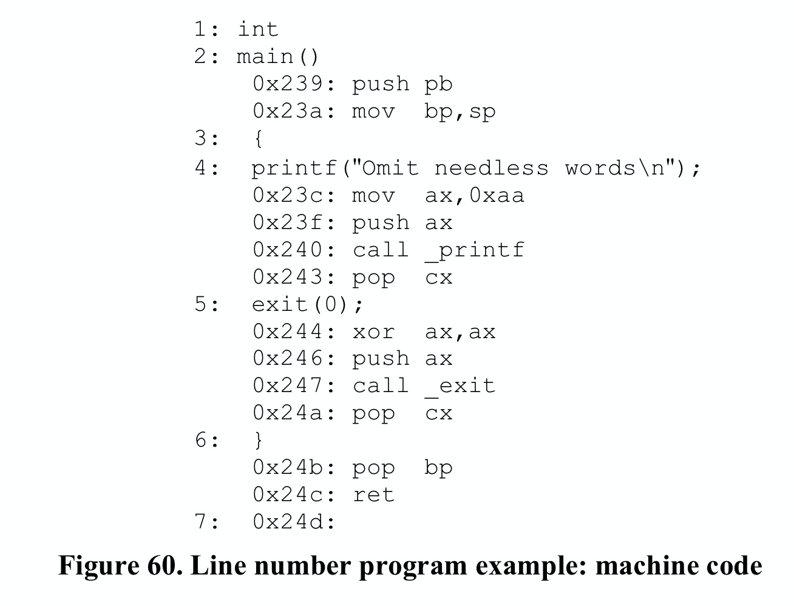
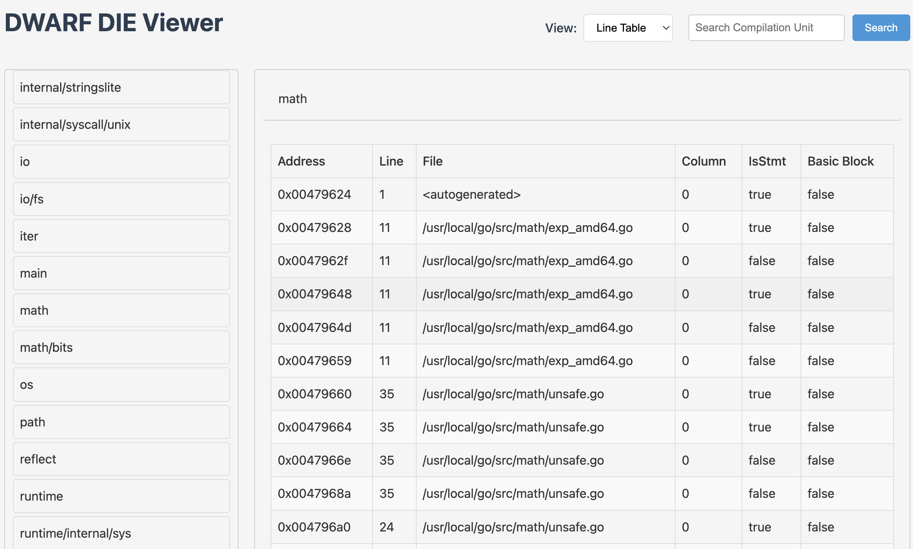

## Line Number Table

### Function Introduction

Symbolic debuggers need to establish a mapping relationship between source code locations and machine instruction addresses. With this mapping relationship, debuggers can implement the following operations:

- Convert source code locations (filename:line number) to corresponding machine instruction addresses, allowing precise breakpoint setting at that address or disassembly starting from that address;
- Convert the currently executing machine instruction address (PC) back to source code location, so that during debugging, whether executing instruction by instruction or statement by statement, the current source location can be displayed;
- Not only can implement instruction-by-instruction execution at the machine instruction level, but also support statement-by-statement execution at the source code level, because it's easy to determine the instruction address of the next statement;

**The line number table records the mapping relationship between machine instruction addresses in the executable program and locations in source files**, providing great convenience for source-level debugging. Each compilation unit has its corresponding line number table, stored in the **.[z]debug_line** section of the target file. The DIE corresponding to the compilation unit in the .debug_info section references the .debug_line data here (see section 3.1.1 of the DWARF v4 specification).

### Storage Structure

**The structure of the line number table can be visualized as a matrix**, where each row contains the following key information:


- Instruction address, corresponding to the location of the machine instruction in memory
- Source filename, the source code file corresponding to the instruction
- Source file line number, the line number in the source file corresponding to the instruction
- Source file column number, the column number in the source file corresponding to the instruction
- Statement flag, marking whether the current instruction is the starting instruction of a source statement
- Lexical block flag, marking whether the current instruction is the starting instruction of a lexical block
- Other auxiliary information

This matrix structure establishes a bidirectional mapping relationship between machine instructions and source code. When a debugger needs to set a breakpoint at a certain source line, it can find the corresponding first instruction address by querying the line number table; when a program execution exception occurs, it can also look up the corresponding source location based on the current instruction address, helping developers quickly locate the problem. This bidirectional mapping mechanism provides important support for source-level debugging.

### Data Compression

**The number of instructions in a program is usually very large. If each instruction in the line number table is allocated a separate row to store the mapping relationship, it would cause the line number table's size to expand dramatically.**

To effectively compress the size of the line number table, DWARF adopts several key optimization strategies:

- For multiple machine instructions corresponding to each source statement, **only record the mapping relationship of the first instruction**, as this is sufficient to determine the source location;
- Convert line number table data into a more compact **bytecode instruction sequence** form. This approach can:
  - Omit identical column values between adjacent instructions, avoiding redundant storage
  - Use incremental encoding for line numbers, column numbers, etc., storing only the difference from the previous record, which typically requires fewer bits
  - Use special encoding schemes to handle common patterns

Through these carefully designed compression strategies, the storage efficiency of the line number table has been significantly improved. DWARF ultimately encodes the compressed line number table as a series of bytecode instructions, forming a "**line number program**".

When using it, the debugger interprets and executes these bytecode instructions through a specially designed **finite state machine**. As the instructions are executed one by one, the complete line number table is gradually reconstructed. This design ensures both compact data storage and efficient runtime access.

### Detailed Design

#### Common Terms

Before introducing the line number table, let's understand several important terms:

- State Machine: A virtual executor used to interpret and execute bytecode instruction sequences. The line number table is encoded as bytecode instructions, and the state machine reconstructs the complete line number table matrix by executing these instructions.
- Line Number Program: A sequence composed of a series of bytecode instructions that encode the line number table information of the compilation unit. The state machine reconstructs the line number table content by executing these instructions.
- Basic Block: A continuous sequence of instructions with the following characteristics:
  - Only the first instruction can be a jump target
  - Only the last instruction can perform control transfer
  - Procedure calls cause the end of a basic block
  Basic blocks are defined from a control flow perspective, emphasizing the continuity of instruction execution and jump characteristics. A basic block doesn't necessarily correspond to a specific source code structure.
- Sequence: A continuous collection of target machine instructions. Note that a compilation unit may generate multiple discontinuous instruction sequences, so we cannot assume that all instructions in a compilation unit are stored contiguously. Sequences are defined from a memory layout perspective, emphasizing the storage location of instructions in memory.

A basic block must be a continuous instruction sequence, but a continuous instruction sequence doesn't necessarily form a basic block (may not satisfy the conditions of a basic block). Basic blocks emphasize control flow characteristics, while sequences focus more on the physical storage characteristics of instructions.

> ps: No need to deliberately understand or distinguish???

#### State Machine Registers

The line number table information state machine contains the following registers:

- address: Program Counter (PC) value, storing the machine instruction address generated by the compiler
- op_index: Unsigned integer, representing the operation index value. The combination of address and op_index forms the operation pointer, which can reference any operation in the instruction sequence
- file, line, column: Source code location triple, containing filename, line number, and column number
- is_stmt: Boolean value, identifying whether the current instruction is a suggested breakpoint location (such as the first instruction of a statement)
- basic_block: Boolean value, identifying whether the current instruction is the starting position of a lexical block
- end_sequence: Boolean value, identifying whether the current address is the first byte after the end of an instruction sequence. When end_sequence is true, other information in the same row is meaningless
- prologue_end: Boolean value, identifying the position in the function prologue where execution should pause, whether the current position is suitable for setting a function entry breakpoint
- epilogue_begin: Boolean value, identifying the position in the function epilogue where execution should pause, whether the current position is suitable for setting a function exit breakpoint
- isa: Unsigned integer, identifying the instruction set architecture to which the current instruction belongs
- discriminator: Unsigned integer, assigned by the compiler, used to distinguish multiple code blocks at the same source location. If a source location corresponds to only a single block, the value is 0

When the line number program starts executing, the initial state of the state machine registers is as follows:


#### Bytecode Instructions

The bytecode instructions in the line number program are divided into the following three categories:

1. Special Opcodes
   - Represented by a single ubyte (unsigned byte) as the opcode
   - Don't contain any operands
   - Constitute the vast majority of instructions in the line number program
   - Compact design, high execution efficiency
2. Standard Opcodes
   - Use a ubyte to represent the basic opcode
   - Can be followed by 0 or more LEB128 encoded operands
   - The opcode itself determines the number and meaning of operands
   - The line number program header explicitly specifies the number of operands for each standard opcode, facilitating parsing
3. Extended Opcodes
   - Use multi-byte opcode design
   - First byte is fixed as 0, used to identify extended opcodes
   - Followed by a LEB128 encoded length value, representing the total number of bytes in the instruction (excluding the identification byte)
   - Finally, the instruction data, where the first byte is the extended opcode of type ubyte
   - Support more complex instruction encoding, with good extensibility

#### Line Number Program Header

The optimal encoding method for line number information depends to some extent on the target machine's architecture. The line number program header contains key information needed by the debugger to decode and execute line number program instructions.

Each compilation unit's line number program starts with a header containing the following fields:

- unit_length (initial length): Total number of bytes of line number information for this compilation unit (excluding the current field itself)
- version (uhalf): Version number, this is a version number specific to line number information, independent of the DWARF version number
- header_length: Offset from the end of this field to the first byte of the line number program. In 32-bit DWARF, it's a 4-byte unsigned integer; in 64-bit DWARF, it's an 8-byte unsigned integer
- minimum_instruction_length (ubyte): Minimum byte length of target machine instructions. Participates in calculations with maximum_operations_per_instruction when modifying address and op_index registers
- maximum_operations_per_instruction (ubyte): Maximum number of operations that can be encoded in a single instruction. Participates in calculations with minimum_instruction_length when modifying address and op_index registers
- default_is_stmt (ubyte): Initial value of the state machine register is_stmt. For multiple machine instructions corresponding to a source statement, at least one instruction's is_stmt should be true, as a recommended breakpoint location
- line_base (sbyte): Used for special opcode calculations, see below
- line_range (sbyte): Used for special opcode calculations, see below
- opcode_base (ubyte): Value of the first special opcode, usually one greater than the maximum standard opcode value. If this value is less than the maximum standard opcode value, standard opcodes greater than opcode_base will be treated as special opcodes in the current compilation unit; if this value is greater than the maximum standard opcode value, the gap in between can be used for third-party extensions
- standard_opcode_lengths (ubyte array): Number of LEB128 encoded operands corresponding to each standard opcode
- include_directories (path name sequence): List of search paths for other files included by the compilation unit
- file_names (file entry sequence): All source filenames related to the current line number table, including the main source file and included files

#### Line Number Program

The main goal of the line number program is to build a matrix representing the target machine instruction sequences generated in the compilation unit. In each instruction sequence, the address (operation pointer) usually only increases (but due to pipeline scheduling or other optimizations, the line number may decrease).

The line number program consists of three types of opcodes: special opcodes, standard opcodes, and extended opcodes. Here we focus on how special opcodes work. If you want to know more about standard opcodes or extended opcodes, please refer to sections 6.2.5.2 and 6.2.5.3 of the DWARF v4 standard.

When each special opcode (represented by a single ubyte) is executed, it has the following seven effects on the state machine:

1. Add a signed value to the line register
2. Update the operation pointer by increasing the values of address and op_index registers
3. Add a new row to the matrix based on the current state machine register values
4. Set the basic_block register to "false"
5. Set the prologue_end register to "false"
6. Set the epilogue_begin register to "false"
7. Set the discriminator register to 0

All special opcodes perform these seven same operations, their only difference being the increment values for the line, address, and op_index registers.

The value of a special opcode is chosen based on the specific values that need to be added to the line, address, and op_index registers. The maximum line number increment is determined by the line_base and line_range fields in the line number program header, calculated as: line_base + line_range - 1. If the required line number increment exceeds this maximum value, standard opcodes must be used instead. The operation advance represents the number of operations to skip when advancing the operation pointer.

**The formula for calculating special opcodes is as follows**:

```
opcode = (desired line increment - line_base) + (line_range * operation advance) + opcode_base
```

If the resulting opcode is greater than 255, standard opcodes must be used instead.

When *maximum_operations_per_instruction* is 1, *operation advance* is the address increment divided by *minimum_instruction_length*.

**To decode special opcodes, the formula is as follows**. Subtract opcode_base from the opcode itself to provide the adjusted opcode. *operation advance* is the result of dividing the adjusted opcode by *line_range*. The new address and new op_index values are given by:

```
adjusted opcode = opcode – opcode_base 
operation advance = adjusted opcode / line_range

new address = address + 
			minimum_instruction_length *
			((op_index + operation advance)/maximum_operations_per_instruction) 

new op_index = (op_index + operation advance) % maximum_operations_per_instruction
```

When the *maximum_operations_per_instruction* field is 1, *op_index* is always 0, and these calculations will simplify to the calculations provided for addresses in DWARF version v3. The line increment value is the sum of line_base and the modulo of the adjusted opcode divided by line_range. That is:

```
line increment = line_base + (adjusted opcode % line_range)
```

For example, when **assuming opcode_base is 13, line_base is -3, line_range is 12, minimum_instruction_length is 1, maximum_operations_per_instruction is 1**, the following table lists the calculated special opcode values when source lines differ in the range [-3,8] and instruction addresses differ in the range [0,20] under the current assumptions.


### Example Demonstration

#### Generating Line Number Program

Figure 60 shows a simple source file and the final machine code for the Intel 8086 processor. Based on this, let's simulate the line number table generation process.



Now, let's build the "line number program" step by step. Actually, we need to first compile the source code into assembly code, then calculate the instruction address and line number increments for each consecutive statement, and calculate the opcodes based on the "instruction address increment (operation advance)" and "line number increment (line increment)". These opcodes form a sequence, which is part of the line number program.

For example, `2: main()` and `4: printf`, the address increment of the first instruction of these two statements is `0x23c-0x239=3`, and the line number increment of the two source statements is `4-2=2`. Then we can calculate the corresponding special opcode through the function `Special(lineIncr,operationAdvance)`, that is, `Special(2, 3)`.


Recall the special opcode calculation formula mentioned above:

```
opcode = (desired line increment - line_base) + (line_range * operation advance) + opcode_base
```

Assuming the line number program header includes the following content (header fields not needed below are not shown):


Then substituting into the above calculation formula, the calculation of Special(2, 3) is as follows:

```
opcode = (2 - 1) + (15 * 3) + 10 = 56 = 0x38
```

This calculates the special opcode 0x38 needed to build the line number table from `2: main()` to `4: printf`. Then process all adjacent source statements one by one:

1. Line 2 generates instructions, so we need a `DW_LNS_advance_pc 0x239`, corresponding to bytes 0x2,0xb9,0x04;
2. Source lines 0~2, source code increases by 2 lines, PC increases by 0, use `SPECIAL(2,0) = (2-1) + (15*0) + 10 = 11 = 0xb`, corresponding to bytes 0xb;
3. Source lines 2~4, source code increases by 2 lines, PC increases by 0x23c-0x239=3, use `SPECIAL(2,3) = (2-1) + (15*3) + 10 = 0x38`, corresponding to bytes 0x38;
4. Source lines 4~5, source code increases by 1 line, PC increases by 0x244-0x23c=8, use `SPECIAL(1,8) = (1-1) + (15*8) + 10 = 0x82`, corresponding to bytes 0x82;
5. Source lines 5~6, source code increases by 1 line, PC increases by 0x24b-0x244=7, use `SPECIAL(1,7) = (1-1) + (15*7) + 10 = 0x73`, corresponding to bytes 0x73;
6. No more source lines, the final instruction address is 0x24d, 2 more than the instruction address 0x244 at source line 6, use `DW_LNS_advance_pc 0x2`, corresponding to bytes 0x2,0x2;
7. At this point, we've reached the end of the instructions, use `DW_LNE_end_sequence` to end, corresponding to bytes 0x0,0x1,0x1;

Finally, we get the following line number program, and this ByteStream will be written to the .debug_line section:


#### Executing Line Number Program

To build the complete line number table, we need to first read the DWARF data from the target program, then read out the line number program, and then execute it with the prepared line number table state machine:

- Read the line number program header to get certain setting field values;
- Traverse the bytecode instructions in the line number program, executing them one by one
  - Decode the opcode, address, pc advance, line advance, op_index
  - Update or append to the line number table
- Finally build the line number table matrix we expect

If developing a debugger in Go, the Go standard library has already automatically completed the parsing of line number table data in each compilation unit when reading DWARF data from ELF files. The LineEntries read from dwarf.LineReader are already the data related to Rows in the final line number table matrix obtained after decoding and executing bytecode instructions. We can use them directly for queries.

[hitzhangjie/dwarfviewer](https://github.com/hitzhangjie/dwarfviewer) implements the line number table information viewing logic based on the Go standard library:



#### Querying Line Number Program

There are two query scenarios: querying PC based on source location, and querying source location based on PC. Let's briefly discuss the query logic.

1) Query PC based on source location:

- We know the source location triple of filename, line number, and column number, and through the filename we can know the corresponding compilation unit information
- Find the DIE corresponding to the compilation unit, find its line number table
- Look up the table `entry.file==$sourcefile && entry.line==$lineno`, find the PC of the corresponding record row
- End

2) Query source location based on PC:

- Traverse all types of DIEs of type compilation unit, query [lowpc,highpc] contains the DIE of the PC, determine the corresponding compilation unit DIE
- Find its line number table from the DIE
- Look up the table `entry.PC<=$PC && nextEntry.PC>$PC`, find the corresponding record row, get its file, line, col information
- End

### Conclusion

The line number table is the core component of DWARF debugging information, providing basic support for source-level debugging through the establishment of a mapping relationship between source code locations and machine instruction addresses. This article comprehensively introduces the working principle of the line number table from its function, storage structure, data encoding, detailed design to practical application. Through carefully designed compression strategies and state machine mechanism, the line number table not only ensures compact data storage but also ensures that the debugger can efficiently access this information, allowing developers to more conveniently perform program debugging and problem location.

ps: Due to the length of this article, this article also skipped some DWARF v4 line number table details. Interested readers can learn more by themselves, and they can also use [hitzhangjie/dwarfviewer](https://github.com/hitzhangjie/dwarfviewer) to view the line number table program of the compilation unit.

### Reference

* DWARFv4, https://dwarfstd.org/doc/DWARF4.pdf
* Introduction to the DWARF Debugging Format, https://dwarfstd.org/doc/Debugging-using-DWARF-2012.pdf
* dwarfviewer, https://github.com/hitzhangjie/dwarfviewer
