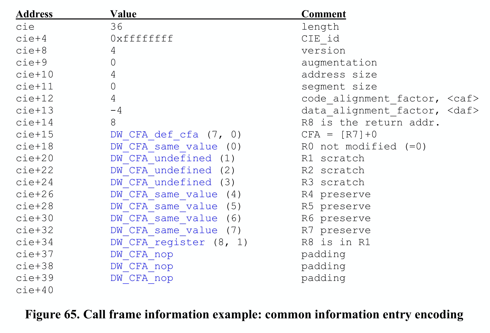

## Call Frame Information (CFI)

### Function Introduction

The **Call Frame Information (CFI)** in DWARF debugging information is an important component that provides key information about function calls to debuggers. It records how register values are modified as the program counter (PC) changes during function calls and function execution. With this table, we can know the base address (CFA) of the current function, function parameters, return address, and then find the caller's stack frame. Because we also have unwinding rules for various registers, we can virtually unwind the call stack to a specified function frame.

### Call Stack Unwinding

#### CFI Stack Unwinding Process

For CFI, we use the translation "Call Frame Information" rather than "Call Stack Information". This is because CFI records how to unwind from the current function's frame to a specific caller's frame. When unwinding, we just need to find the corresponding function's FDE and execute the bytecode instructions in this FDE, rather than processing callers one by one until reaching the specified caller.

> ps: Although we can unwind the entire call stack, it's important to clear up misconceptions in conceptual understanding. In DWARF's design, you can unwind any function's frame as long as that function's frame actually exists. Usually we look at the caller's frame because caller->current called function are all executing on a specific tracee, and when the tracee stops we can conveniently observe its state. Even if we know that some thread executed a function and created the corresponding frame, if the debugger hasn't been tracking this thread, trying to unwind it would be meaningless.

For example, in the CFI table, each machine instruction basically corresponds to one row: the first column is the instruction address, and other columns contain unwind operations for various registers before executing that instruction. Assuming the program goes from fn1->fn2-> ... -> fnN, with PCs from addr1 to current addrN. When we want to virtually unwind fn1's stack, how do we do it? We need to first find fn1's corresponding FDE, then use CIE=FDE.cie_pointer, execute CIE's initialization instructions and FDE's instructions until reaching the target instruction address in fn1. At this point, the corresponding register state will be correctly virtually restored to the state when fn1 executed that instruction.

OK, the debugger indeed needs to be able to view and modify the state of any active record (subroutine activation) on the call stack. We say stack frame (frame) and active record - these are not the same thing. The former emphasizes frame organization, while the latter emphasizes a new call record when a function is called. When a function call occurs, an activation contains at least:

- One valid instruction address in the called function, where either the program stopped when the debugger gained control (e.g., at a breakpoint), or where it called another callee, or where it was interrupted by an asynchronous event (e.g., a signal);
- A memory area allocated on the stack called the "call frame" or "function's stack frame". The starting address of the frame corresponding to this function is called the "**Canonical Frame Address (CFA)**", which is actually the base address of the function's frame.
- A set of registers used by the function when executing at a specific instruction location;

> ps: For example, when function a calls function b, it first pushes b's parameters onto the stack (return value was also allocated on stack before go1.17, passed through registers after 1.17), then pushes b's return address (i.e., rip value), then pushes rbp, ... For b's stack frame, CFA is its frame's base address, which is actually the caller's rsp value before pushing rip.

To be able to view or modify a function frame that's not at the top of the stack frame, the debugger must be able to "virtually unwind" the entire call stack until the target function frame is unwound. The unwinding process starts from the current function frame and instruction address, looks up the CFI information table, finds the corresponding record, then executes the corresponding register unwinding rules in reverse order until the target stack frame is unwound.

Think about the gdb debugging process - we can see the call frames through bt, then select a specific frame using frame N. This is a process of virtually unwinding the call frame. The register state in the Nth frame is calculated and stored somewhere, for example rsp and rbp are recalculated and stored somewhere, and used to calculate variable addresses for subsequent print operations, so we can see the Nth frame's function parameters, local variables, and register values. Why do we say it's virtual unwinding? It means that the register unwinding rules are only used to recalculate the register values at that time, but they are not set back into the registers, the process state is not modified, it just appears as if we've returned to the corresponding caller's stack frame... That's why we say virtually unwind.

Usually, when a function is called, a set of registers is specified and their state is saved. If the called function wants to use a register, it must save that register's value to the stack frame at function entry and restore it at function exit.

- The code that adjusts frame size (for local variables) and saves register state on the call frame is called the function prologue;
- The code that restores register state and destroys the call frame is called the function epilogue.

Usually, the prologue code is actually at the beginning of the function, while the epilogue code is at the end of the function.

#### Architecture-Independent Encoding

For stack unwinding operations, we need to know where registers are saved and how to calculate the caller's CFA and code location. When considering architecture-independent information encoding, there are some special considerations:

- Subroutine (function) prologue and epilogue code are not always in two different blocks at the beginning and end of the subroutine. Usually the subroutine epilogue code will be copied to each return operation location. Sometimes, the compiler will also split up register save/unsave operations and move them to where the subroutine code needs them;
- The compiler will use different ways to manage the call frame, sometimes through a stack pointer, sometimes not;
- As the subroutine prologue and epilogue code executes, the algorithm for calculating CFA also changes (by definition, the CFA value doesn't change);
- Some subroutine calls don't have a call frame (e.g., may be optimized away through "tail recursion");

  > For information about compiler optimization of tail recursion, you can refer to the blog post: [tail recursion call optimization](http://www.ruanyifeng.com/blog/2015/04/tail-call.html). The current Go compiler doesn't support tail recursion optimization, but gcc does.
  >
- Sometimes a register's value is saved in another register, but the latter may conventionally not need to be stored in the subroutine prologue;
- Some architectures have special instructions that can perform part or all of register management in a single instruction, leaving some special information on the stack to indicate how registers should be saved;
- Some architectures handle return address values specially. For example, in some architectures, the call instruction ensures the call address's lower two bits are zero, while the return instruction ignores these bits. This leaves two storage bits available for other uses, which must be handled specially.

### CFI Detailed Design

#### CFI Table Structure Design

DWARF defines architecture-independent basic elements to support "virtual unwinding" of call frames. These basic elements can record how register state is saved and restored during subroutine calls. For certain specific machines, they may have architecture-specific information defined by ABI committees, hardware vendors, or compiler manufacturers, which needs to supplement DWARF's basic elements.

The table structure described by CFI is shown in the figure below:

- Column 1, instruction address. Represents the address of an instruction in the program (in shared library files, instruction addresses are offsets relative to the start address);
- Column 2, CFA (Canonical Frame Address), which is simply the base address of the Callee's stack frame. The CFA column's address calculation rule can be calculated by combining registers and offsets, or by DWARF expressions.
- Other columns, virtual unwinding rules for each register; the register rules here include:

  - undefined, this rule indicates that the corresponding register has no recoverable value in the previous stack frame. Usually, this means the relevant register's state was not saved when calling the callee;
  - same value, this rule indicates that the corresponding register's value is the same as in the previous stack frame. Usually, this means the relevant register's state was saved when calling the callee, but not modified;
  - offset(N), this rule indicates that the corresponding register's value is saved at address CFA+N, where CFA is the current CFA value and N is a signed offset;
  - val_offset(N), this rule indicates that the corresponding register's value is the value at CFA+N, where CFA is the current CFA value and N is a signed offset;
  - register(R), this rule indicates that the corresponding register's value is saved in another register R;
  - expression(E), this rule indicates that the corresponding register's value is saved at the memory address corresponding to DWARF expression E;
  - val_expression(E), this rule indicates that the corresponding register's value is the value of DWARF expression E;
  - architectural, this rule is not defined in the current specification, it is defined by the augmenter;

If we really stored one record for each instruction in the above CFI information table, the table space would be very large! To efficiently store this information, CFI adopts a compression strategy similar to the line number table: encoding the information as a bytecode instruction sequence. Although the complete CFI table is large, since state changes between adjacent instructions are usually small, we can still store based on differences and increments. This encoding method allows CFI to maintain a fairly compact storage format. When reconstructing the CFI table matrix, these instructions are interpreted and executed by a specialized CFI state machine.

The above CFI information table is encoded in the "**.debug_frame**" section. Entries in the .debug_frame section are aligned relative to the start of the section by multiples of the address size, and appear in two forms:

- Common Information Entry (CIE);
- Frame Descriptor Entry (FDE);

> ps: If a function's code segment address range is not continuous, there may be multiple CIEs and FDEs.

Building the CFI table structure requires CIE and FDE, because the bytecode program for building the CFI table structure is stored in them. We need to first introduce CIE and FDE content before explaining how to generate the CFI table.

#### Common Information Entry (CIE)

Each compilation unit has one CIE, and the information in each Common Information Entry (CIE) may be shared by many Frame Descriptor Entries (FDEs). Each non-empty .debug_frame section contains at least one CIE, and each CIE contains the following fields:

1. length (initial length), constant, indicates the size of this CIE structure (number of bytes), not including the field itself. The number of bytes occupied by the length field plus the value of length must be aligned according to address size;
2. CIE_id (4 bytes or 8 bytes), constant, used for CIEs and FDEs;
3. version(ubyte), version number, this value is related to CFI information, independent of DWARF version;
4. augmentation (UTF-8 string), null-terminated UTF-8 string, used to mark extension information for the current CIE and FDEs that use it
5. address_size (ubyte), number of bytes occupied by target machine addresses in this CIE and other FDEs that use this CIE. If there is a compilation unit in this frame, its address size must be the same as the address size here;
6. segment_size (ubyte), number of bytes occupied by segment selectors in this CIE and other FDEs that use this CIE;
7. code_alignment_factor (unsigned LEB128), constant, instruction address offset = operand * code_alignment_factor;
8. data_alignment_factor (signed LEB128), constant, offset = operand * data_alignment_factor;
9. return_address_register (unsigned LEB128), constant, indicates where the return address is stored, may be a physical register or memory
10. initial_instructions (array of ubyte), a series of rules, used to indicate how to create the initial settings of the CFI information table;
    Before executing initial instructions, the default generation rule for all columns is undefined, however, the ABI authoring body or compilation system authoring body can also specify other default rules for some or all columns;
11. padding (array of ubyte), byte padding, fills the structure with DW_CFA_nop instructions to make the CIE structure size meet the length requirement. The length value plus field bytes must be aligned according to address size;

#### Frame Descriptor Entry (FDE)

Each function has one FDE, and a Frame Descriptor Entry (FDE) contains the following fields:

1. length (initial length), constant, indicates the number of bytes of the header and instruction stream corresponding to this function, not including the field itself. The size of the length field (number of bytes) plus the length value must be a multiple of address size (defined in the FDE's referenced CIE), i.e., aligned by address size;
2. CIE_pointer (4 or 8 bytes), constant, offset of the CIE referenced by this FDE in .debug_frame;
3. initial_location (segment selector, and target address), instruction address corresponding to the first instruction of this table entry. If segment_size (defined in referenced CIE) is non-zero, a segment selector needs to be added before initial_location;
4. address_range (target address), number of bytes occupied by program instructions described by this FDE;
5. instructions (array of ubyte), instruction sequence contained in the FDE, described later;
6. padding (array of ubyte), byte padding, fills the structure with DW_CFA_nop instructions to make the FDE structure size meet the length field requirement;

#### Bytecode Instruction Classification

Call Frame Instructions, each instruction can contain zero or more operands, some operands are encoded into the opcode. Some instruction operands are encoded through DWARF expressions. The initialization instruction sequence in CIE and instruction sequence in FDE are executed to create the CFI table structure.

The call frame instructions here include the following categories:

- CFI table row creation instructions, used to create a row in the table;
- CFI table CFA definition instructions, used to define the CFA calculation rule for the current row;
- CFI table register rule instructions, used to define unwinding rules for other registers in the current row;
- CFI table row state instructions, ability to save register state to stack and retrieve it;
- CFI table row padding instructions, fill with nop, do nothing;

##### CFI Table Row Creation Instructions

1. DW_CFA_set_loc
   The DW_CFA_set_loc instruction takes a single operand representing the target address. The required operation is to create a new table row using the specified address as the new location. All other values in the new row are initially the same as the current row. The new location value is always greater than the current location value. If the segment_size field of this FDE's CIE is not zero, a segment selector needs to be added before the initial location.
2. DW_CFA_advance_loc
   The DW_CFA_advance instruction takes a single operand (encoded in the opcode) representing a constant increment. The required operation is to create a new table row using a location value calculated by taking the current entry's location value and adding delta * code_alignment_factor. All other values in the new row are initially the same as the current row.
3. DW_CFA_advance_loc1
   The DW_CFA_advance_loc1 instruction takes a single ubyte operand representing a constant increment. This instruction is the same as DW_CFA_advance_loc except for the encoding and size of the increment operand.
4. DW_CFA_advance_loc2
   The DW_CFA_advance_loc2 instruction takes a single uhalf operand representing a constant increment. This instruction is the same as DW_CFA_advance_loc except for the encoding and size of the increment operand.
5. DW_CFA_advance_loc4
   The DW_CFA_advance_loc4 instruction takes a single uword operand representing a constant increment. This instruction is the same as DW_CFA_advance_loc except for the encoding and size of the increment operand.

##### CFI Table CFA Definition Instructions

1. DW_CFA_def_cfa
   The DW_CFA_def_cfa instruction has two operands, both unsigned LEB128 encoded, representing register number and non-factored offset respectively. This instruction defines the CFA rule using the provided register and offset.
2. DW_CFA_def_cfa_sf
   The DW_CFA_def_cfa_sf instruction takes two operands: an unsigned LEB128 value representing register number and a signed LEB128 factored offset. This instruction is the same as DW_CFA_def_cfa except that the second operand is signed factored. The resulting offset is factored_offset * data_alignment_factor.
3. DW_CFA_def_cfa_register
   The DW_CFA_def_cfa_register instruction takes a single unsigned LEB128 operand representing register number. This instruction defines the current CFA rule to use the provided register (but keeps the old offset). This operation is only valid when the current CFA rule is defined to use a register and offset.
4. DW_CFA_def_cfa_offset
   The DW_CFA_def_cfa_offset instruction takes a single unsigned LEB128 operand representing a non-factored offset. This instruction defines the current CFA rule to use the provided offset (but keeps the old register). This operation is only valid when the current CFA rule is defined to use a register and offset.
5. DW_CFA_def_cfa_offset_sf
   The DW_CFA_def_cfa_offset_sf instruction takes a signed LEB128 operand representing a factored offset. This instruction is the same as DW_CFA_def_cfa_offset except that the operand is signed factored. The resulting offset is factored_offset * data_alignment_factor. This operation is only valid when the current CFA rule is defined to use a register and offset.
6. DW_CFA_def_cfa_expression
   The DW_CFA_def_cfa_expression instruction takes a single operand encoded as a DW_FORM_exprloc value representing a DWARF expression. This instruction uses the expression as a way to calculate the current CFA.

> ps: For restrictions on available DWARF expression operators, see DWARF v4 section 6.4.2.

##### CFI Table Register Rule Instructions

1. DW_CFA_undefined
   The DW_CFA_undefined instruction takes a single unsigned LEB128 operand representing register number. This instruction specifies that the register unwind rule is set to "undefined".
2. DW_CFA_same_value
   The DW_CFA_same_value instruction takes a single unsigned LEB128 operand representing register number. This instruction sets the specified register unwind rule to "same".
3. DW_CFA_offset
   The DW_CFA_offset instruction takes two operands: a register number (encoded using the opcode) and an unsigned LEB128 constant (factored offset). This instruction changes the unwind rule for the register indicated by the specified register number to the offset(N) rule, where N's value is factored_offset * data_alignment_factor.
4. DW_CFA_offset_extended
   The DW_CFA_offset_extended instruction takes two unsigned LEB128 operands representing register number and factored offset. This instruction is the same as DW_CFA_offset except for the encoding and size of the register operand.
5. DW_CFA_offset_extended_sf
   The DW_CFA_offset_extended_sf instruction takes two operands: an unsigned LEB128 value representing register number and a signed LEB128 encoded factored offset. This instruction is the same as DW_CFA_offset_extended except that the second operand is a signed factored offset. The resulting offset is factored_offset * data_alignment_factor.
6. DW_CFA_val_offset
   The DW_CFA_val_offset instruction takes two unsigned LEB128 operands representing register number and factored offset. The required operation is to change the register rule for the register indicated by the register number to the val_offset(N) rule, where N's value is factored_offset * data_alignment_factor.
7. DW_CFA_val_offset_sf
   The DW_CFA_val_offset_sf instruction takes two operands: an unsigned LEB128 value representing register number and a signed LEB128 factored offset. This instruction is the same as DW_CFA_val_offset except that the second operand is a signed factored offset. The resulting offset is factored_offset * data_alignment_factor.
8. DW_CFA_register
   The DW_CFA_register instruction takes two unsigned LEB128 operands representing register numbers. This instruction sets the first register's unwind rule to register(R), where R is the second register.
9. DW_CFA_expression
   The DW_CFA_expression instruction takes two operands: an unsigned LEB128 value representing register number and a DW_FORM_block value representing a DWARF expression. This instruction changes the unwind rule for the register indicated by the register number to the expression(E) rule, where E is the DWARF expression.

   > Before executing the DWARF expression, the current CFA value must be pushed onto the operation stack. After the DWARF expression execution completes, the top of the stack is the result. For restrictions on available DWARF expression operators, see DWARF v4 section 6.4.2.
   >
10. DW_CFA_val_expression
    The DW_CFA_val_expression instruction takes two operands: an unsigned LEB128 value representing register number and a DW_FORM_block value representing a DWARF expression. This instruction changes the unwind rule for the register indicated by the LEB128 value to the val_expression(E) rule, where E is the DWARF expression.
11. DW_CFA_restore
    The DW_CFA_restore instruction takes a single operand (encoded in the opcode) representing register number. This instruction changes the specified register unwind rule to the rule assigned to it by initial_instructions in the CIE.
12. DW_CFA_restore_extended
    The DW_CFA_restore_extended instruction takes a single unsigned LEB128 operand representing register number. This instruction is the same as DW_CFA_restore except for the encoding and size of the register operand.

##### CFI Table Row State Instructions

The next two instructions provide the ability to save register state to stack and retrieve it. They are useful when the compiler needs to move function epilogue code into return locations in the function body.

1. DW_CFA_remember_state
   The DW_CFA_remember_state instruction takes no operands, it pushes each register's rule set onto an implicit stack.
2. DW_CFA_restore_state
   The DW_CFA_restore_state instruction takes no operands, it pops the rule set from the implicit stack and places it in the current row.

##### CFI Table Byte Padding Instruction

1. DW_CFA_nop
   The DW_CFA_nop instruction has no operands and no required operation. It is used as a padding byte to make the CIE or FDE size appropriate.

### Two Uses of CFI

#### Call Frame Instruction Usage

The main use of Call Frame Information (CFI) is to perform stack unwinding during program execution to reconstruct the function call chain. To achieve this goal, we need to be able to determine the register state at any execution point. Below we introduce how to use CFI instructions to obtain this information.

To **determine the virtual unwind rule set for a given location (L1)**, first search for the FDE containing that location in FDE headers. This can be done by comparing the initial_location and address_range values in FDE headers.

Once the corresponding FDE is found, the unwind rule set for that location can be determined by following these steps:

1. Initialize the register set by reading the initial_instructions field of the CIE associated with the FDE;
2. Read and process the FDE's instruction sequence until encountering an instruction with address greater than L1 (DW_CFA_advance_loc, DW_CFA_set_loc), or reaching the end of the instruction stream;
3. If a DW_CFA_advance_loc or DW_CFA_set_loc instruction is encountered, calculate a new location value (L2). If L1 >= L2, process that instruction and return to step 2 to continue execution;
4. The end of the instruction stream can be treated as a DW_CFA_set_loc(initial_location+address_range) instruction. Note that if after executing to the end of the instruction stream, if L2<L1, then the FDE format is incorrect;

By executing the above steps, we can obtain the virtual unwind rule set for location L1, which describes how to restore all register states at that location. For specific examples, see DWARF v4 2 Appendix D.6.

#### Call Frame Calling Address

When performing stack unwinding, the debugger usually wants to obtain the **instruction address at function call time**. This information may not exist (e.g., tail recursion eliminates function calls). But usually, CFI will specify a register (specified in CIE) to store the function call's return address.

If a return address register is defined in the CFI table and its rule is undefined (e.g., defined by DW_CFA_undefined), then there is no return address, no calling address, and the virtual unwinding of the call frame is complete.

In most cases, the return address is in the same context as the calling address, but this doesn't have to be the case, especially if the compiler somehow knows the call will never return. The "return address" context may be in a different line, in a different lexical block, or at the end of the calling function. If the user assumes the return address is in the same context as the calling address, the unwinding may fail.

For architectures with fixed-length instructions where the return address immediately follows the call instruction, a simple solution is to subtract the instruction length from the return address to get the call instruction's address. For architectures with variable-length instructions (e.g., x86), this is not possible. However, **subtracting 1 from the return address, while not guaranteed to provide the exact calling address, usually generates an address in the same context as the calling address, which is usually sufficient**. Why is it sufficient? Because at least we can determine the same source location, which is enough.

> ps: So, the Calling Address calculated is Callee's function return address - 1. Subtracting 1 from this address value (e.g., Call is a multi-byte instruction), while not giving the exact instruction address before the function call, at least helps us determine the source location and stack frame when the function call occurred, so we can view the source location and context information at that time, which is usually sufficient.
>
> When we use `gdb> bt` to view all current stack frames and select a frame using the `frame` command, we don't care what the exact calling address is, as long as we can restore the corresponding source location and stack frame context at call time, that's sufficient.

> ps: The calling address and return address not being in the same context may be a bit confusing, but if you've seen the Linux kernel startup code, you'll understand this point very easily. Linux kernel head.s needs to do a lot of work to bridge the transition from BIOS 16-bit operation mode to Linux 32/64-bit mode, such as supporting 32-bit/64-bit addressing, rebuilding 32-bit/64-bit interrupt vector tables, rebuilding GDT, etc., before finally calling the Linux kernel's main function. Because this main function will never return, head.s actually simulates call main through ret main address. The manifestation is that the function calling address and return address are not in the same context at all.
>
> This is just an example to help everyone understand this point, but it's not to say that this example's scenario completely covers or equals the above point.

### Example Demonstration

#### Machine Information

The example below assumes a RISC machine, Motorola 88000.

- Memory is byte-addressable;
- All instructions are 4-byte fixed length and word-aligned;
- Instruction operands are generally organized as: `<destination.reg>, <source.reg>, <constant>`
- Memory addresses for load and store instructions are calculated by adding the value in source register source.reg and constant const;
- Has 8 4-byte registers:
  R0: Always 0;
  R1: Saves return address during function calls;
  R2-R3: Temporary registers, don't need to save original values during function calls;
  R4-R6: Need to save original values during function calls;
  R7: Saves stack pointer value;
- Stack grows from high to low addresses;
- Architecture ABI committee specifies stack pointer `(R7)` is the same as CFA;

#### Machine Instructions for foo

Below are two machine instruction fragments for function foo, corresponding to the function prologue and epilogue parts respectively. Besides using stack pointer, it also uses frame pointer. The first column is instruction address, `<fs>` represents stack frame size (in bytes), which is 12 bytes in this example.

#### CFI Table for foo

The CFI information table corresponding to Figure 63 is shown in Figure 64 below, and the corresponding code fragment in .debug_frame section is shown in Figure 65.

We used the following annotation symbols in Figure 64 CFI information table, please understand their meanings first.

1. R8 stores return address
2. s = same_value unwind rule
3. u = undefined unwind rule
4. rN = register(N) unwind rule
5. cN = offset(N) unwind rule
6. a = architectural unwind rule

#### CIE Initial Instructions Guide Creation of First Row in CFI

The first row of the CFI information table is created by the initial instructions in the CIE referenced by FDE.CIE_Pointer of the current called function foo. Therefore, to understand why the first row is `foo [R7]+0 s u u u s s s a r1`, we need to look at the CIE. Figure 65 below gives the CIE description.

The CIE specifies that R8 is the return address register. This machine Motorola 88000 specifies that R1 saves the return address during function calls, so R8's value is actually in R1. After clarifying this point, let's see how the initial instructions part in CIE guides the creation of the first row in the CFI information table.

Before foo's first instruction executes, the PC value is the memory address corresponding to the foo symbol:

- DW_CFA_def_cfa(7,0) specifies CFA=[R7]+0, indicating that foo's canonical frame address CFA is the caller's stack pointer value, i.e., R7's value (at this point `R7=R7-<fs>`, execution hasn't started yet, stack frame hasn't been allocated for foo), giving us `foo [R7]+0`;

  > ps: Usually function call instructions like call push the return address (PC value) onto the call stack as the return address for after function execution completes.
  >
- DW_CFA_same_value(0) specifies that register R0 is always 0, using same unwind rule, which makes sense, giving us `foo [R7]+0 s`;
- DW_CFA_undefined(1)/(2)/(3) specifies that registers R1/R2/R3 use undefined unwind rule. R2 and R3 are temporary registers that don't need saving, so using undefined rule is fine. R1 actually saves the return address, and this program doesn't use R1 for other purposes, so it's also undefined. This gives us `foo [R7]+0 s u u u`;

  > If prologue code later uses R1, epilogue would have other unwind rules to restore it, but there aren't any, indicating R1 isn't used at all;
  >
- DW_CFA_same_value(4)/(5)/(6) specifies that registers R4/R5/R6 use same unwind rule. R4, R5, and R6 are registers that need their state saved, so same unwind rule is used here. This gives us `foo [R7]+0 s u u u s s s`;
- R7 originally saves the stack pointer value, it's also special, the architecture ABI committee specifies it's the same as CFA, so architectural unwind rule is used here, giving us `foo [R7]+0 s u u u s s s a`;
- DW_CFA_register(8,1) specifies that register R8 is stored in register R1, because R8 represents the return address, and R1 records the return address, so register(8,1) is used. This gives us `foo [R7]+0 s u u u s s s a r1`;
- Next are padding instructions, filling the CIE structure size to meet the CIE.length requirement, which is unrelated to building the CFI information table, so we can ignore it.

After the above instructions execute, the first row in the CFI information table is built: `foo [R7]+0 s u u u s s s a r1`.

#### FDE Instruction Sequence Guides Creation of Rows 2, 3, and n in CFI Table

Then looking at the foo machine instruction code fragments, let's see what the instruction sequence in FDE corresponding to the prologue and epilogue parts should look like, and what effect these instructions have on the CFI table.

Recalling the machine instructions for foo prologue and epilogue fragments:

Figure 66 below shows the instruction sequence in FDE corresponding to the machine instructions in Figure 63. Figure 66 uses the following annotations:

1. `<fs>` = stack frame size
2. `<caf>` = code alignment factor
3. `<daf>` = data alignment factor

You must have questions about how the instruction sequence in FDE is generated. Each machine instruction in Figure 63 has a different address and affects different registers. Actually, it's just generating corresponding CFI table building instructions based on each machine instruction's specific actions, such as CFI table row create rules, and unwind rules for affected registers, that's all. Below we'll explain how the instruction sequence in FDE is built based on the machine instructions in Figure 63, and what it looks like reflected in the CFI information table. After reading this, you'll have a clear understanding of CFI table building!

First row of CFI information table: `foo [R7]+0 s u u u s s s a r1`, it indicates how to calculate CFA and how to restore various registers when PC is at address foo. Below we explain how each instruction operation in the code is converted to corresponding CFI row rule set.

- `foo sub R7, R7, <fs>`

  R7 stores the stack pointer value, after instruction executes `R7=R7-<fs>`, equivalent to allocating a `<fs>` sized stack frame for foo to use. Since CFI previously used R7 and offset as the rule for calculating CFA, and R7's value decreased by `<fs>` here, we need to adjust the CFA rule. First we need a row create rule, then a CFA adjustment rule, which are DW_CFA_advance_loc(1) and DW_CFA_def_cfa_offset(12) in Figure 66 below. Since no other register adjustments are involved, these two unwind rules are enough.

  Here DW_CFA_advance_loc(1) means instruction address advances by code_alignment_factor * 1 = 4 * 1 = 4, indicating that after this machine instruction executes PC=foo+4. DW_CFA_def_cfa_offset(12) means the register in CFA calculation rule is still R7, but offset changes from 0 to +12.

  So the second row of CFI table is `foo+4 [R7]+fs s u u u s s s a r1`, where fs=12.

  > Therefore each row `addr : unwind rule set` in the CFI information table indicates the unwind rule set when PC=addr (instruction at this address is to be executed).
  >
- `foo+4 store R1, R7, (<fs>-4)`

  R1 stores the return address, `R7+<fs>-4` is the highest 4 bytes of foo's stack frame. This instruction intends to store the return address of foo function call (R1 value) at this location. Since R8 in the CFI information table is used to store the return address, we need to adjust R8's unwind rule. We need two operations, first a row create rule, then an R8 unwind rule.

  DW_CFA_advance_loc(1), DW_CFA_offset(8,1), DW_CFA_advance_loc(1) increases instruction address offset by `code_alignment_factor * 1 = 4 * 1`, i.e., addr = foo+8. DW_CFA_offset(8,1) means register R8 is stored at `current CFA + offset data_alignment_factor * 1 = CFA + (-4) * 1 = CFA-4`, i.e., unwind rule becomes c-4.

  This gives us the second row of CFI table `foo+8 [R7]+fs s u u u s s s a c-4`.

  > data_alignment_factor=-4, this is defined in CIE.
  >
- `foo+8 store R6, R7, (<fs>-8)`

  Here we want to store R6 register's value to the 4~8 byte position of foo's stack frame, affecting R6 register's unwind rule. We need two operations, one row create rule, one adjustment of R6's unwind rule.

  DW_CFA_advance_loc(1), DW_CFA_offset(6,2) means instruction address `addr+=code_alignment_factor * 1`, i.e., foo+12, and R6's value is stored at `current CFA + data_alignment_factor*2 = CFA+(-4)*2 = CFA-8` position, CFA-8 represents exactly the 4~8 byte position of foo's stack frame.

  This gives us the third row of CFI table `foo+12 [R7]+fs s u u u s s c-8 a c-4`.
- ...
- Other assembly instructions' corresponding operations in FDE and explanations won't be listed one by one, generally following the above approach.

At this point, we should understand the following process clearly: "**source code -> machine instructions -> generation of instruction sequence in CIE+FDE -> process of CIE and FDE instructions building CFI table**". As for `CFI table usage`, such as given an instruction address L1, further determining its corresponding CFA or return address, these are simpler and were covered earlier.

This concludes the introduction of the Call Frame Information table.

### Conclusion

This article detailed the Call Frame Information (CFI) in DWARF debugging information, including its basic concepts, functions, table structure design (CIE and FDE), and bytecode instruction system. Through a concrete example on the Motorola 88000 architecture, it demonstrated the complete process from source code to machine instructions to CFI table building, explaining how to build the CFI table through instruction sequences in CIE and FDE, and how to use this information for stack unwinding and call stack expansion. This knowledge is important for understanding debugger working principles and program execution processes.
