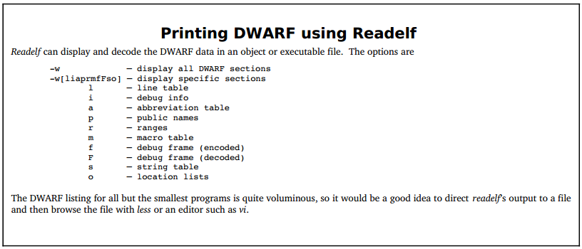

## Chapter Summary

The basic concepts of DWARF are very simple:

- Programs are described as a "**tree of DIE nodes**", representing various functions, data, and types in the source code in a compact, machine-independent manner;
- The "**Line Number Table**" provides a mapping between executable instruction addresses and the source code that generated them;
- The "**CFI (Call Frame Information Table)**" describes how to virtually unwind the call stack;
- Given that DWARF needs to express many different nuances for **multiple programming languages** and **different machine architectures**, there are also many subtleties in DWARF.

Taking gcc as an example, using the option -g "**gcc -g -c filename.c**" can generate DWARF debugging information and store it in the debugging information-related sections of the target file filename.o. Go programs, on the other hand, generate debugging information by default during build.

By using "**readelf -w**", you can read and display all generated DWARF debugging information, or specify a particular section to load specific DWARF debugging information, such as "**readelf -wl**" to load only the .debug_line line number table information.

This chapter has detailed how DWARF describes different program constructs in programming languages, with some providing complete examples and detailed explanations along with computational processes. It is hoped that readers now understand the general working principles of DWARF.

This chapter first introduced how the debugging information standard DWARF describes different constructs of a program, including data structures, compilation units, functions, call stacks, line number tables, etc. Then, we analyzed and applied the DWARF parsing-related code in go-delve/delve to help everyone better understand the actual value and uses of DWARF.

Although we provided some DWARF-related test cases from go-delve/delve, compared to implementing a true symbolic debugger, this is only scratching the surface of DWARF applications. In actual implementation, we need more complex DWARF operations and even a deep understanding of Go's design and implementation to create a truly usable symbolic debugger.

Let's move on to the next chapter with our foundational knowledge and the "ambition" to implement a symbolic debugger.