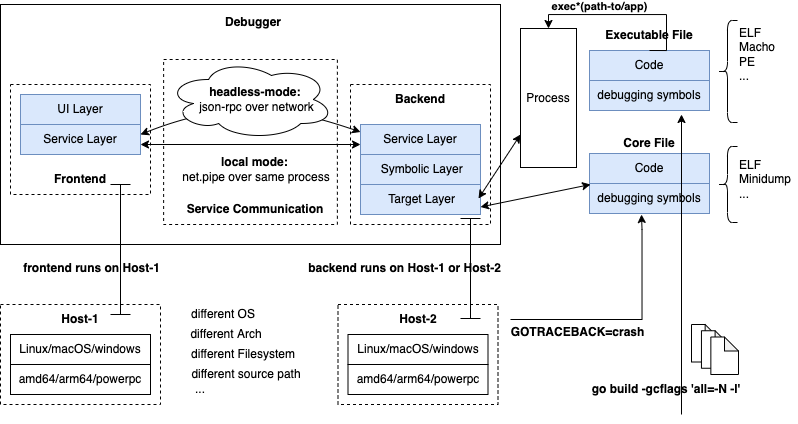

## Frontend UI Layer Design



Thinking about the overall architecture design of the debugger, in the frontend-backend separation architecture, the frontend part mainly consists of two parts:

- UI layer provides users with debugging-related interface interaction logic;
- Service layer completes communication with the debugger backend implementation, controlling the debugged process;

The Service layer design for both frontend and backend is described uniformly in the "Service Layer Design" section. This section introduces the detailed design of the frontend UI layer and related technical points.

### Graphical Debugging Interface

For graphical debugging interfaces, including:

- Adjusting the terminal from text mode to graphical mode for visual debugging, with supporting libraries including ncurses, etc.;
- Using graphics libraries to design and implement graphical debugging interfaces, such as gdlv based on the nuklear graphics library;
- Implementing debugging plugins in IDEs, such as built-in or third-party debugging plugins in VSCode, implementing debugging interfaces using JS or TS;

The content of graphical debugging interfaces is not within our detailed discussion scope, we just list it as an extensible direction.

Graphical interface debugging, compared to command-line interface debugging in terminal text mode, has significant advantages as it can display more content at once. While command-line debugging interfaces must support all operations that graphical interfaces support, graphical interfaces can display more things simultaneously, theoretically requiring more refined UI layer design.

### Command-line Debugging Interface

The Go debugger we will implement in this chapter will ultimately be a command-line debugger in terminal text mode, interacting with users in text mode, receiving user input debugging commands, converting them into corresponding debugging actions, and displaying results in text mode.

> Terminals can work in text mode or graphical mode, we use text mode here. In fact, mainstream command-line debuggers like gdb, lldb, dlv all work in terminal text mode.

Command-line debugging has its unique advantages and disadvantages compared to graphical debugging:

**Advantages:**

1. Cross-platform consistency: Text mode debugging interface performs consistently across different operating systems, no need to develop specific graphical interfaces for different platforms
2. Low resource usage: No need to load graphics libraries, lower system resource requirements
3. Remote debugging friendly: Easier to use through SSH and other remote connections in remote server or container environments
4. Scriptable: Command-line operations are easier to script, facilitating automated debugging processes
5. Unified learning curve: Once command-line debugging is mastered, can quickly adapt to different command-line debugging tools

**Disadvantages:**

1. Limited information display: Can only display limited information at once, requiring frequent view switching
2. Command memory burden: Developers need to memorize various debugging commands and their parameters
3. Operational efficiency: Inputting commands usually takes more time than clicking graphical interface buttons
4. Poor visualization: Difficult to intuitively display complex data structures or call relationships
5. Low newbie friendliness: Command-line interface may seem not intuitive and friendly to beginners

### Debugging Command Support

The functional requirements for the Go symbol-level debugger are quite intuitive when thinking about common debugger usage experiences:

#### Multiple Debug Object Types for Starting Debugging

| Command                | Description                                                                 |
| ---------------------- | --------------------------------------------------------------------------- |
| godbg attach           | Debug a running process                                                     |
| godbg exec             | Start and debug specified Go executable                                     |
| godbg test             | Debug test functions in current Go package                                  |
| godbg debug            | Debug current Go main module                                                |
| godbg debug --headless | Headless mode similar to gdbserver                                          |
| godbg dap              | Start a headless mode service, receiving DAP protocol requests for VSCode integration |
| godbg core             | Start and debug specified coredump                                          |
| godbg tracepoint       | Support tracepoint for convenient observation of program execution hitting functions |

#### Multiple Debugging Commands in Debug Session

**1 Running the program**

| Command             | Alias | Description                                                                                                      |
| ------------------- | ----- | ---------------------------------------------------------------------------------------------------------------- |
| call                | -     | Resumes process, injecting a function call (EXPERIMENTAL!!!)                                                     |
| continue            | c     | Run until breakpoint or program termination.                                                                     |
| next                | n     | Step over to next source line.                                                                                   |
| rebuild             | -     | Rebuild the target executable and restarts it. It does not work if the executable was not built by delve.        |
| restart             | r     | Restart process.                                                                                                 |
| step                | s     | Single step through program.                                                                                     |
| step-instruction    | si    | Single step a single cpu instruction.                                                                            |
| stepout             | so    | Step out of the current function.                                                                                |
| rr related          |       | rr related commands, such as rnext, rstep...                                                                     |

**2 Manipulating breakpoints**

| Command        | Alias | Description                                         |
| -------------- | ----- | --------------------------------------------------- |
| break          | b     | Sets a breakpoint.                                  |
| breakpoints    | bp    | Print out info for active breakpoints.              |
| clear          |       | Deletes breakpoint.                                 |
| clearall       |       | Deletes multiple breakpoints.                       |
| condition      | cond  | Set breakpoint condition.                           |
| on             |       | Executes a command when a breakpoint is hit.        |
| toggle         |       | Toggles on or off a breakpoint.                     |
| trace          | t     | Set tracepoint.                                     |

**3 Viewing program variables and memory**

| Command       | Alias | Description                                     |
| ------------- | ----- | ----------------------------------------------- |
| args          |       | Print function arguments.                        |
| display       |       | Disassembler.                                    |
| examinemem    | x     | Examine raw memory at the given address.         |
| locals        |       | Print local variables.                           |
| print         | p     | Evaluate an expression.                          |
| regs          |       | Print contents of CPU registers.                 |
| set           |       | Changes the value of a variable.                 |
| vars          |       | Print package variables.                         |
| whatis        |       | Prints type of an expression.                    |

**4 Listing and switching between threads and goroutines**

| Command       | Alias | Description                                    |
| ------------- | ----- | ---------------------------------------------- |
| goroutine     | gr    | Shows or changes current goroutine             |
| goroutines    | grs   | List program goroutines.                       |
| thread        | tr    | Switch to the specified thread.                |
| threads       |       | Print out info for every traced thread.        |

**5 Viewing the call stack and selecting frames**

| Command     | Alias | Description                                                            |
| ----------- | ----- | ---------------------------------------------------------------------- |
| deferred    |       | Executes command in the context of a deferred call.                    |
| down        |       | Move the current frame down.                                           |
| frame       |       | Set the current frame, or execute command on a different frame.        |
| stack       | bt    | Print stack trace.                                                     |
| up          |       | Move the current frame up.                                             |

**6 Other commands**

| Command        | Alias     | Description                                                   |
| -------------- | --------- | ------------------------------------------------------------- |
| config         |           | Changes configuration parameters.                             |
| disassemble    | disass    | Disassembler.                                                 |
| dump           |           | Creates a core dump from the current process state            |
| edit           | ed        | Open where you are in `$DELVE_EDITOR` or `$EDITOR`            |
| exit           | quit / q  | Exit the debugger.                                            |
| funcs          |           | Print list of functions.                                      |
| help           | h         | Prints the help message.                                      |
| libraries      |           | List loaded dynamic libraries                                 |
| list           | ls / l    | Show source code.                                             |
| source         |           | Executes a file containing a list of delve commands           |
| sources        |           | Print list of source files.                                   |
| types          |           | Print list of types.                                          |
| ptype          |           | Print type info of specific datatype.                         |

Readers who have used the Go debugger `go-delve/delve` should be familiar with the debugging commands listed above. We have basically listed all the debugging commands supported by `go-delve/delve`, with an additional `ptype` command inspired by gdb for printing type details.

> dlv supports `whatis <expr>` to view type information for expr, but if we define a type with some members and methods, whatis can only output the type name, not the members and methods, which is inconvenient.
>
> While gdb's `ptype` supports this. Here's a gdb example, we will implement the same effect as gdb ptype in the implementation phase.
>
> ```bash
> (gdb) ptype student1
> type = class Student {
>   private:
>     std::__cxx11::string name;
>     int age;
>
>   public:
>     Student(std::__cxx11::string, int);
>     std::__cxx11::string String(void) const;
> }
> ```

The original intention of writing this book is to explain how to develop a symbol-level debugger, not just for writing's sake, and certainly not to surpass dlv. Considering factors such as debugging functionality completeness, coverage of related knowledge, project complexity, and limited personal time, we will fork go-delve/delve implementation and make appropriate cuts, retaining core design, removing architecture extension code unrelated to linux/amd64, removing dap implementation, removing extensions for different debugger backends gdb, lldb, rr. Content that is removed from these codes but necessary to introduce will be moved to the extended reading section.

### Debugging Command Management

There are many debugging functions that need to be supported. When we did requirements analysis earlier, we organized the debugging commands that need to be supported and grouped them according to the type of debugging action.

These debugging commands to be supported can be divided into two categories based on the usage stage. One category is about how to initiate debugging, and the other is about how to read/write and control the debugged process state in the debugging session. Therefore, when managing commands, we need to pay attention to distinguishing between these two different groups of commands.

#### Method 1: Unified Management by Cobra

When designing and implementing the instruction-level debugger, we used the cobra command-line framework to organize commands. First, we registered two commands to initiate debugging: `godbg exec` and `godbg attach`.

```go
rootCmd.AddCommand(execCmd)
rootCmd.AddCommand(attachCmd)
```

When the debugger successfully attaches to the debugged process, we will immediately start a debugging session DebugSession. In fact, all debugging commands that can be run inside this DebugSession are also managed by the cobra command-line framework. Each debugging session has a `root *cobra.Command`, and we register a series of debugging commands on this root.

```go
// DebugSession debugging session
type DebugSession struct {
	root   *cobra.Command
    ...
}

debugRootCmd.AddCommand(breakCmd)
debugRootCmd.AddCommand(clearCmd)
...
debugrootCmd.AddCommand(nextCmd)
```

Both the commands to start debugging and the debugging commands in the debugging session are managed by cobra, just managed at two levels. This design approach is more elegant and simple.

#### Method 2: Cobra + Custom Management Logic

We will change the implementation approach next. The commands to start debugging like attach, exec will still be managed by cobra, but the debugging commands in the debugging session will be managed by our own written command organization logic. Why do this?

- Need to allow users to customize debugging command aliases, not just those specified in `cobra.Command.Aliases`, and cobra doesn't provide a configurable way to freely add aliases;
- In the cobra framework, the handler functions corresponding to each command only have cmd, flags, args parameters, but during debugging we need to maintain some state-related information and pass this information to the debugging command handler functions, of course in the form of parameters, but the list of handler functions corresponding to commands in the cobra framework cannot pass additional parameters, and these are not suitable to be maintained through shared variables;
- Besides implementing these functions, we ultimately hope to provide additional extension capabilities. We can embed the starlark script engine into the debugger and register functions for new debugging commands, so developers can customize starlark functions as new debugging commands for the debugger, thus expanding debugger functionality. To achieve this requires the debugger implementation to have 100% control over the management logic details of subcommands, while cobra as a command-line management framework has some limitations;

Therefore, in the upcoming symbol-level debugger implementation, debugging commands in the debugging session will be completed through rewritten command management logic, rather than being managed by cobra as before (the debugger go-delve/delve also does this).

### User Interaction Design

The interaction with users here mainly involves two parts: user input and debugger output.

#### User Input

When executing attach or exec to start debugging, a debugging session will be started, which is essentially a command-line window that can input debugging commands and display debugging results:

- Users can input debugging commands and their parameters in stdin, then wait for the debugger to execute corresponding debugging actions (such as reading/writing memory), then wait for debugger results, which will be output to stdout;
- Users can input the `help` command to view which debugging commands the current debugger supports. These commands will be displayed in summary according to their groups, such as breakpoint-related, run/pause-related, data read/write-related, goroutine-related, stack and other groups;
- Users can also input `help subcmd` to display detailed help information for a specific command, at which time the help information for each parameter of subcmd will be displayed;
- Users can input aliases of debugging commands instead of complete command names to simplify command input;
- Users can directly press the Enter key to repeat the last input debugging command, which will be very useful when executing next, step;
- To facilitate users to input previously entered debugging commands, we can also record commands entered by users and allow users to select previously entered commands through up/down arrow keys, and also allow auto-completion to simplify command input;
- When users want to end debugging, they can end debugging through ctrl+c or exit, quit and other commands;

User input actions are very simple line input on stdin. After the debugging session starts, we can start a for-loop to continuously read line input from stdin. When a complete line is read, we parse the input information into commands and parameters, where the command may also be an alias. Then we look for which command's alias matches the user input. Once that command is found, we execute the handler function associated with the command to complete the debugging action.

Regarding the input logic here, we will use the [peterh/liner](https://github.com/peterh/liner) third-party library to conveniently manage user input, execute input processing, record input history, input auto-completion and other functions.

#### Debugger Output

Debugger output information includes execution logs and debugging command results. In our debugger implementation, both types of information are output to stdout to simplify implementation complexity.

- In local debugging, both frontend and backend logs of the debugger are output to stdout. Debugging results are first sent from backend to frontend, and frontend does some data conversion before outputting to stdout for display. So in local debugging, both logs and debugging results can be viewed in stdout;
- In remote debugging (or when frontend and backend processes are started on the same machine), both frontend and backend logs of the debugger are output to stdout. If running in two different terminals, then logs are output to the corresponding terminals. For debugging results, they are sent from backend to frontend, and finally displayed by frontend in its corresponding terminal.
- For logs corresponding to frontend and backend, if not concerned, they can be turned off through log level, or through the --log option to specify a log file to output log information to the specified log file.

  > ps: Supporting the --log option, this design doesn't necessarily mean it will be implemented this way in the end. For progress, we made some simplifications, only allowing debug logs and results to be output to stdout, but will give certain log level control.
  >
- Some output information may need color highlighting, such as when executing `l main.go:10` to view source code, we hope to have different color highlighting for different keywords, statements, comments, strings, current execution source line, etc. like in IDEs, which would undoubtedly be more user-friendly. This means we need to perform necessary AST analysis on the source code to identify which lexemes need highlighting.

#### Input/Output Redirection

For the debugged process, it may need to read input from stdin and output information to stdout and stderr, but the debugger process itself also has similar needs.

This creates read/write conflicts, and the question arises:

- When users input in stdin, should the input content go to the debugger or the debugged process?
- When there is output in stdout and stderr, is the output information from the debugger or the debugged process?

To solve this problem, we need to provide input and output redirection capabilities for the debugged process, such as `godbg exec ./main -r stdin:/path-to/fin -r stdout:/path-to/fout -r stderr:/path-to/ferr`.

Debugging during the period, when you want to observe what data the debugged process is reading, whether it is waiting for data input, or whether it is reading successfully, you can observe through `tail -f /path-to/fout /path-to/ferr`, and through `echo data >> /path-to/fin` to input.

### This Section Summary

This section briefly introduces some design aspects of the frontend UI layer of the debugger, including command-line debugging interface, debugging command management, user interaction management, and so on. In the subsequent implementation part, we will further expand on the source code.
