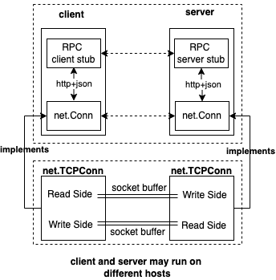

## Service Layer Design


In the frontend-backend separation architecture of the debugger, the frontend and backend need to communicate through the service layer. Although there are two types of debugging: local debugging and remote debugging, from an architectural design perspective, the backend always hopes to handle requests and responses in the form of API calls.

In remote debugging scenarios, the frontend and backend interact using a C/S protocol request method, and the backend naturally provides services in the form of API calls; for local debugging scenarios, to achieve architectural elegance and unification, the in-process logic is split into two parts: one part is the frontend logic, and the other is the backend logic. They communicate via net.Pipe using a protocol.

- Remote debugging is accomplished through real C/S network communication to send, process, and respond to debugging requests. To simplify packet receiving, unpacking, encoding/decoding, and serialization, we can directly use the JSON-RPC implementation provided by the Go standard library to complete the network communication between the debugger frontend and backend.
- Local debugging is implemented by creating a `preConnectedListener` based on net.Pipe, which implements the net.Listener interface, so that the connection between the frontend and backend can be established through a unified Accept operation.

In this way, the entire service layer's communication interface can be unified using the network layer's communication interface to establish connections, and then unified through API calls to send, process, and respond to requests, making the overall code logic very elegant. The following will provide a detailed introduction.

### Remote Debugging: JSON-RPC over network

As mentioned in the overview design, in remote debugging scenarios, the frontend and backend of the debugger need to communicate over the network. We use JSON-RPC to implement communication between the frontend and backend. The service layer design for remote debugging is as follows.

<p align="center">

</p>

RPC is a common communication pattern in client/server architecture design. Its philosophy is to allow the client to request the server's interface handler functions as if calling local methods, while the underlying details such as service discovery, rate limiting, circuit breaking, serialization, encoding/decoding, and network communication are all handled in the stub code and lower-level frameworks.

We hope to enable the debugger frontend and backend to communicate via RPC, which is valuable for future protocol extensions and simplifying coding complexity. However, we do not want to introduce heavy frameworks like GRPC. What should we do? The Go standard library provides good support for http and JSON-RPC, so we can implement JSON-RPC communication based on the standard library. Of course, if the client and server run on the same host, UnixConn-based communication can also be considered.

> In the demo implementation of the debugger that accompanies this book, network communication and RPC are the foundation for implementing the frontend-backend separation architecture, but they are not the most difficult part of implementing a Go symbol-level debugger.
>
> The author assumes that readers are already familiar with RPC-related knowledge, so this book will not provide a lengthy introduction to these topics. If you are interested, you can search for relevant materials online.

### Local Debugging: JSON-RPC over net.Pipe

How should the frontend and backend of the debugger communicate during local debugging? We are familiar with many inter-process communication methods, such as pipe, fifo, shm, etc. In Go programs, communication between goroutines widely adopts the idea of Communicating Sequential Processes (CSP), i.e., communication via channels.

The Go standard library encapsulates net.pipe based on channels. net.pipe internally contains two channels, one for read operations (readonly) and one for write operations (writeonly):

- rdRx, a read-only channel, used to read data sent from the other end of the pipe;
- rdTx, a write-only channel, used to send data to the other end of the pipe;

```go
type pipe struct {
	wrMu sync.Mutex // Serialize Write operations

	// Used by local Read to interact with remote Write.
	// Successful receive on rdRx is always followed by send on rdTx.
	rdRx <-chan []byte
	rdTx chan<- int

	// Used by local Write to interact with remote Read.
	// Successful send on wrTx is always followed by receive on wrRx.
	wrTx chan<- []byte
	wrRx <-chan int

	once       sync.Once // Protects closing localDone
	localDone  chan struct{}
	remoteDone <-chan struct{}

	readDeadline  pipeDeadline
	writeDeadline pipeDeadline
}
```

The function `net.Pipe() (Conn, Conn)` prepares such a full-duplex pipe for us and returns two net.Conn instances, which are actually net.pipe. We can then use the Read and Write functions of net.Conn to implement full-duplex communication within the same process as if performing network operations.

```go
// Pipe creates a synchronous, in-memory, full duplex
// network connection; both ends implement the Conn interface.
// Reads on one end are matched with writes on the other,
// copying data directly between the two; there is no internal
// buffering.
func Pipe() (Conn, Conn) {
	cb1 := make(chan []byte)
	cb2 := make(chan []byte)
	cn1 := make(chan int)
	cn2 := make(chan int)
	done1 := make(chan struct{})
	done2 := make(chan struct{})

	p1 := &pipe{
		rdRx: cb1, rdTx: cn1,
		wrTx: cb2, wrRx: cn2,
		localDone: done1, remoteDone: done2,
		readDeadline:  makePipeDeadline(),
		writeDeadline: makePipeDeadline(),
	}
	p2 := &pipe{
		rdRx: cb2, rdTx: cn2,
		wrTx: cb1, wrRx: cn1,
		localDone: done2, remoteDone: done1,
		readDeadline:  makePipeDeadline(),
		writeDeadline: makePipeDeadline(),
	}
	return p1, p2
}
```

So, from the design diagram, communication via net.Pipe is not very different from communication via JSON-RPC. The main difference is that it does not go through the network or the HTTP protocol. This unification of communication operations on net.Conn makes the implementation of frontend-backend communication in the debugger clearer and simpler.

<p align="center">

</p>

Next, we need to consider the following issues. Although net.Pipe() returns net.Conn for full-duplex communication:

- The server usually creates a net.Listener and then Accepts client connection requests to create net.Conn;

  We can create a new type preconnectedListener that implements the net.Listener interface and internally holds one of the net.Conn returned by `net.Pipe() (Conn, Conn)`. Each time Accept is called, it directly returns the stored net.Conn.
- The client usually creates net.Conn via net.Dial;

  The other Conn returned by `net.Pipe() (Conn, Conn)` serves as the net.Conn for the client's net.Dial, so the client does not need to use net.Dial to create a connection.

Thus, for local debugging, instead of using `net.Listen(network, address)`, we use `net.ListenerPipe()` to return preconnectedListener as net.Listener.

### What RPCs Need to Be Supported

In the frontend UI layer design, we listed some debugging commands, including subcommands for starting debugging such as `attach exec debug trace ...`, as well as interactive commands in the debugging session such as `breakpoint continue step print ...`. When these debugging commands are executed, the debugger frontend will call one or more corresponding API interfaces of the debugger backend to request the backend to complete the response processing.

The following Client interface definition reflects some methods that the debugger needs to expose for client calls. Each Client interface method is a method call convention, with corresponding backend implementations and frontend stub code calls. When the debugger frontend receives and executes a debugging command, it calls one or more client methods, combines some frontend calculations, conversions, and displays, and finally implements the debugging command.

```go
// Client represents a client of a debugger service. All client methods are synchronous.
type Client interface {
	// ProcessPid returns the pid of the process we are debugging.
	ProcessPid() int

	// BuildID returns the BuildID of the process' executable we are debugging.
	BuildID() string

	// Detach detaches the debugger, optionally killing the process.
	Detach(killProcess bool) error

	// Restart restarts program. Set true if you want to rebuild the process we are debugging.
	Restart(rebuild bool) ([]api.DiscardedBreakpoint, error)
	// RestartFrom restarts program from the specified position.
	RestartFrom(rerecord bool, pos string, resetArgs bool, newArgs []string, newRedirects [3]string, rebuild bool) ([]api.DiscardedBreakpoint, error)

	// GetState returns the current debugger state.
	GetState() (*api.DebuggerState, error)
	// GetStateNonBlocking returns the current debugger state, returning immediately if the target is already running.
	GetStateNonBlocking() (*api.DebuggerState, error)

	// Continue resumes process execution.
	Continue() <-chan *api.DebuggerState
	// Rewind resumes process execution backwards.
	Rewind() <-chan *api.DebuggerState
	// DirectionCongruentContinue resumes process execution, if a reverse next, step or stepout operation is in progress it will resume execution backward.
	DirectionCongruentContinue() <-chan *api.DebuggerState
	// Next continues to the next source line, not entering function calls.
	Next() (*api.DebuggerState, error)
	// ReverseNext continues backward to the previous line of source code, not entering function calls.
	ReverseNext() (*api.DebuggerState, error)
	// Step continues to the next source line, entering function calls.
	Step() (*api.DebuggerState, error)
	// ReverseStep continues backward to the previous line of source code, entering function calls.
	ReverseStep() (*api.DebuggerState, error)
	// StepOut continues to the return address of the current function.
	StepOut() (*api.DebuggerState, error)
	// ReverseStepOut continues backward to the caller of the current function.
	ReverseStepOut() (*api.DebuggerState, error)
	// Call resumes process execution while making a function call.
	Call(goroutineID int64, expr string, unsafe bool) (*api.DebuggerState, error)

	// StepInstruction will step a single cpu instruction.
	StepInstruction(skipCalls bool) (*api.DebuggerState, error)
	// ReverseStepInstruction will reverse step a single cpu instruction.
	ReverseStepInstruction(skipCalls bool) (*api.DebuggerState, error)
	// SwitchThread switches the current thread context.
	SwitchThread(threadID int) (*api.DebuggerState, error)
	// SwitchGoroutine switches the current goroutine (and the current thread as well)
	SwitchGoroutine(goroutineID int64) (*api.DebuggerState, error)
	// Halt suspends the process.
	Halt() (*api.DebuggerState, error)

	// GetBreakpoint gets a breakpoint by ID.
	GetBreakpoint(id int) (*api.Breakpoint, error)
	// GetBreakpointByName gets a breakpoint by name.
	GetBreakpointByName(name string) (*api.Breakpoint, error)
	// CreateBreakpoint creates a new breakpoint.
	CreateBreakpoint(*api.Breakpoint) (*api.Breakpoint, error)
	// CreateBreakpointWithExpr creates a new breakpoint and sets an expression to restore it after it is disabled.
	CreateBreakpointWithExpr(*api.Breakpoint, string, [][2]string, bool) (*api.Breakpoint, error)
	// CreateWatchpoint creates a new watchpoint.
	CreateWatchpoint(api.EvalScope, string, api.WatchType) (*api.Breakpoint, error)
	// ListBreakpoints gets all breakpoints.
	ListBreakpoints(bool) ([]*api.Breakpoint, error)
	// ClearBreakpoint deletes a breakpoint by ID.
	ClearBreakpoint(id int) (*api.Breakpoint, error)
	// ClearBreakpointByName deletes a breakpoint by name
	ClearBreakpointByName(name string) (*api.Breakpoint, error)
	// ToggleBreakpoint toggles on or off a breakpoint by ID.
	ToggleBreakpoint(id int) (*api.Breakpoint, error)
	// ToggleBreakpointByName toggles on or off a breakpoint by name.
	ToggleBreakpointByName(name string) (*api.Breakpoint, error)
	// AmendBreakpoint allows user to update an existing breakpoint for example to change the information
	// retrieved when the breakpoint is hit or to change, add or remove the break condition
	AmendBreakpoint(*api.Breakpoint) error
	// CancelNext cancels a Next or Step call that was interrupted by a manual stop or by another breakpoint
	CancelNext() error

	// ListThreads lists all threads.
	ListThreads() ([]*api.Thread, error)
	// GetThread gets a thread by its ID.
	GetThread(id int) (*api.Thread, error)

	// ListPackageVariables lists all package variables in the context of the current thread.
	ListPackageVariables(filter string, cfg api.LoadConfig) ([]api.Variable, error)
	// EvalVariable returns a variable in the context of the current thread.
	EvalVariable(scope api.EvalScope, symbol string, cfg api.LoadConfig) (*api.Variable, error)

	// SetVariable sets the value of a variable
	SetVariable(scope api.EvalScope, symbol, value string) error

	// ListSources lists all source files in the process matching filter.
	ListSources(filter string) ([]string, error)
	// ListFunctions lists all functions in the process matching filter.
	ListFunctions(filter string, tracefollow int) ([]string, error)
	// ListTypes lists all types in the process matching filter.
	ListTypes(filter string) ([]string, error)
	// ListPackagesBuildInfo lists all packages in the process matching filter.
	ListPackagesBuildInfo(filter string, includeFiles bool) ([]api.PackageBuildInfo, error)
	// ListLocalVariables lists all local variables in scope.
	ListLocalVariables(scope api.EvalScope, cfg api.LoadConfig) ([]api.Variable, error)
	// ListFunctionArgs lists all arguments to the current function.
	ListFunctionArgs(scope api.EvalScope, cfg api.LoadConfig) ([]api.Variable, error)
	// ListThreadRegisters lists registers and their values, for the given thread.
	ListThreadRegisters(threadID int, includeFp bool) (api.Registers, error)
	// ListScopeRegisters lists registers and their values, for the given scope.
	ListScopeRegisters(scope api.EvalScope, includeFp bool) (api.Registers, error)

	// ListGoroutines lists all goroutines.
	ListGoroutines(start, count int) ([]*api.Goroutine, int, error)
	// ListGoroutinesWithFilter lists goroutines matching the filters
	ListGoroutinesWithFilter(start, count int, filters []api.ListGoroutinesFilter, group *api.GoroutineGroupingOptions, scope *api.EvalScope) ([]*api.Goroutine, []api.GoroutineGroup, int, bool, error)

	// Stacktrace returns stacktrace
	Stacktrace(goroutineID int64, depth int, opts api.StacktraceOptions, cfg *api.LoadConfig) ([]api.Stackframe, error)

	// Ancestors returns ancestor stacktraces
	Ancestors(goroutineID int64, numAncestors int, depth int) ([]api.Ancestor, error)

	// AttachedToExistingProcess returns whether we attached to a running process or not
	AttachedToExistingProcess() bool

	// FindLocation returns concrete location information described by a location expression
	// loc ::= <filename>:<line> | <function>[:<line>] | /<regex>/ | (+|-)<offset> | <line> | *<address>
	// * <filename> can be the full path of a file or just a suffix
	// * <function> ::= <package>.<receiver type>.<name> | <package>.(*<receiver type>).<name> | <receiver type>.<name> | <package>.<name> | (*<receiver type>).<name> | <name>
	// * <function> must be unambiguous
	// * /<regex>/ will return a location for each function matched by regex
	// * +<offset> returns a location for the line that is <offset> lines after the current line
	// * -<offset> returns a location for the line that is <offset> lines before the current line
	// * <line> returns a location for a line in the current file
	// * *<address> returns the location corresponding to the specified address
	// NOTE: this function does not actually set breakpoints.
	// If findInstruction is true FindLocation will only return locations that correspond to instructions.
	FindLocation(scope api.EvalScope, loc string, findInstruction bool, substitutePathRules [][2]string) ([]api.Location, string, error)

	// DisassembleRange disassemble code between startPC and endPC
	DisassembleRange(scope api.EvalScope, startPC, endPC uint64, flavour api.AssemblyFlavour) (api.AsmInstructions, error)
	// DisassemblePC disassemble code of the function containing PC
	DisassemblePC(scope api.EvalScope, pc uint64, flavour api.AssemblyFlavour) (api.AsmInstructions, error)

	// Recorded returns true if the target is a recording.
	Recorded() bool
	// TraceDirectory returns the path to the trace directory for a recording.
	TraceDirectory() (string, error)
	// Checkpoint sets a checkpoint at the current position.
	Checkpoint(where string) (checkpointID int, err error)
	// ListCheckpoints gets all checkpoints.
	ListCheckpoints() ([]api.Checkpoint, error)
	// ClearCheckpoint removes a checkpoint
	ClearCheckpoint(id int) error

	// SetReturnValuesLoadConfig sets the load configuration for return values.
	SetReturnValuesLoadConfig(*api.LoadConfig)

	// IsMulticlient returns true if the headless instance is multiclient.
	IsMulticlient() bool

	// ListDynamicLibraries returns a list of loaded dynamic libraries.
	ListDynamicLibraries() ([]api.Image, error)

	// ExamineMemory returns the raw memory stored at the given address.
	// The amount of data to be read is specified by length which must be less than or equal to 1000.
	// This function will return an error if it reads less than `length` bytes.
	ExamineMemory(address uint64, length int) ([]byte, bool, error)

	// StopRecording stops a recording if one is in progress.
	StopRecording() error

	// CoreDumpStart starts creating a core dump to the specified file
	CoreDumpStart(dest string) (api.DumpState, error)
	// CoreDumpWait waits for the core dump to finish, or for the specified amount of milliseconds
	CoreDumpWait(msec int) api.DumpState
	// CoreDumpCancel cancels a core dump in progress
	CoreDumpCancel() error

	// ListTargets returns the list of connected targets
	ListTargets() ([]api.Target, error)
	// FollowExec enables or disables the follow exec mode. In follow exec mode
	// Delve will automatically debug child processes launched by the target
	// process
	FollowExec(bool, string) error
	FollowExecEnabled() bool

	// Disconnect closes the connection to the server without sending a Detach request first.
	// If cont is true a continue command will be sent instead.
	Disconnect(cont bool) error

	// SetDebugInfoDirectories sets directories used to search for debug symbols
	SetDebugInfoDirectories([]string) error

	// GetDebugInfoDirectories returns the list of directories used to search for debug symbols
	GetDebugInfoDirectories() ([]string, error)

	// GuessSubstitutePath tries to guess a substitute-path configuration for the client
	GuessSubstitutePath() ([][2]string, error)

	// CallAPI allows calling an arbitrary rpc method (used by starlark bindings)
	CallAPI(method string, args, reply interface{}) error
}
```

Now you may be surprised: why are so many interfaces needed? If we were making a toy, it would be relatively simple; if we were making a tool of usable quality, it would not be so simple. All the above interfaces have already been implemented in `go-delve/delve`. In our demo debugger, due to space limitations, we will only discuss the implementation of the most core interfaces. Readers can implement the others themselves or refer to delve's implementation.

### Section Summary

This section introduced the design of the Service layer in the frontend-backend separation architecture of the debugger, including detailed design descriptions for both remote and local debugging, and finally provided the list of RPC interfaces we need to support. In other words, our next task is to implement these RPC interface lists on the frontend and backend.

> ps: In addition to interacting with the debugger by entering debugging commands in the frontend, more user-friendly methods are also needed. For example, you may want to save the current debugging session and continue debugging from here later, or share a complete debugging process with others to help locate problems. go-delve/delve allows users to do this by writing starlark scripts. Within the debugger session, you can automatically execute debugging operations in the script via `source /path-to/your.star`, which is very convenient. The starlark script can execute some functions pre-supported by dlv, such as `dlv_command("debugging command in the session")` to execute debugging commands, which will eventually be converted into API calls to invoke the implementation logic in the debugger backend. As a supplement to the debugger interaction logic, we briefly mention it here and will introduce it in detail later.
