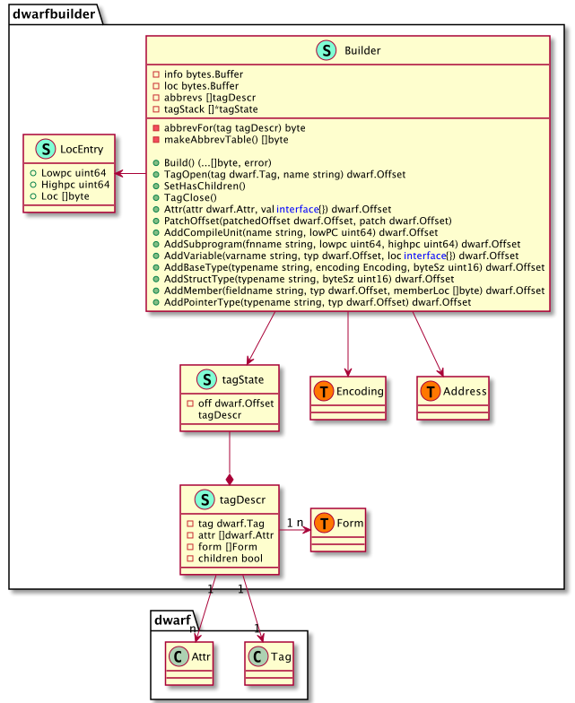

## Backend Symbol Layer Design


In this section, we introduce the design of the symbol layer in the debugger backend. The symbol layer here refers to the conversion between instruction addresses and source-level views using DWARF debugging information, such as mapping instruction addresses to source locations, call stacks, or mapping data addresses to data types. In Chapter 8, we introduced the DWARF debugging information standard and provided some examples of obtaining variables, types, line tables, etc., through DWARF. You should now have some understanding of what DWARF is and how to use it.

Due to the complexity of the debugging information standard and the compiler toolchain's generation of debugging information, even after so many years, the DWARF standard, Go, and delve are still evolving and optimizing. Starting from Go 1.25, DWARFv5 debugging information is generated by default, and the DWARFv6 draft has also been completed. This is a never-ending, continuously evolving process. However, when the author wrote this book, there were many changes from Go 1.13 to Go 1.24, and the Go toolchain's DWARF information generation and parsing also changed... We will not chase the latest Go 1.25 here; instead, we will introduce according to Go 1.24 and DWARFv4.

> The compiler and linker in Go 1.25 now generate debug information using DWARF version 5; the newer DWARF version reduces the space required for debugging information in Go binaries.

### DWARFv4 sections

DWARFv4, the corresponding debug sections in ELF files and their contents are as follows:

| Section         | Description                                                           |
| --------------- | --------------------------------------------------------------------- |
| .debug_abbrev   | Stores abbreviation information used in .debug_info                   |
| .debug_arranges | Stores an accelerated lookup table for querying compilation unit info by memory address |
| .debug_frame    | Stores call stack frame information                                   |
| .debug_info     | Stores core DWARF data, including DIEs describing variables, code, etc.|
| .debug_line     | Stores the line number table program (instructions executed by the line table state machine to build the complete line table) |
| .debug_loc      | Stores location description information                                |
| .debug_macinfo  | Stores macro-related description information                           |
| .debug_pubnames | Stores an accelerated lookup table for querying global objects and functions by name |
| .debug_pubtypes | Stores an accelerated lookup table for querying global types by name    |
| .debug_ranges   | Stores address ranges referenced by DIEs                               |
| .debug_str      | Stores the string table referenced in .debug_info, also referenced by offset |
| .debug_types    | Stores DIEs describing data types                                      |

The reference relationships between these debug sections are shown in the figure below (see DWARFv4 Appendix B for details).


To better understand this part, you can use the small tool [aarzilli/diexplorer](https://github.com/aarzilli/diexplorer) by aarzilli or my [hitzhangjie/dwarfviewer](https://github.com/hitzhangjie/dwarfviewer) to browse the debugging information in the debug sections, which is very helpful for deepening your understanding.

### DWARFv4 Read/Write and Query

To better implement reading and writing of DWARFv4 data and facilitate queries and conversions of different forms of DWARF data, the following packages are designed.

| package      | Purpose and Usage |
| ------------ | ------------------------------------------------------------------------------------------------------------------------------------------------------------------------------------------------------------------------------------------------------------------------------------------------------------------------------------------------------------------------------------------------------------------------------------------------------------------------------------------------------------------------------------------------------------------------------------------------------------------------------------------------------------------------------------------------------------------------------------------------------------------------------------------------------------------------------------------------------------------------------------------------------------------------------------------------------------------------------------------------------------------------------------------------------------------------------------------------------------------------------------------------------------------------------------------------------------------------------------------------------------------------------------------------------------------------------------------------------------------------------------------------------------------------------------------------------------------ |
| dwarfbuilder | Implements a Builder that can easily generate DWARF debugging information corresponding to different code structures. For example, New() returns a Builder and initially sets the header fields of the DWARF information, then the returned builder can add compilation units, data types, variables, functions, etc. This Builder greatly facilitates the rapid generation of corresponding debugging information for source code. However, this package is not very useful for implementing a debugger, but it is very helpful for verifying how the Go compiler toolchain generates debugging information. Once you understand how the Go compiler toolchain generates DWARF debugging information, you can further understand how to parse and apply the corresponding debugging information. The purpose of this package is more for learning and verifying the generation and application of DWARF debugging information. |
| frame        | The information in .[z]debug_frame can help build the CFI (Canonical Frame Information). Given any instruction address, we can use the CFI to calculate the current call stack. Each compilation unit in DWARF information may compress multiple Go source files, and each compilation unit starts with a CIE (Common Information Entry), followed by a series of FDEs (Frame Description Entry). Here, the types CommonInformationEntry and FrameDescriptionEntry are defined to represent CIE and FDE, respectively. FDE references CIE, CIE contains the initial instruction sequence, and FDE contains its own instruction sequence. Combining CIE and FDE can build a complete CFI table. To facilitate determining whether an instruction address is within the range of an FDE, the type FrameDescriptionEntry defines the method Cover, and also provides Begin and End to give the range of the FDE. In addition, it defines the method EstablishFrame, which uses a state machine to execute the instruction sequences in CIE and FDE to build all or part of the CFI table as needed, making it easy to calculate the CFA (Canonical Frame Address), which can be further used to calculate the return address of the called function. With this return address (an instruction address), we can calculate the corresponding source code location (such as file name, line number, function name). By iterating this process, we can calculate the complete call stack. **Note: The begin and end in FDE describe the address range of the instruction sequence during the creation, existence, and destruction of the stack frame. See the DWARF v4 standard for details.** The type FrameDescriptionEntries is also defined, which is actually a slice of FDEs with some helper functions, such as FDEForPC for querying the FDE containing a given instruction address. Each function has an FDE, and the instruction range of each function is arranged in order. There is no case where the instruction range of one function's FDE includes that of another function's FDE. |
| godwarf      | This package provides some basic functions. addr.go provides the ability to parse .[z]debug_addr added in DWARF v5. sections.go provides functions to read debugging information from different file formats, such as GetDebugSectionElf, which can read the specified debugging section data from a given ELF file and automatically decompress the data if it is compressed. tree.go provides the ability to read the Tree composed of DIEs. If a compilation unit is not continuous, there will be multiple address ranges in Tree.Ranges. When determining whether the address range of a compilation unit contains a specified instruction address, you need to traverse Tree.Ranges for checking. The Tree.ContainsPC method simplifies this operation. The Tree.Type method also supports reading the type information corresponding to the current TreeNode. type.go defines some types corresponding to Go data types, including basic types like BasicType and composite types like CharType, UcharType, IntType, StructType, SliceType, StringType, etc. These types are all stored as DIEs in .[z]debug_info. tree.go provides a very important function ReadType, which can read the type information defined at a specified offset from DWARF data and establish the correspondence with Go data types through reflect.Kind, making it easy to create variables and assign values using Go's reflect package. |
| line         | A very important aspect of symbol-level debugging is the ability to convert between instruction addresses and source file:line numbers. For example, when adding a breakpoint to a statement, it needs to be converted into an instruction patch for the instruction address, or when stopping at a breakpoint, the current source code location should be displayed. The line table is used to implement this conversion. The line table is encoded as a bytecode instruction stream and stored in .[z]debug_line. Each compilation unit has a line table, and the line table data of different compilation units will eventually be merged by the linker. Each line table has a fixed structure for parsing, such as the header field, followed by specific data. line_parser.go provides the ParseAll method to parse the line tables of all compilation units in .[z]debug_line. The type DebugLines represents all line tables, and each compilation unit's line table corresponds to the type DebugLineInfo. An important field in DebugLineInfo is the instruction sequence, which is executed by a line table state machine defined in state_machine.go. After execution, the complete line table can be built. With the complete line table, we can look up the corresponding source line by PC. |
| loclist      | The location of an object in memory can be described by a location expression or a location list. If the location of an object may change during its lifetime, a location list is needed. Also, if an object's storage in memory is not a contiguous segment but consists of multiple non-adjacent segments, a location list is also needed. In DWARF v2~v4, location list information is stored in .[z]debug_loc, and in DWARF v5, it is stored in .[z]debug_loclist. The loclist package supports both the old (DWARF v2~v4) and new (DWARF v5) versions of location lists. The package defines Dwarf2Reader and Dwarf5Reader for reading location lists from the raw data of the old and new versions, respectively. |
| op           | In op.go, when discussing address expression operations in DWARF, it was mentioned that address operations are performed by executing a stack-based program instruction list. The program instructions are all 1-byte opcodes, defined in this package, and their operands are on the stack. Each opcode has a corresponding function stackfn, which operates on the stack data, takes operands, and pushes the result back onto the stack. The final top element of the stack is the result. opcodes.go defines a series of opcodes, opcode-to-name mappings, and the number of operands for each opcode. registers.go defines the list of registers concerned by DWARF as DwarfRegisters and provides some traversal methods, such as returning the register information for a specified number, or returning the current PC/SP/BP register values. |
| reader       | This package defines the type Reader, which embeds the Go standard library's dwarf.Reader to read DIE information from .[z]debug_info. Each DIE in DWARF is organized as a tree, and each DIE corresponds to a dwarf.Entry, which includes the previously mentioned Tag and []Field (Field records Attr information), as well as the DIE's Offset and whether it contains child DIEs. The Reader here also defines some other functions such as Seek, SeekToEntry, AddrFor, SeekToType, NextType, SeekToTypeNamed, FindEntryNamed, InstructionsForEntryNamed, InstructionsForEntry, NextMemberVariable, NextPackageVariable, NextCompileUnit. The package also defines the type Variable, which embeds the tree godwarf.Tree describing a variable's DIE. It also provides the function Variables to extract the list of variables contained in a specified DIE tree. |
| regnum       | Defines the mapping between register numbers and register names, and provides functions for fast bidirectional lookup. |
| leb128       | Implements several utility functions: reading an int64 from a sleb128-encoded reader; reading a uint64 from a uleb128-encoded reader; writing an int64 to a writer in sleb128 encoding; writing a uint64 to a writer in uleb128 encoding. |
| dwarf        | Implements several utility functions: reading basic information (length, dwarf64, dwarf version, byte order) from DWARF data, reading the list of compilation units and their version information, reading a DWARF string from a buffer, reading Uint16, Uint32, Uint64 from a buffer in the specified byte order, encoding a Uint32, Uint64 in the specified byte order and writing it to a buffer. |

Handwriting a complete DWARF parsing library requires proficiency in the DWARF debugging information standard and understanding the various adjustments made by the Go compiler toolchain in the evolution from DWARF v4 to DWARF v5. The workload is quite large. To avoid making the learning process too tedious, we will not handwrite a new DWARF support library, but instead reuse the implementation in go-delve/delve.

OK, let's take a look at how these packages are organized internally.

#### dwarfbuilder

The dwarfbuilder package is mainly used to generate DWARF debugging information. When do we need to generate DWARF debugging information? We want to allow a running Go program to generate a core file. We usually get a core file when a Go program crashes (set the environment variable GOTRACEBACK=crash at startup), but it is also possible to dynamically generate a core file during program execution.

The core file is also in ELF format under Linux, and we need to write some DWARF information for debugging. dwarfbuilder is used to generate this DWARF data (mainly the data in .[z]debug_info).



#### frame

The data in .[z]debug_frame can be used to build the call stack information table, which can be used during program execution to build the call stack and allow us to select stack frames forward and backward and view variable information in the stack frame. Of course, you can also use bt to print the current call stack information.

The information in .[z]debug_frame mainly consists of a series of CIEs (one per compilation unit) and a series of FDEs (many FDEs in each compilation unit). After parsing this data, you get a FrameDescriptionEntries, which encapsulates several commonly used methods, such as FDEForPC, which returns the corresponding stack frame when a specific instruction address is specified.

When a PC value is specified, executing its EstablishFrame will execute the instructions in the call stack information table, and after completion, a FrameContext is built, which records the CFA, Regs, and RetAddrReg at that time. With this data, you can calculate the return address of the current function and further calculate the stack frame of the calling function... Repeating this process allows you to calculate the call stack.


#### line

.[z]debug_line records the mapping between instruction addresses and source file line numbers. The data in this table helps us complete the conversion between source code addresses and instruction addresses.

The design of this package is roughly as follows: `line.Parse(*DebugLineInfo, *bytes.Buffer)`, where the data in .[z]debug_info is the second parameter. After parsing, the data in *DebugLineInfo will be filled in.

During parsing, a formReader is used to read and parse data from *bytes.Buffer, and a StateMachine is used to execute the bytecode instructions in the table to rebuild the table.

Finally, we can use the exported methods in DebugLineInfo to perform some common operations, such as PCToLine to convert a PC address to a source file address, and LineToPC to convert a source file address to an instruction address PC.


#### loclist

.[z]debug_loc and .[z]debug_loclist store some address-related information. The former is defined in DWARF standard v2, and the latter is defined in DWARF standard v5. The latter is more space-saving and efficient than the former.


This part of the data describes the address of an object. When describing the address of an object, if its address may change during its entire lifetime, it needs to be described by loclists. When does this happen?

The change of location here does not mean that the object will migrate (like GC), but that as the program executes instruction by instruction, the PC value is constantly changing. In order to quickly calculate the object's address, a new loc entry may be generated in loclists. By looking up the corresponding entry, the address can be quickly calculated.

For example, consider the following program:

```c
void delay(int num)
{
   volatile int i;
   for(i=0; i<num; i++);
}
```

Compiling with `gcc -g -O1 -o delay.o delay.c` generates a delay.o file. Disassembly:

```asm
00000000 <delay>:
   0:   e24dd008    sub sp, sp, #8
   4:   e3a03000    mov r3, #0
   8:   e58d3004    str r3, [sp, #4]
   c:   e59d3004    ldr r3, [sp, #4]
  10:   e1500003    cmp r0, r3
  14:   da000005    ble 30 <delay+0x30>
  18:   e59d3004    ldr r3, [sp, #4]
  1c:   e2833001    add r3, r3, #1
  20:   e58d3004    str r3, [sp, #4]
  24:   e59d3004    ldr r3, [sp, #4]
  28:   e1530000    cmp r3, r0
  2c:   bafffff9    blt 18 <delay+0x18>
  30:   e28dd008    add sp, sp, #8
  34:   e12fff1e    bx  lr
```

We can see the instruction address range. Now let's look at the corresponding DWARF data:

```bash
<1><25>: Abbrev Number: 2 (DW_TAG_subprogram)
   <26>   DW_AT_external    : 1
   <27>   DW_AT_name        : (indirect string, offset: 0x19): delay
   <2b>   DW_AT_decl_file   : 1
   <2c>   DW_AT_decl_line   : 1
   <2d>   DW_AT_prototyped  : 1
   <2e>   DW_AT_low_pc      : 0x0
   <32>   DW_AT_high_pc     : 0x38
   <36>   DW_AT_frame_base  : 0x0      (location list)
   <3a>   DW_AT_sibling     : <0x59>
...
<2><4b>: Abbrev Number: 4 (DW_TAG_variable)
   <4c>   DW_AT_name        : i
   <4e>   DW_AT_decl_file   : 1
   <4f>   DW_AT_decl_line   : 3
   <50>   DW_AT_type        : <0x60>
   <54>   DW_AT_location    : 0x20     (location list)
```

We see the definition of variable i. From its DW_AT_location attribute, we see that its location is described in the location list, so let's also output its .debug_loc:

```bash
Offset   Begin    End      Expression
00000000 00000000 00000004 (DW_OP_breg13 (r13): 0)
00000000 00000004 00000038 (DW_OP_breg13 (r13): 8)
00000000 <End of list>
00000020 0000000c 00000020 (DW_OP_fbreg: -12)
00000020 00000024 00000028 (DW_OP_reg3 (r3))
00000020 00000028 00000038 (DW_OP_fbreg: -12)
00000020 <End of list>
```

We can see that when the instruction address is from 4 to 38, the calculation expression for its location is r13+8; when the address is c to 20, the address is fbreg-12; when the address is 24 to 28, the address is r3; when the address is 28 to 38, the address is fbreg-12. It can be seen that the change of location here means that as the instruction address PC value changes, the calculation expression for its location changes. The reason for the change is that during the execution of instructions, some registers are used and can no longer be calculated using the previous expression, so a new loclists entry is generated in .debug_loc or .debug_loclists.

> This demo is taken from a Stack Overflow Q&A: https://stackoverflow.com/q/47359841.

#### godwarf

In .[z]debug_info, a DIE Tree is used to describe the defined types, variables, functions, compilation units, etc. DIEs use Tag and Attr to describe specific objects, and these DIEs can form a Tree.

the godwarf package provides exported functions to simplify the loading and parsing logic of the DIE Tree.


#### op

the most important exported function in the op package is `op.ExecuteStackProgram(...)`, which executes a DWARF location expression and returns the calculated address value (int64 type), or returns a []Piece, each Piece describing a location, which may be in memory (address is Piece.Val), in a register (number in Piece.Val), or an immediate value (Piece.Val or Piece.Bytes).

op.DwarfRegisters and op.DwarfRegister are two important types that define the registers needed by the stack program. The related functions and methods are relatively simple.


#### reader

Here, a more convenient reader for reading and parsing .debug_info in DWARF is defined, based on the Go standard library's dwarf.Reader. This reader can easily seek, read variables, types, functions, compilation units, and other program elements.


#### regnum

Defines some register numbers and their corresponding register names,

```go
// List of registers under amd64 architecture
const (
	AMD64_Rax     = 0
	AMD64_Rdx     = 1
	AMD64_Rcx     = 2
	AMD64_Rbx     = 3
	AMD64_Rsi     = 4
	AMD64_Rdi     = 5
	...
)

// Mapping from register number to register name
var amd64DwarfToName = map[uint64]string{
	AMD64_Rax:        "Rax",
	AMD64_Rdx:        "Rdx",
	AMD64_Rcx:        "Rcx",
	AMD64_Rbx:        "Rbx",
	...
}

var AMD64NameToDwarf = func() map[string]int {
	r := make(map[string]int)
	for regNum, regName := range amd64DwarfToName {
		r[strings.ToLower(regName)] = int(regNum)
	}
	r["eflags"] = 49
	r["st0"] = 33
	r["st1"] = 34
	r["st2"] = 35
	r["st3"] = 36
	r["st4"] = 37
	r["st5"] = 38
	r["st6"] = 39
	r["st7"] = 40
	return r
}()

// Return the maximum register number
func AMD64MaxRegNum() uint64 { ... }

// Return the register name corresponding to the register number
func AMD64ToName(num uint64) string { ... }
```

#### leb128

Defines some commonly used utility functions for reading and writing leb128:

```go
// Reader is a io.ByteReader with a Len method. This interface is
// satisfied by both bytes.Buffer and bytes.Reader.
type Reader interface {
	io.ByteReader
	io.Reader
	Len() int
}

// DecodeUnsigned decodes an unsigned Little Endian Base 128
// represented number.
func DecodeUnsigned(buf Reader) (uint64, uint32) {...}

// DecodeSigned decodes a signed Little Endian Base 128
// represented number.
func DecodeSigned(buf Reader) (int64, uint32) { ... }

// EncodeUnsigned encodes x to the unsigned Little Endian Base 128 format.
func EncodeUnsigned(out io.ByteWriter, x uint64) { ... }

// EncodeSigned encodes x to the signed Little Endian Base 128 format.
func EncodeSigned(out io.ByteWriter, x int64) { ... }
```

#### dwarf

Defines some commonly used utility functions for reading and writing strings, uints, etc.:

```go
const (
	_DW_UT_compile = 0x1 + iota
	_DW_UT_type
	_DW_UT_partial
	_DW_UT_skeleton
	_DW_UT_split_compile
	_DW_UT_split_type
)

// ReadString reads a null-terminated string from data.
func ReadString(data *bytes.Buffer) (string, error) { ... }

// ReadUintRaw reads an integer of ptrSize bytes, with the specified byte order, from reader.
func ReadUintRaw(reader io.Reader, order binary.ByteOrder, ptrSize int) (uint64, error) { ... }

// WriteUint writes an integer of ptrSize bytes to writer, in the specified byte order.
func WriteUint(writer io.Writer, order binary.ByteOrder, ptrSize int, data uint64) error { ... }

// ReadDwarfLengthVersion reads a DWARF length field followed by a version field
func ReadDwarfLengthVersion(data []byte) (length uint64, dwarf64 bool, version uint8, byteOrder binary.ByteOrder) { ... }

// ReadUnitVersions reads the DWARF version of each unit in a debug_info section and returns them as a map.
func ReadUnitVersions(data []byte) map[dwarf.Offset]uint8 { ... }
```

### Section Summary

This section introduced the debug sections of symbol layer debugging information and their relationships, as well as the design of some Go packages used for reading and writing these DWARF data. We did not design this from scratch, nor do we need to implement it from scratch in the future. We just need to read, understand, and reuse the implementation that has been accumulated in go-delve/delve over the years.
