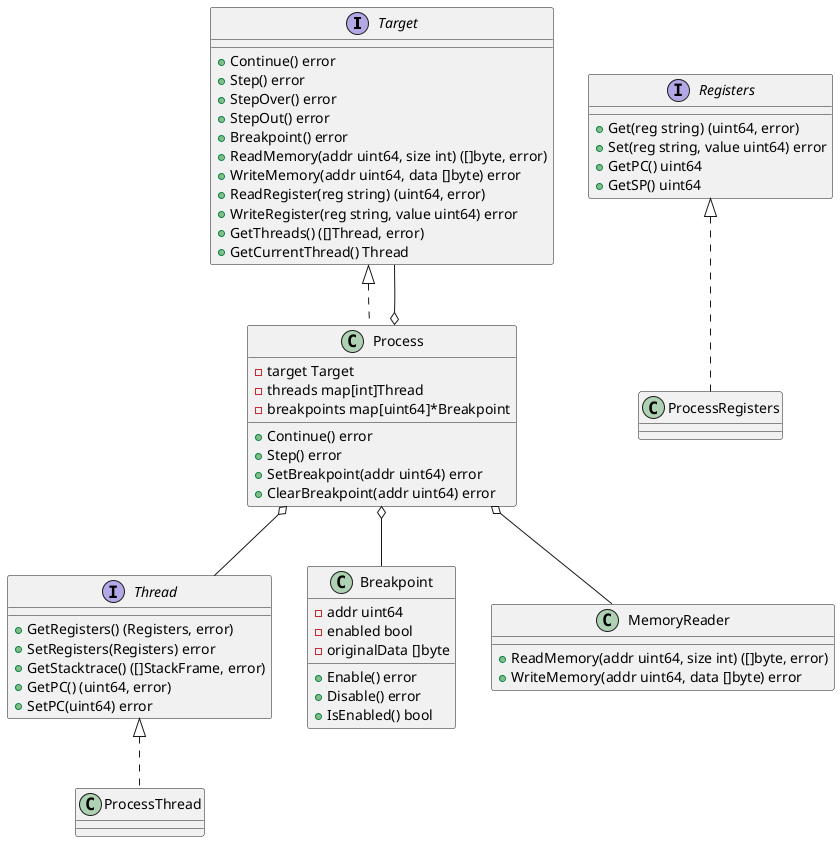

## Backend Target Layer Design

The debugger backend target layer is the lowest layer in the debugger architecture, directly interacting with the debugged process (tracee) and responsible for executing the most basic control and data operations. The main responsibilities of this layer include:

### 1. Execution Control
- Process Control: Starting, stopping, and continuing the debugged process
- Breakpoint Management: Setting, clearing, enabling, and disabling breakpoints
- Single-step Execution: Supporting step over, step into, and step out operations
- Execution State Query: Obtaining current execution state, PC value, etc.

### 2. Data Access
- Memory Operations: Reading and writing process memory space
- Register Operations: Reading and writing CPU registers
- Thread Operations: Getting thread list, switching current thread
- Stack Operations: Reading call stack information

### 3. Raw Data Processing
The target layer deals with the most primitive binary data, not concerned with data semantics and types. For example:
- Reading memory returns raw byte sequences
- Reading registers returns raw values
- These raw data need to be passed to the symbol layer for parsing and type conversion

### 4. Collaboration with Symbol Layer
The target layer works closely with the symbol layer:
- Target layer provides raw data access capabilities
- Symbol layer is responsible for parsing DWARF debug information
- Symbol layer converts raw data into meaningful typed data
- Both work together to implement source-level debugging functionality

### 5. Platform Adaptation
The target layer needs to adapt to different operating systems and hardware architectures:
- Support for different operating systems (Linux, Windows, macOS, etc.)
- Support for different CPU architectures (x86, ARM, etc.)
- Handling platform-specific debugging interfaces (such as ptrace, debugger API, etc.)

### Class Diagram Design

This class diagram shows the main components of the target layer and their relationships:

1. The `Target` interface defines the core functionality that the target layer needs to implement
2. The `Thread` interface defines thread-related operations
3. The `Registers` interface defines register access operations
4. The `Process` class serves as the main implementation class, managing process state and debugging operations
5. The `Breakpoint` class handles breakpoint-related operations
6. The `MemoryReader` class handles memory read/write operations

This design enables the target layer to:
- Provide a unified debugging interface
- Support multi-platform implementation
- Facilitate extension of new features
- Clearly separate concerns

