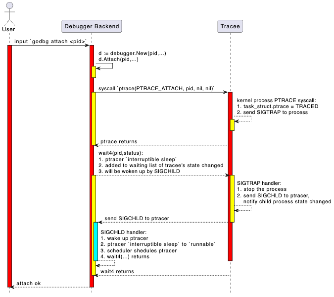

## Attach

### Implementation Goal: `tinydbg attach <pid>`

This section introduces the attach command for starting debugging: `tinydbg attach <pid> [executable] [flags]`. The attach operation will attach to the target process and make it stop.

Compared to the instruction-level debugger godbg attach, the symbol-level debugger tinydbg attach adds more options to support more user-friendly debugging.

```bash
$ tinydbg help attach
Attach to an already running process and begin debugging it.

This command will cause Delve to take control of an already running process, and
begin a new debug session.  When exiting the debug session you will have the
option to let the process continue or kill it.

Usage:
  tinydbg attach pid [executable] [flags]

Flags:
      --continue                 Continue the debugged process on start.
  -h, --help                     help for attach
      --waitfor string           Wait for a process with a name beginning with this prefix
      --waitfor-duration float   Total time to wait for a process
      --waitfor-interval float   Interval between checks of the process list, in millisecond (default 1)

Global Flags:
      --accept-multiclient               Allows a headless server to accept multiple client connections via JSON-RPC.
      --allow-non-terminal-interactive   Allows interactive sessions of Delve that don't have a terminal as stdin, stdout and stderr
      --headless                         Run debug server only, in headless mode. Server will accept JSON-RPC client connections.
      --init string                      Init file, executed by the terminal client.
  -l, --listen string                    Debugging server listen address. Prefix with 'unix:' to use a unix domain socket. (default "127.0.0.1:0")
      --log                              Enable debugging server logging.
      --log-dest string                  Writes logs to the specified file or file descriptor (see 'dlv help log').
      --log-output string                Comma separated list of components that should produce debug output (see 'dlv help log')
```

Let's explain the attach command options above:

1. tinydbg attach pid - This is straightforward, attaching to a running process with id==pid;
2. --waitfor, --waitfor-duration, --waitfor-interval - Wait for a process with name prefix xxx to start and then attach, see [waitfor design](./1-tinydbg_attach_waitfor.md).
3. --accept-multiclient - This allows the same debugger backend to serve multiple debugger clients, enabling simultaneous or sequential debugging, see [multiclient design](../3-高级功能扩展/108-howto_accept_multiclient.md).
4. --allow-non-terminal-interactive - If you want to perform non-terminal-based debugging in CI/CD or automated debugging workflows;
5. --headless - Start a debugger backend and run it in server mode;
6. --listen - Start a debugger backend in server mode and specify the server's listening address;
7. --log, --log-output, --log-dest - Whether to enable server logging, which levels of logging to enable, and where to output logs, see [logging system design](../1-架构设计/6-日志系统设计).

OK, let's look at the detailed design and implementation of Attach.

### Basic Knowledge

In Chapter 6 on instruction-level debugger development, we combined Linux kernel source code to very详细介绍介绍了syscall.PtraceAttach(...)的处理过程. If you've forgotten these details, you can go back and review the relevant content. Here we'll summarize the key processing logic through a sequence diagram.

FIXME: This diagram has issues, refer to Chapter 6's start+attach "put it together" section for summary.

<p align="center">

</p>

General processing flow:

- User inputs `attach <pid>` command in the frontend.
- Frontend sends attach request to backend via json-rpc (remote) or net.Pipe (local).
- Backend parses request and calls system API (like ptrace or equivalent mechanism) to attach to target process.
- Backend initializes debugging context (like symbol table, breakpoints, thread information, etc.).
- Returns attach result, frontend enters debugging session.

### Code Implementation

As the first debugging command implementation we're introducing, we need to explain the complete interaction flow between the debugger frontend and backend in detail here. For subsequent debugging commands, we won't repeat this detailed explanation. So please be patient, readers.

#### Executing `tinydbg attach <pid>` in Shell

First, when the user executes the command `tinydbg attach <pid>`, the tinydbg main program is a command-line program based on spf13/cobra:

file: path-to/tinydbg/main.go

```go
package main

import (
  ...

	"github.com/hitzhangjie/tinydbg/cmds"
	"github.com/hitzhangjie/tinydbg/pkg/logflags"
	"github.com/hitzhangjie/tinydbg/pkg/version"
)

// Build is the git sha of this binaries build.
//
// note: we can pass -ldflags "-X main.Build=v0.0.1" to set the build version when building.
var Build string = "v0.0.1"

func main() {
	// current demo only supports linux/amd64
	if runtime.GOOS != "linux" || runtime.GOARCH != "amd64" {
		fmt.Fprintf(os.Stderr, "WARNING: tinydbg only supports linux/amd64")
		os.Exit(1)
	}

	// this build version will be dumped when generating the core file
	if Build != "" {
		version.DelveVersion.Build = Build
	}

	// if cgo used, pass "-O0 -g" to disable optimization and enable debugging symbols
	const cgoCflagsEnv = "CGO_CFLAGS"
	if os.Getenv(cgoCflagsEnv) == "" {
		os.Setenv(cgoCflagsEnv, "-O0 -g")
	} else {
		logflags.WriteCgoFlagsWarning()
	}

	cmds.New().Execute()
}

```

Since it's a command-line program managed by spf13/cobra, its subcommand registration logic is similar, it should have a corresponding attach subcmd.

see: path-to/tinydbg/cmds/cmd_root.go

```go
// New returns an initialized command tree.
func New() *cobra.Command {
	// Config setup and load.
	//
	// Delay reporting errors about configuration loading delayed until after the
	// server is started so that the "server listening at" message is always
	// the first thing emitted. Also, logflags hasn't been set up yet at this point.
	conf, loadConfErr = config.LoadConfig()
	buildFlagsDefault := ""

	// Main dlv root command.
	rootCommand = &cobra.Command{
		Use:   "tinydbg",
		Short: "tinydbg is a lightweight debugger trimmed from Delve (Dlv) for the Go programming language.",
		Long:  longDesc,
	}
  ...
  rootCommand.AddCommand(attachCommand)
	rootCommand.AddCommand(connectCommand)
  ...
}
```

We can see the registration of attachCommand here. When executing `tinydbg attach`, it actually executes the attachCommand.Run method.

see: path-to/tinydbg/cmds/cmd_attach.go

```go
// 'attach' subcommand.
var attachCommand = &cobra.Command{
	Use:   "attach pid [executable]",
	Short: "Attach to running process and begin debugging.",
	Long: `Attach to an already running process and begin debugging it.

This command will cause Delve to take control of an already running process, and
begin a new debug session.  When exiting the debug session you will have the
option to let the process continue or kill it.
`,
	PersistentPreRunE: func(cmd *cobra.Command, args []string) error {
		if len(args) == 0 && attachWaitFor == "" {
			return errors.New("you must provide a PID")
		}
		return nil
	},
	Run: attachCmd,
	ValidArgsFunction: func(cmd *cobra.Command, args []string, toComplete string) ([]string, cobra.ShellCompDirective) {
		if len(args) != 1 {
			return nil, cobra.ShellCompDirectiveNoFileComp
		}
		return nil, cobra.ShellCompDirectiveDefault
	},
}

...

func attachCmd(_ *cobra.Command, args []string) {
	var pid int
	if len(args) > 0 {
		var err error
		pid, err = strconv.Atoi(args[0])
		if err != nil {
			fmt.Fprintf(os.Stderr, "Invalid pid: %s\n", args[0])
			os.Exit(1)
		}
		args = args[1:]
	}
	os.Exit(execute(pid, args, conf, "", debugger.ExecutingOther, args, buildFlags))
}
```

Here `attachCommand.Run()` -> `attachCmd(...)` -> `execute(pid, args, conf, ....)`, the RPC client for frontend-backend communication is initialized in execute and completes the call to the server.

ps: In section 9.1 Service Layer Design, we mentioned that for local debugging, we actually simulate real network connection communication through preConnectedListener+net.Pipe. Essentially, it still follows the C/S architecture for requests and processing.

#### Frontend and Backend Responsibilities in Attach Operation

When executing to the execute method, the different responsibilities of frontend and backend in the separated architecture begin to show. For local debugging mode, the execute method includes both frontend JSON-RPC client initialization and debugging session logic, as well as backend network IO and debugger core functionality initialization. In remote debugging mode, the execute method mainly handles backend network IO and debugger core functionality initialization, while frontend initialization needs to be done through the connect operation to initialize the JSON-RPC client and debugging session.

We've already introduced the initialization and working process of the debugging session in the previous section. In this section, we only need to focus on the debugger backend's core functionality initialization involved in the attach operation, based on the already introduced debugging session.

Actually, if it's remote debugging mode, the attach operation is mainly a backend operation, with little frontend involvement. The attach operation doesn't need the frontend to send a JSON-RPC request - it just needs the backend to do network IO initialization and debugger initialization, then let the debugger attach to the target process and that's it. If it's local debugging mode, after the debugger backend completes the above initialization, the debugger frontend establishes a debugging session and it's ready to go, with subsequent communication with the backend through net.Pipe.

see: path-to/tinydbg/cmds/cmd_root.go

```go
func execute(attachPid int, processArgs []string, conf *config.Config, coreFile string, kind debugger.ExecuteKind, dlvArgs []string, buildFlags string) int {
  	...

	var listener net.Listener
	var clientConn net.Conn
	if headless {
		listener, err = netListen(addr)               // remote debug mode via TCP network
	} else {
		listener, clientConn = service.ListenerPipe() // local debug mode via net.Pipe
	}

	...

	// debugger backend: create and start a debugger server
	server := rpccommon.NewServer(&service.Config{
		Listener:       listener,
		ProcessArgs:    processArgs,
		AcceptMulti:    acceptMulti,
		DisconnectChan: disconnectChan,
		Debugger: debugger.Config{
			AttachPid:             attachPid,
			。。。
		},
	})

	if err := server.Run(); err != nil {
		。。。
	}
  	...

	// debugger frontend: connect to debugger server and init debug session
	return connect(listener.Addr().String(), clientConn, conf)
}
```

#### Debugger Backend Initialization and Request Acceptance

The debugger backend starts, with two ways of network initialization:
1. One is through --headless mode startup, net.Listen creates a TCPListener or UnixListener, then waits for incoming connection requests;
2. One is local mode startup, through preConnectedListener+net.Pipe, to simulate network listening and connection operations;

see: path-to/tinydbg/cmds/cmd_root.go

```go
func execute(attachPid int, processArgs []string, conf *config.Config, coreFile string, kind debugger.ExecuteKind, dlvArgs []string, buildFlags string) int {
  	...
	var listener net.Listener
	if headless {
		listener, err = netListen(addr)               // remote debug mode via TCP network
	} else {
		listener, clientConn = service.ListenerPipe() // local debug mode via net.Pipe
	}
  	...

	// debugger backend: create and start a debugger server
	server := rpccommon.NewServer(&service.Config{
		Listener:       listener,
		ProcessArgs:    processArgs,
		AcceptMulti:    acceptMulti,
		DisconnectChan: disconnectChan,
		Debugger: debugger.Config{
			AttachPid:             attachPid,
			...
		},
	})

	// debugger backend: run the server
	if err := server.Run(); err != nil {
		...
	}

	...
}
```

After `server.Run()` starts executing, it creates a ptracer and attaches to the target process, then starts accepting incoming connection requests and processing RPC requests.

```go
// Run starts a debugger and exposes it with an JSON-RPC server. The debugger
// itself can be stopped with the `detach` API.
func (s *ServerImpl) Run() error {
	var err error

	// Create and start the debugger
	config := s.config.Debugger
	if s.debugger, err = debugger.New(&config, s.config.ProcessArgs); err != nil {
		return err
	}

	s.s2 = rpc2.NewServer(s.config, s.debugger)
	s.methodMap = make(map[string]*methodType)

	// register RPC methods and relevant handlers
	registerMethods(s.s2, s.methodMap)

	// accept incoming connections and serves the RPC requests
	go func() {
		defer s.listener.Close()
		for {
			c, err := s.listener.Accept()
      ...
			go s.serveConnection(c)
			if !s.config.AcceptMulti {
				break
			}
		}
	}()
	return nil
}
```

So, when is the attach operation executed? Shouldn't the debugger frontend send an attach request to the debugger backend? Theoretically it could be done this way, but actually there's no need for another round of RPC. Consider:
1. If it's remote debugging, when starting the server with --headless, I definitely know which tracee to attach to, so why would the client need to explicitly send an RPC request;
2. If it's local debugging, the pid parameter has already been passed to the process through command line options, so in local debugging we can directly reference this option value, no need to go through RPC again;

Indeed, so there actually isn't this active Attach RPC. If you don't believe it, you can look at the rpc2.Client interface definition.

see: path-to/tinydbg/service/rpc2c/client.go

#### Debugger Backend Attaching to Process

OK, following the previous content, besides network (listener, accept, serve) related initialization, the debugger backend also involves creating a real debugger tracer to control the target process tracee. Actually, the attach operation is completed at this time.

see: path-to/tinydbg/service/debugger/debugger.go

```go
package debugger

// New creates a new Debugger. ProcessArgs specify the commandline arguments for the
// new process.
func New(config *Config, processArgs []string) (*Debugger, error) {
  ...
	d := &Debugger{
		config:      config,
		processArgs: processArgs,
		log:         logger,
	}

	// Create the process by either attaching or launching.
	switch {
	case d.config.AttachPid > 0 || d.config.AttachWaitFor != "":
		d.log.Infof("attaching to pid %d", d.config.AttachPid)

		path := ""
		if len(d.processArgs) > 0 {
			path = d.processArgs[0]
		}

		var waitFor *proc.WaitFor
		if d.config.AttachWaitFor != "" {
			waitFor = &proc.WaitFor{
				Name:     d.config.AttachWaitFor,
				Interval: time.Duration(d.config.AttachWaitForInterval * float64(time.Millisecond)),
				Duration: time.Duration(d.config.AttachWaitForDuration * float64(time.Millisecond)),
			}
		}

    // attach the target tracee
		var err error
		d.target, err = d.Attach(d.config.AttachPid, path, waitFor)
		if err != nil {
			err = go11DecodeErrorCheck(err)
			err = noDebugErrorWarning(err)
			return nil, attachErrorMessage(d.config.AttachPid, err)
		}

	case d.config.CoreFile != "":
    ...
  default:
    ...
	}

	return d, nil
}

// Attach will attach to the process specified by 'pid'.
func (d *Debugger) Attach(pid int, path string, waitFor *proc.WaitFor) (*proc.TargetGroup, error) {
	return native.Attach(pid, waitFor)
}
```

Our debugger backend only has a native implementation, we removed gdb, lldb, mozilla rr. You should understand that if you want to extend it, you should make changes here.

```go
// Attach to an existing process with the given PID. Once attached, if
// the DWARF information cannot be found in the binary, Delve will look
// for external debug files in the directories passed in.
//
// note: we remove the support of reading separate dwarfdata.
func Attach(pid int, waitFor *proc.WaitFor) (*proc.TargetGroup, error) {
  // If waitfor attach is specified, need to wait for process to start and get pid
	if waitFor.Valid() {
		pid, err = WaitFor(waitFor)
    ...
	}

	dbp := newProcess(pid)

  // Execute actual ptrace attach operation
	var err error
	dbp.execPtraceFunc(func() { err = ptraceAttach(dbp.pid) })
  ...

  // Execute wait operation to get tracee stop status
	_, _, err = dbp.wait(dbp.pid, 0)
	...

  // After tracee stops, try to read tracee information and complete necessary setup
	tgt, err := dbp.initialize(findExecutable("", dbp.pid))
  ...

	// ElfUpdateSharedObjects can only be done after we initialize because it
	// needs an initialized BinaryInfo object to work.
	err = linutil.ElfUpdateSharedObjects(dbp)
	...
	return tgt, nil
}
```

At this point, the debugger backend has correctly established a ptrace link relationship with the tracee. Subsequently, the frontend can send interactive debugging commands through debug.Session, which internally converts them to RPC calls debug.Session.client.Call(...).

Then the debugger backend continuously accepts requests through net.Conn, decodes them according to JSON-RPC, finds the corresponding server interface for processing based on the request parameters. The interface internally calls various operations in debugger native to complete actual control of the target process, and returns results level by level, finally giving them to the frontend for display.

#### What the Debugger Backend Does After Attaching to Process

see path-to/tinydbg/pkg/proc/native/proc.go

```go
// initialize will ensure that all relevant information is loaded
// so the process is ready to be debugged.
func (dbp *nativeProcess) initialize(path string) (*proc.TargetGroup, error) {
	cmdline, err := dbp.initializeBasic()
	if err != nil {
		return nil, err
	}

	stopReason := proc.StopLaunched
	if !dbp.childProcess {
		stopReason = proc.StopAttached
	}

	procgrp := &processGroup{}
	grp, addTarget := proc.NewGroup(procgrp, proc.NewTargetGroupConfig{
		DisableAsyncPreempt: false,
		StopReason: stopReason,
		CanDump:    true,
	})
	procgrp.addTarget = addTarget
	tgt, err := procgrp.add(dbp, dbp.pid, dbp.memthread, path, stopReason, cmdline)
	if err != nil {
		return nil, err
	}
	return grp, nil
}

func (dbp *nativeProcess) initializeBasic() (string, error) {
	cmdline, err := initialize(dbp)
	if err != nil {
		return "", err
	}
	if err := dbp.updateThreadList(); err != nil {
		return "", err
	}
	return cmdline, nil
}
```

see path-to/tinydbg/pkg/proc/native/proc_linux.go

```go
func initialize(dbp *nativeProcess) (string, error) {
	comm, err := os.ReadFile(fmt.Sprintf("/proc/%d/comm", dbp.pid))
	if err == nil {
		// removes newline character
		comm = bytes.TrimSuffix(comm, []byte("\n"))
	}

	if comm == nil || len(comm) <= 0 {
		stat, err := os.ReadFile(fmt.Sprintf("/proc/%d/stat", dbp.pid))
		if err != nil {
			return "", fmt.Errorf("could not read proc stat: %v", err)
		}
		expr := fmt.Sprintf("%d\\s*\\((.*)\\)", dbp.pid)
		rexp, err := regexp.Compile(expr)
		if err != nil {
			return "", fmt.Errorf("regexp compile error: %v", err)
		}
		match := rexp.FindSubmatch(stat)
		if match == nil {
			return "", fmt.Errorf("no match found using regexp '%s' in /proc/%d/stat", expr, dbp.pid)
		}
		comm = match[1]
	}
	dbp.os.comm = strings.ReplaceAll(string(comm), "%", "%%")

	return getCmdLine(dbp.pid), nil  ...
}

func (dbp *nativeProcess) updateThreadList() error {
	tids, _ := filepath.Glob(fmt.Sprintf("/proc/%d/task/*", dbp.pid))
	for _, tidpath := range tids {
		tidstr := filepath.Base(tidpath)
		tid, err := strconv.Atoi(tidstr)
		if err != nil {
			return err
		}
		if _, err := dbp.addThread(tid, tid != dbp.pid); err != nil {
			return err
		}
	}
	return linutil.ElfUpdateSharedObjects(dbp)
}
```

It looks like after attaching to the target process, it starts reading some information about the target process, including pid, cmdline, exec, thread list, etc.

Note that there may already be multiple threads created in the process, or new threads may be created in the future. For more user-friendly multi-threaded debugging, these all need to be managed:

```go
const (
	ptraceOptionsNormal     = syscall.PTRACE_O_TRACECLONE
	ptraceOptionsFollowExec = syscall.PTRACE_O_TRACECLONE | syscall.PTRACE_O_TRACEVFORK | syscall.PTRACE_O_TRACEEXEC
)

// Attach to a newly created thread, and store that thread in our list of
// known threads.
func (dbp *nativeProcess) addThread(tid int, attach bool) (*nativeThread, error) {
	if thread, ok := dbp.threads[tid]; ok {
		return thread, nil
	}

	ptraceOptions := ptraceOptionsNormal
	if dbp.followExec {
		ptraceOptions = ptraceOptionsFollowExec
	}

	var err error
	if attach {
		dbp.execPtraceFunc(func() { err = sys.PtraceAttach(tid) })
		if err != nil && err != sys.EPERM {
			// Do not return err if err == EPERM,
			// we may already be tracing this thread due to
			// PTRACE_O_TRACECLONE. We will surely blow up later
			// if we truly don't have permissions.
			return nil, fmt.Errorf("could not attach to new thread %d %s", tid, err)
		}
		pid, status, err := dbp.waitFast(tid)
		if err != nil {
			return nil, err
		}
		if status.Exited() {
			return nil, fmt.Errorf("thread already exited %d", pid)
		}
	}

	dbp.execPtraceFunc(func() { err = syscall.PtraceSetOptions(tid, ptraceOptions) })
	if err == syscall.ESRCH {
		if _, _, err = dbp.waitFast(tid); err != nil {
			return nil, fmt.Errorf("error while waiting after adding thread: %d %s", tid, err)
		}
		dbp.execPtraceFunc(func() { err = syscall.PtraceSetOptions(tid, ptraceOptions) })
		if err == syscall.ESRCH {
			return nil, err
		}
		if err != nil {
			return nil, fmt.Errorf("could not set options for new traced thread %d %s", tid, err)
		}
	}

	dbp.threads[tid] = &nativeThread{
		ID:  tid,
		dbp: dbp,
		os:  new(osSpecificDetails),
	}
	if dbp.memthread == nil {
		dbp.memthread = dbp.threads[tid]
	}
	for _, bp := range dbp.Breakpoints().M {
		if bp.WatchType != 0 {
			err := dbp.threads[tid].writeHardwareBreakpoint(bp.Addr, bp.WatchType, bp.HWBreakIndex)
			if err != nil {
				return nil, err
			}
		}
	}
	return dbp.threads[tid], nil
}
```

This way, all current and future threads in the target process are brought under the debugger's control logic. The debugger can control them as a group, making them all execute or pause.

#### Accepting Incoming Connection Requests and Processing Requests

After the debugger backend receives an incoming connection request, it starts processing interactive debugging requests on the connection: `s.serveConnection(c)`. We've already introduced this part in detail in the previous section on debugging sessions, so we won't repeat it here.

At this point, the attach operation is complete. If it's local debugging mode, you can start interactive debugging directly through the debugging session provided by the frontend; if it's remote debugging mode, you still need to establish a connection with the server through the connect operation and create a debugging session before you can start debugging.

#### Attach Operation Doesn't Involve RPC

For the attach operation, it doesn't involve JSON-RPC calls between frontend and backend, as we've already introduced. Here we specifically mention it. When you want to look at the detailed code for the attach operation, you can search for attachCmd, but don't search for the corresponding RPC method in rpc2/client.go, because there isn't one.

### Running Tests

TODO:
1. Single-threaded program from the start
2. Multi-threaded program from the start
3. Program that creates new threads during execution

To observe if they are all attached, 1 and 2 can be verified, but 3 cannot because after attaching all existing threads are paused. But we can't verify 3 yet because we haven't implemented continue, disconnect and other operations to resume execution.

### Summary

This article detailed the implementation of tinydbg's attach command, mainly including the following aspects:

1. Attach command option design, including basic pid attachment, waitfor process waiting, multi-client support and other advanced features;

2. Basic principles of attach, showing the entire process from user input command to final process attachment through a sequence diagram;

3. Code implementation details:
   - How the debugger frontend parses and processes attach commands
   - How the debugger backend implements process attachment
   - How to handle multi-threading in the target process
   - How to maintain thread state and hardware breakpoints

4. Test scenario design, including attach testing for single-threaded programs, multi-threaded programs, and programs that create new threads during runtime.

Through this article, readers should understand how the debugger implements process attachment functionality and the various details that need to be considered in the implementation process. Subsequent chapters will continue to introduce the implementation of other debugging features based on this foundation.


