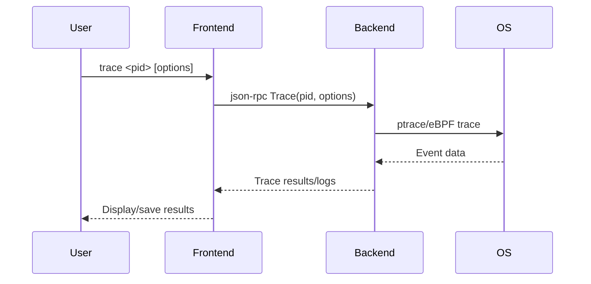

## Trace

### Implementation Goals

The trace command is used to track system calls, signals, or specific events of the target process, suitable for performance analysis, anomaly detection, and security auditing scenarios. This section introduces the implementation of the `trace` command.

```bash
$ tinydbg help trace
Trace program execution.

The trace sub command will set a tracepoint on every function matching the
provided regular expression and output information when tracepoint is hit.  This
is useful if you do not want to begin an entire debug session, but merely want
to know what functions your process is executing.

The output of the trace sub command is printed to stderr, so if you would like to
only see the output of the trace operations you can redirect stdout.

Usage:
  tinydbg trace [package] regexp [flags]

Flags:
  -e, --exec string        Binary file to exec and trace.
      --follow-calls int   Trace all children of the function to the required depth
  -p, --pid int            Pid to attach to.
      --output string      Output path for the binary.
  -s, --stack int          Show stack trace with given depth. (Ignored with --ebpf)
  -t, --test               Trace a test binary.
      --timestamp          Show timestamp in the output

  ...
```

Brief introduction:
- --exec, launch and trace an executable program
- --follow-calls, unlimited tracing by default, limits the depth of function call fanout when specified
- --pid, trace an already running process
- --output, specifies the output binary name when compiling the target's main module, test package, or Go source files
- --stack, trace command sets breakpoints at both entry and exit addresses of functions matching regexp, printing the stack when execution reaches these points
- --test, build and test a test package using `go test -c`

### Basic Knowledge

To implement frontend-backend interaction commands, here are the general execution steps:

1. User inputs `tinydbg trace <pid> [regexp]` command in the frontend.
2. Frontend sends the trace request to backend via json-rpc (remote) or net.Pipe (local).
3. Backend calls system APIs (like ptrace, eBPF, etc.) to track events of the target process.
4. Backend collects and reports trace event data in real-time.
5. Frontend displays trace results or saves logs.

This logic is clear, let's see how the code implements it.

#### Flow Diagram



### Code Implementation

#### Client Sends Trace Request

```go
godbg trace [flags] [args]
    \--> traceCommand.Run(..)
            \--> traceCmd(...)
                    \--> client.ListFunctions(regexp, traceFollowCalls)
                         wait response
                    \--> print the functions ilst

            \--> breakpointCmd(...)
                    \--> for each fn in functions, create entry/finish breakpoint with loadargs set
```

Let's look at the traceCmd source code:

```go
func traceCmd(cmd *cobra.Command, args []string, conf *config.Config) int {
	status := func() int {
        ...
		var regexp string
		var processArgs []string

		dbgArgs, targetArgs := splitArgs(cmd, args)
        ...

		// Make a local in-memory connection that client and server use to communicate
		listener, clientConn := service.ListenerPipe()
        ...

		client := rpc2.NewClientFromConn(clientConn)
        ...

		funcs, err := client.ListFunctions(regexp, traceFollowCalls)
		if err != nil {
			fmt.Fprintln(os.Stderr, err)
			return 1
		}
		success := false
		for i := range funcs {
			// Fall back to breakpoint based tracing if we get an error.
			var stackdepth int
			// Default size of stackdepth to trace function calls and descendants=20
			stackdepth = traceStackDepth
			if traceFollowCalls > 0 && stackdepth == 0 {
				stackdepth = 20
			}
			_, err = client.CreateBreakpoint(&api.Breakpoint{
				FunctionName:     funcs[i],
				Tracepoint:       true,
				Line:             -1,
				Stacktrace:       stackdepth,
				LoadArgs:         &debug.ShortLoadConfig,
				TraceFollowCalls: traceFollowCalls,
				RootFuncName:     regexp,
			})

            ...
            // create breakpoint at the return address
			addrs, err := client.FunctionReturnLocations(funcs[i])
			if err != nil {
				fmt.Fprintf(os.Stderr, "unable to set tracepoint on function %s: %#v\n", funcs[i], err)
				continue
			}
			for i := range addrs {
				_, err = client.CreateBreakpoint(&api.Breakpoint{
					Addr:             addrs[i],
					TraceReturn:      true,
					Stacktrace:       stackdepth,
					Line:             -1,
					LoadArgs:         &debug.ShortLoadConfig,
					TraceFollowCalls: traceFollowCalls,
					RootFuncName:     regexp,
				})
                ...
			}
		}
        ...

        // set terminal to non-interactive
		cmds := debug.NewDebugCommands(client)
		cfg := &config.Config{
			TraceShowTimestamp: traceShowTimestamp,
		}
		t := debug.New(client, cfg)
		t.SetTraceNonInteractive()
		t.RedirectTo(os.Stderr)
		defer t.Close()

        // resume ptracee
		err = cmds.Call("continue", t)
		if err != nil {
			fmt.Fprintln(os.Stderr, err)
			if !strings.Contains(err.Error(), "exited") {
				return 1
			}
		}
		return 0
	}()
	return status
}
```

#### Server Receives and Processes Logic

Now let's look at the server-side processing logic.

```bash
godbg listenAndServe(conn)
    \--> rpc2.(*RPCServer).ListFunctions(..)
            \--> debugger.(*Debugger).ListFunctions(..)
                    \--> traverse(f, followCalls)
                    \--> uniq = sort + compact, return uniq funcs

    \--> rpc2.(*RPCServer).CreateBreakpoint

    \--> rpc2.(*RPCServer).Continue
       \--> excuete `continue` to resume process
       \--> when any breakpoint hit, ptracer print current `file:lineno:pc` 
            if loadargs set, then print `args` and `locals`
```

Expanding the key code:

```go
// ListFunctions lists all functions in the process matching filter.
func (s *RPCServer) ListFunctions(arg ListFunctionsIn, out *ListFunctionsOut) error {
	fns, err := s.debugger.Functions(arg.Filter, arg.FollowCalls)
	if err != nil {
		return err
	}
	out.Funcs = fns
	return nil
}
```

Regarding CreateBreakpoint and Continue, we'll skip them for now to avoid repetition, and we'll cover them when discussing related content.

### Summary

The trace command provides a powerful tool for performance analysis and anomaly detection by integrating system-level tracing capabilities, supporting multiple event types and flexible output methods. 