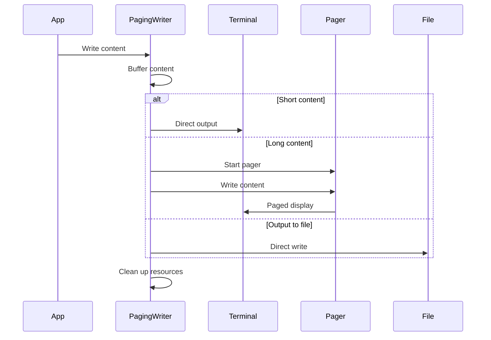

## Design and Implementation of Paging Output

### Feature Overview

Paging Output is an important feature in debuggers that intelligently handles large amounts of output content by displaying it through pagers (such as less, more, etc.), enhancing the user experience. This feature is particularly useful when viewing large amounts of debug information, stack traces, or variable contents.

### Core Design

The core of paging output is the `pagingWriter` struct, which implements the `io.Writer` interface and can dynamically decide whether to use a pager to display output. The main design features include:

1. Support for multiple output modes:

   - Direct output to terminal
   - Output through pager
   - Output to file
2. Intelligent decision making:

   - Determines whether to use paging based on output content length
   - Considers terminal window size
   - Supports user configuration

### Key Implementation

```go
type pagingWriter struct {
    mode     pagingWriterMode    // Output mode
    w        io.Writer          // Base output stream
    buf      []byte             // Output buffer
    cmd      *exec.Cmd          // Pager command
    cmdStdin io.WriteCloser     // Pager input stream
    pager    string            // Pager program name, e.g., PAGER=less or PAGER=more from environment variables
    lastnl   bool              // Whether the last output ended with a newline
    cancel   func()            // Cancel function

    lines, columns int         // Terminal window size
}
```

#### Output Process

1. Initialization phase:

   - Detect terminal size
   - Determine output mode
   - Prepare pager (if needed)
2. Writing phase:

   - Buffer output content
   - Decide whether to enable paging based on content length and terminal size
   - Write content to target (terminal/pager/file)
3. Cleanup phase:

   - Close pager
   - Clear buffer
   - Reset state

### Flow Diagram



### Use Cases

1. Debug session recording:

   - When using the transcript command, can choose whether to enable paging
   - Automatically switches to paging mode for large outputs
2. Variable inspection:

   - Automatic paging when viewing large data structures
   - Supports search and navigation in paging mode
3. Stack traces:

   - Automatic paging for long stack information
   - Facilitates page-by-page viewing of call chains

### Summary

The paging output feature significantly improves the usability of the debugger through intelligent content management and display methods. It can:

1. Automatically adapt to different output scenarios
2. Provide better user experience
3. Effectively handle large amounts of output content
4. Maintain output consistency and readability

This feature's design fully considers actual usage scenarios and is an important component of the debugger's output system. 