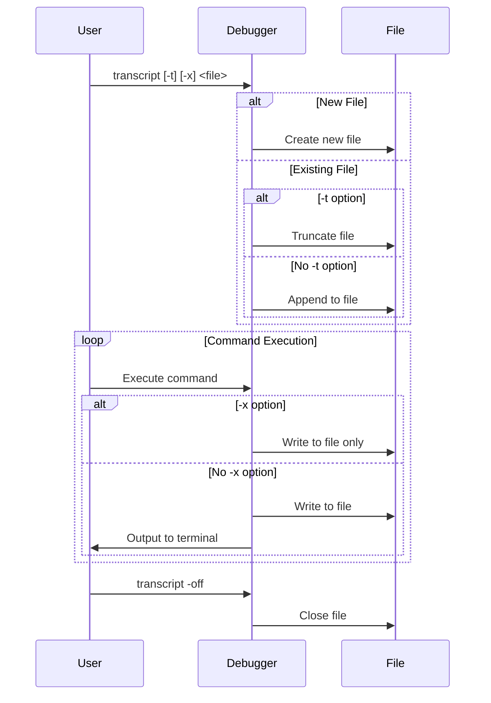

## Design and Implementation of transcript

### Debugging Notebook

When executing Linux commands, to record the commands executed in a series of operations and their outputs, we typically use the `script` command. Readers who have systematically learned Linux command-line operations should be familiar with this.

see `man 1 script`:

```bash
NAME
       script - make typescript of terminal session

SYNOPSIS
       script [options] [file]

DESCRIPTION
       script makes a typescript of everything displayed on your terminal.  It is useful for students who need a hardcopy record of an inter‐
       active session as proof of an assignment, as the typescript file can be printed out later with lpr(1).

       If the argument file is given, script saves the dialogue in this file.  If no filename is given, the dialogue is  saved  in  the  file
       typescript.
```

In fact, for debugging scenarios, we also hope to have such debugging capabilities. The debugging process is mostly step-by-step, and it's unlikely to locate the problem 100% on the first attempt. Often, we need to refer to previous debugging processes and initiate multiple rounds of debugging to identify the root cause. tinydbg (dlv) has designed and implemented the `transcript` command to achieve this functionality, saving your debugging commands and their outputs to a specified file for future reference.

### Feature Overview

The `transcript` command is used to record command outputs from debugging sessions to a file, supporting append or overwrite modes, and optionally suppressing standard output. This feature is very useful for saving debugging session records, generating debugging reports, or conducting subsequent analysis.

### Execution Flow

1. User inputs `transcript [options] <output file>` command in the frontend.
2. Frontend parses command parameters, including:
   - `-t`: Truncate if output file exists
   - `-x`: Suppress standard output
   - `-off`: Turn off transcription
3. Backend opens or closes file output stream based on configuration.
4. During the debugging session, all command outputs are written to the specified file.
5. User can stop recording at any time using `transcript -off`.

### Key Code Snippet

```go
var transcriptCmd = func(c *DebugSession) *command {
    return &command{
        aliases: []string{"transcript"},
        cmdFn:   transcript,
        helpMsg: `Appends command output to a file.

    transcript [-t] [-x] <output file>
    transcript -off

Output of Delve's command is appended to the specified output file. If '-t' is specified and the output file exists it is truncated. If '-x' is specified output to stdout is suppressed instead.

Using the -off option disables the transcript.`,
    }
}
```

### Flow Diagram



### Summary

The transcript command provides comprehensive output recording functionality for debugging sessions. Through flexible option configuration, it can meet various recording needs. This feature is helpful for tracking debugging processes, problem analysis, and knowledge sharing. Its design fully considers practicality and flexibility, making it an important auxiliary feature in debugging tools.
