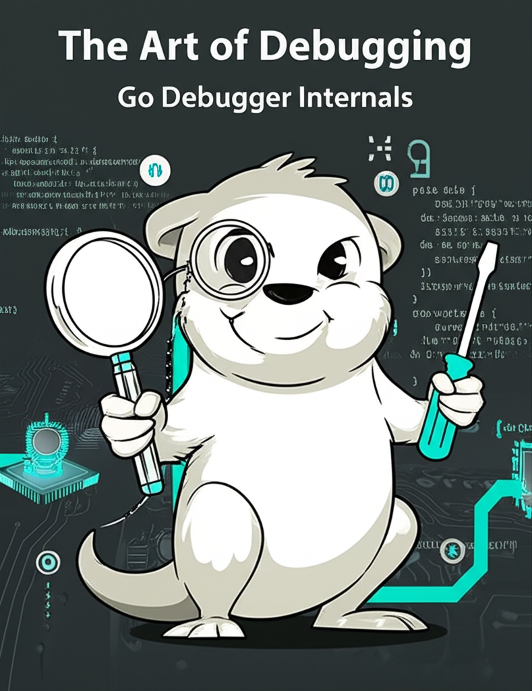

# The Art of Debugging: Debugger Internals

## 1.1 Author Introduction

Hi, I'm Zhang Jie, currently working as a Senior Backend Engineer at Tencent (Shenzhen) Technology Co., Ltd. During my time at Tencent, I have worked on the backend development of Now Live, KanDian, and content processing systems for information feeds. I have also participated as a core developer in the design and development of microservice frameworks goneat and trpc, as well as in code review work for company code standards, career advancement, and intern retention.

From my first exposure to programming after high school, through systematic learning in university, to my work experience to date, ten years have passed. The development of computer technology continues to attract me to learn, think, and explore broader application scenarios to enrich our real lives.

Open source has exposed me to a larger world, where I learn and contribute. I greatly admire engineers who are technically skilled, willing to share, and whose fingertips exude talent and genius. I take such people as my role models and frequently summarize and share in my work and learning practice. This book is one such example.

## 1.2 About This Book

Computer science is a systematic engineering. For example, a seemingly simple question like "how does a program run" involves many aspects such as programming languages, compilers, linkers, operating systems, processors, memory, bus control, etc. Mastering these requires long-term learning and practice.

I started learning about Go in 2016 and began using it as my primary development language in 2018, with some interesting twists along the way - including initial resistance to Go. After gaining a deep understanding of C, C++, Java's third-party coroutine library support, and development practices, I finally recognized Go's elegance and decided to master it.

When learning Go, beginners often need to understand language details through debugging. Delve is a symbol-level debugger for Go. While using Delve, I realized that we could explore the secrets of the computer world from the perspective of a debugger. Regardless of the programming language, as long as there is debugging information support, we can always use a debugger to peek into the process's execution. To put it figuratively, it's like an FPS game: 1x scope to peek at code execution, 2x scope to peek at variables, 3x scope to peek at the type system, 4x scope to peek at hardware features... what can escape the debugger's eye?

This book hopes to help developers better understand the connections between Go programming language, compiler, linker, operating system, debugger, and hardware from the perspective of a Go debugger. This will be more effective than fragmented course teaching in helping readers understand their respective values and close collaboration. Developers will also master debugger development capabilities, enabling them to develop runtime analysis and debugging capabilities at the language level.

## 1.3 Book Content

The debugging process is not just the work of the debugger; it also involves source code, compiler, linker, and debugging information standards. Therefore, from the debugger's perspective, it sees a series of collaborative processes, giving developers a more macro view to examine the position of software development.

Debugging standards come in various formats. In the process of understanding debugging information standards, we can better understand the design philosophy of processors, operating systems, programming languages, etc. Combined with debugger implementation, we can also understand and verify the design implementation of certain language features.

Debugging requires interaction with the operating system. Debugging provides a more direct and faster way for us to peek into the working principles of the operating system, such as task scheduling, signal handling, virtual memory management, etc. The operating system is so close to us but conceptually so far away. Debuggers rely on operating system support, which is also a great opportunity to deepen our understanding of the operating system.

Additionally, debuggers are commonly used development tools. This book not only analyzes the design implementation of common debugger features and debugging techniques but also allows readers to experience the lofty design philosophy of debugging information standards, experiencing the beauty of standards while standing on the shoulders of giants.

Of course, there are already debuggers for Go in the industry, such as gdb, dlv, etc. Our intention in developing another debugger from scratch is not just to be new for the sake of being new, but to use the debugger as an entry point to integrate related knowledge. The technical points here involve Go language itself (type system, goroutine scheduling), compiler and debugger collaboration (DWARF), operating system kernel (virtual memory, task scheduling, system calls, instruction patching), and processor-related instructions, etc.

In short, by using the development of a Go language debugger as an entry point, beginners can not only learn Go language development from practical engineering but also gradually understand the collaborative process between operating systems, compilers, linkers, debuggers, and processors during the progressive and advanced process, thereby deepening their understanding of the computer system as a whole.

## 1.4 Example Code

The example code for this book can be obtained in two ways:

1. [**golang-debugger-lessons**](https://github.com/hitzhangjie/golang-debugger-lessons), readers can view the example code according to the chapter correspondence. The directory [**/0-godbg**](https://github.com/hitzhangjie/golang-debugger-lessons) provides a relatively complete implementation of a Go language symbol-level debugger.
2. [**godbg**](https://github.com/hitzhangjie/godbg), migrated from the /0-godbg in the above supporting example code. Readers who want to quickly experience the complete functionality can also directly experience this project or view the source code;

   > ps: The project provides vscode's devcontainer configuration, using centos+go1.13. If you upgrade the Go version, it may cause program issues, such as the preemption problem introduced in go1.14, which means the debugger must solve the preemption problem, which may cause the debugger to work unexpectedly.
   >
   > Also, if you use other versions, the book's content description may differ from the actual situation. For example, go1.13 will write DWARF information to .zdebug_ sections after compilation, but go1.19 will not write to .zdebug_ sections (it writes to .debug_ sections).
   >
   > It is strongly recommended that you first test and learn using the provided development container. When you have mastered some basics, you can upgrade the Go version as needed.
3. [**hitzhangjie/delve**](https://github.com/hitzhangjie/tinydbg), this project is derived from go-delve/delve. To facilitate the discussion of the most core parts of the symbol-level debugger, the project has removed some extended implementations unrelated to linux/amd64. The symbol-level debugger implementation part of this book will reference code from this project.

## 1.5 Contact Information

If you have any suggestions, please submit [Issues](https://github.com/hitzhangjie/golang-debugger-book/issues), or email `hit.zhangjie@gmail.com` with the subject line `GoDebugger Discussion`.

I hope this book and related examples can be completed successfully, which will be a way for me to temper my character and improve myself. If it can truly help everyone, that would be even better.

If you like this book, don't forget to [Star](https://github.com/hitzhangjie/golang-debugger-book) to support the author :)
